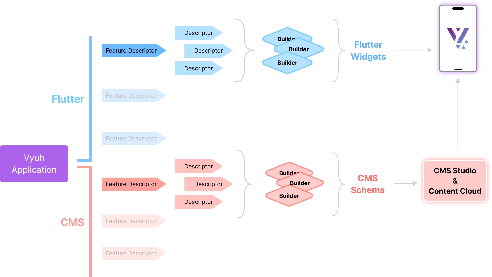

# {{ $frontmatter.title }}

The Vyuh framework provides an extensible architecture for building large-scale
apps using a CMS (or other content source) to drive the experience. To support
this extensibility, two concepts appear throughout the framework: **Descriptors**
and **Builders**. Let's understand why they are required and what purpose they
serve.

A Vyuh app is a collection of features, where each feature is an independent
unit of functionality that exposes components and routes. When not using a CMS,
routes alone are sufficient to stitch together user journeys. The full benefit,
however, comes from using a CMS to drive the entire experience.

## Harvesting Content

Content in a CMS-driven system has two counterparts. One resides on the CMS,
where it is exposed as a schema block used in the CMS Studio. The other is the
Flutter-side widget that renders this content. The connecting glue is the
_framework_, which converts the JSON from the CMS into a Flutter widget.

### Descriptors

Since an app can have many features, there must be a way to describe each
feature's content so the framework can understand and render it. A _descriptor_
is exactly this: a structured description of content. Common descriptors include
`FeatureDescriptor` (describes the feature), `ContentDescriptor` (describes the
content), and `ExtensionDescriptor` (describes framework extensions).

Every feature declares its contribution to the app using a `FeatureDescriptor`
and its content using `ContentDescriptor` instances. Descriptors are
content-specific because each content type has its own set of properties.

> Descriptors define the schemas for the CMS and have a counterpart in Flutter.
> The Flutter-side descriptor primarily converts from the JSON schema of the
> content to a `Widget`.

#### A Concrete Example

To see how the CMS and Flutter sides connect, consider a `ProductCard` content
type. On the CMS, you define a schema that determines what content editors see
in the Studio:

```typescript
// CMS Schema - defines what content editors see
export const productCard = defineType({
  name: 'shop.productCard',
  title: 'Product Card',
  type: 'object',
  fields: [
    defineField({ name: 'title', type: 'string' }),
    defineField({ name: 'price', type: 'number' }),
    defineField({ name: 'image', type: 'image' }),
  ],
});
```

On the Flutter side, you create a corresponding `ContentItem` that deserializes
the CMS JSON into a Dart object. The `TypeDescriptor` registers this content
type with the framework using the same `schemaType` string:

```dart
// Flutter ContentItem - deserializes CMS JSON
@JsonSerializable(createToJson: false)
final class ProductCard extends ContentItem {
  static const schemaName = 'shop.productCard';
  static final typeDescriptor = TypeDescriptor(
    schemaType: schemaName,
    title: 'Product Card',
    fromJson: ProductCard.fromJson,
  );

  final String title;
  final double price;
  final ImageReference? image;

  ProductCard({
    required this.title,
    required this.price,
    this.image,
    super.layout,
  }) : super(schemaType: schemaName);

  factory ProductCard.fromJson(Map<String, dynamic> json) =>
      _$ProductCardFromJson(json);
}
```

The `schemaName` value (`'shop.productCard'`) is the key that ties the CMS
schema to the Flutter content item. The `@JsonSerializable` annotation and the
`_$ProductCardFromJson` factory are part of the
[json_serializable](https://pub.dev/packages/json_serializable) package. The
generated `.g.dart` files are produced by running:

```shell
dart run build_runner build
```

### Builders

Describing the feature is one half of the story. The other half is collecting all
these descriptors across every feature and _assembling an app_ from them. This is
where the **Builder** comes in. A builder is a class that works with a specific
descriptor type and collects instances of it across all features. For example,
for every `ContentDescriptor`, there is a corresponding `ContentBuilder` that
gathers the descriptors and assembles them. Descriptors and builders are
_type-safe_ to ensure they work together correctly.

At runtime, the framework uses the various builders to render content. Each
builder exposes a `build()` method that takes a `BuildContext` and a `content`
instance and produces a Flutter `Widget`:

```dart
abstract class ContentBuilder {
  // Rest of the class definition...

  /// Builds the content into a Flutter Widget
  ///
  /// The [content] is the instance of the content that needs to be rendered.
  Widget build(BuildContext context, ContentItem content);
}
```

## Assemble and Render

Once descriptors and builders are in place, the framework can orchestrate the
rendering of content. When a new page is fetched from the CMS, the framework
identifies the correct builder for each content type and renders it. Builders are
maintained in a type-safe registry, indexed by schema name for efficient lookup.



From the framework's perspective, even the page itself is a content type with its
own builder. The process works recursively down into the items of the page. The
framework performs error checking, validation, and provides debug hints to ensure
correct implementation.

## Related Guides

- [Content Types](/docs/guides/content-types) -- define and register custom content types
- [Layouts](/docs/guides/layouts) -- create layout builders for your content
