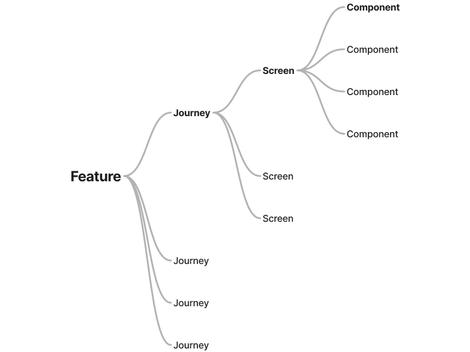
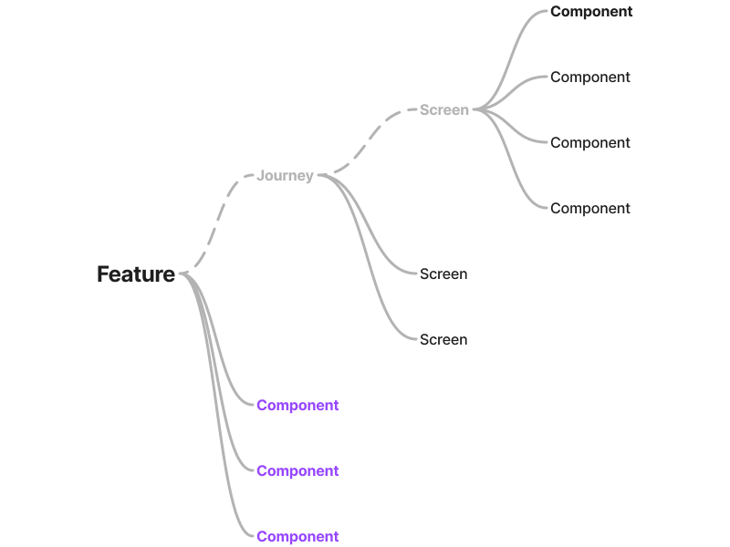

# {{ $frontmatter.title }}

A Vyuh application is composed of two types of building blocks: **Features** and
**Plugins**. Features represent user-facing capabilities, while Plugins provide
shared infrastructure that all features rely on.

## Features

A feature is a self-contained unit of functionality within your application. When
describing an app, you naturally describe it in terms of its features. This is
the same principle Vyuh uses to organize code.

For example, an E-Commerce application might contain the following features:

- Authentication (social logins, email-password, SAML)
- Dashboard with personalized highlights
- Product search
- Account management
- Order history and tracking
- Subscription management
- Payments
- Wishlists

Each feature is responsible for a set of user journeys, composed of screens that
display content and enable task completion. A hierarchical view of a feature
looks like this:



### Components over journeys

A feature in Vyuh does not hard-code its journeys and screens by default. This
is intentional. A feature exposes a set of **components** to the CMS, and the
business teams decide how to assemble those components into journeys, screens,
and navigation flows. Content is structured in terms of **blocks** rather than
pixel-level screen designs.

::: info Feature and Components

A Feature does not hard-code a journey and instead exposes components that the
business teams can use. The journey control stays with the business.

Thinking in terms of the **components** gives you freedom to explore different
journeys and screen structures. This is a benefit not just for business but also
during development where you can check different navigational patterns and
ensure consistency of state and other behaviors.

:::

This does not mean a feature can never contain a fixed journey. Certain flows
have fixed internal navigation that will not change, such as a payment checkout.
Those journeys can be built directly into the feature. However, this is not the
default approach.

A more realistic hierarchy of a feature looks like this:



The _dashed lines_ to `Journey` and `Screen` indicate that they are optional and
not the standard way of packaging a feature.

To summarize, a feature:

- Exposes a collection of components that business teams use to construct screens
  and journeys via the CMS
- May contain fixed internal journeys for standard tasks (e.g., payment flows)
- Encapsulates business logic and exposes minimal configuration to the CMS
- Is described using a `FeatureDescriptor` that declares its routes, extensions,
  and initialization logic

### FeatureDescriptor

Each feature is defined with a `FeatureDescriptor`. This descriptor declares the
feature's routes, content extensions, and any initialization logic that should
run at startup.

```dart
final feature = FeatureDescriptor(
  name: 'shop',
  title: 'Shopping',
  description: 'E-commerce shopping feature',
  icon: Icons.shopping_cart,
  init: () async {
    // Initialize feature dependencies
    vyuh.di.register(ShopStore());
  },
  routes: () async => [
    GoRoute(path: '/shop', builder: (_, __) => const ShopHome()),
  ],
  extensions: [
    ContentExtensionDescriptor(
      contentBuilders: [ProductCard.contentBuilder],
      actions: [AddToCartAction.typeDescriptor],
    ),
  ],
);
```

The `FeatureDescriptor` includes:

- **name / title / description** -- identifiers for the feature
- **icon** -- used in developer tools and CMS references
- **init** -- an async callback for registering dependencies or performing setup
- **routes** -- the set of routes this feature contributes to the application
- **extensions** -- content builders, actions, and other CMS-facing components

## Plugins

While a feature is a user-facing capability, a **Plugin** provides
infrastructure that is available app-wide across all features. Plugins handle
cross-cutting concerns such as:

- Authentication
- Content management (CMS integration)
- Analytics
- Telemetry and logging
- Networking
- Storage and secure storage
- Dependency injection

Plugins are configured at the application level using a `PluginDescriptor` and
are available to every feature at runtime.

```dart
vc.runApp(
  features: () => [...],
  plugins: PluginDescriptor(
    content: DefaultContentPlugin(
      provider: SanityContentProvider.withConfig(
        config: SanityConfig(
          projectId: 'your-project-id',
          dataset: 'production',
        ),
      ),
    ),
    auth: FirebaseAuthPlugin(),
    analytics: AnalyticsPlugin(
      providers: [FirebaseAnalyticsProvider()],
    ),
    telemetry: TelemetryPlugin(
      providers: [ConsoleLoggerTelemetryProvider()],
    ),
  ),
);
```

Each plugin type addresses a specific concern: `content` handles CMS
integration, `auth` manages authentication, `analytics` tracks user behavior,
and `telemetry` captures logs and diagnostics.

### The Provider model

Plugins are extensible in two ways: by adding new plugin types to the framework,
and by adding **providers** to existing plugin types. The Provider model applies
when the core functionality of a plugin remains the same but the underlying
vendor or implementation varies.

The **Analytics plugin** is a clear example of this. The plugin itself defines a
standard interface for tracking events and user behavior. The actual delivery of
those events to a backend is handled by one or more providers. You can configure
multiple providers simultaneously:

```dart
analytics: AnalyticsPlugin(
  providers: [
    FirebaseAnalyticsProvider(),
    MixpanelAnalyticsProvider(),
    CustomAnalyticsProvider(),
  ],
),
```

When the application records an analytics event, the plugin dispatches it to all
registered providers. This means you can send the same event data to Firebase,
Mixpanel, and a custom backend without changing any feature code. Adding or
removing a provider is a configuration change, not a code change within your
features.

The same Provider model applies to other plugin types like Telemetry, where you
might use a console logger during development and a remote logging service in
production.

## Features and Plugins together

Features and Plugins form the two fundamental building blocks of every Vyuh
application. Features define what the user sees and interacts with. Plugins
provide the shared services that features depend on. Together, they cover the
full scope of an application.


## Related Guides

- [Creating a Feature](/docs/guides/creating-a-feature) -- build and register a feature from scratch
- [Using Plugins](/docs/guides/using-plugins) -- configure and use the built-in plugins
- [Custom Plugins](/docs/guides/custom-plugins) -- create your own plugin types
