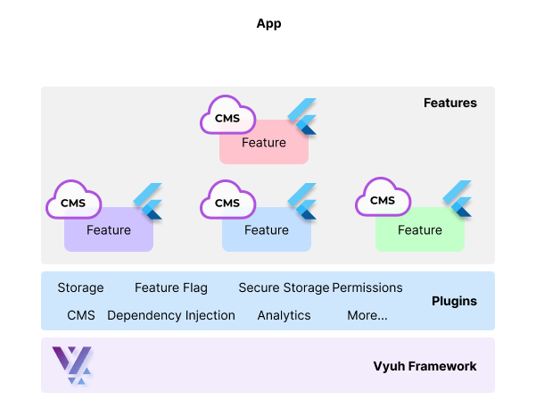

# {{ $frontmatter.title }}

The Vyuh Framework structures Flutter apps as a composition of **Features** and
**Plugins**, driven by content from a headless CMS. Instead of monolithic
codebases, apps are assembled from independent modules that expose content blocks
to the CMS and render them in Flutter. This section covers the architectural
concepts, extension mechanisms, and terminology that underpin every Vyuh app.

## What You'll Learn

- **Features and Plugins** -- the two building blocks of every Vyuh app
- **Descriptors and Builders** -- the extension mechanism that connects CMS
  content to Flutter widgets
- **Content blocks** -- the modular, CMS-managed units that replace hard-coded
  screens
- **The separation of concerns** between business configuration (CMS) and
  implementation (Flutter)

::: tip Learning Path
Read the concepts in this order for the best understanding:

1. [Features & Plugins](./features-and-plugins) -- building blocks of a Vyuh app
2. [Descriptors & Builders](./descriptors-and-builders) -- extensibility
   mechanism
3. [Glossary](./glossary) -- reference for all framework terminology
   :::

## Shape of a Vyuh App

A Vyuh app is bootstrapped with a single `runApp()` call that declares its
features and plugins:

```dart
import 'package:vyuh_core/vyuh_core.dart' as vc;

void main() async {
  vc.runApp(
    initialLocation: '/',
    features: () => [
      // Features assembled here
      counterFeature,
      authFeature,
    ],
    plugins: PluginDescriptor(
      content: SanityContentProvider(...),
      analytics: AnalyticsPlugin(providers: [...]),
      auth: FirebaseAuthPlugin(),
    ),
  );
}
```

Features are user-facing modules (authentication, search, payments). Plugins
provide cross-cutting infrastructure (analytics, networking, storage) available
to all features.

## Divide and Conquer


The CMS and Flutter each handle a distinct responsibility:

- **CMS** -- business teams compose pages, navigation, and content using
  high-level semantic blocks. No pixel-level design decisions are exposed here.
- **Flutter** -- engineering teams implement the rendering, business logic, and
  design system for each block.

The framework bridges both sides: it parses the CMS JSON payload and resolves
each block to its corresponding Flutter widget through a type-safe registry of
builders.


This separation gives business teams a no-code interface for managing app
experiences while engineering retains full control over implementation in Dart
and Flutter.

## Core Capabilities



The framework provides the following capabilities out of the box:

- **Modular features** -- each feature is an independent package that can be
  developed, tested, and transferred between Vyuh apps
- **CMS-driven navigation** -- routes and page content are controlled from the
  CMS, enabling dynamic user journeys and A/B testing
- **Conditional content** -- content visibility and routing can be controlled by
  runtime conditions (platform, auth state, feature flags)
- **Plugin system** -- analytics, authentication, storage, networking, and
  dependency injection are all pluggable
- **Design system focus** -- components are built as part of a design system from
  day one


## Traditional vs Vyuh Approach

| Aspect                 | Traditional Flutter                                            | Vyuh Framework                                                        |
| ---------------------- | -------------------------------------------------------------- | --------------------------------------------------------------------- |
| **Structure**          | Monolithic single codebase                                     | Modular, feature-based packages                                       |
| **Content Management** | Static, hard-coded within the app                              | Dynamic, managed via external CMS with content blocks                 |
| **User Journeys**      | Fixed, hard-coded in the app                                   | Dynamic, controlled through CMS                                       |
| **Modularity**         | Requires deliberate effort to split into packages              | Built-in through reusable features and blocks                         |
| **Flexibility**        | Requires redeployment for updates                              | Real-time updates through CMS                                         |
| **Exploration**        | Requires code changes to try different variations              | Real-time changes and variant switching with live preview              |
| **Team Coordination**  | High, to ensure minimal impact of changes across shared code   | Low, since features are developed independently                       |

## Mindset for Building with Vyuh

Adopting Vyuh requires shifting from screen-centric thinking to block-centric
thinking:

- **Modular design** -- treat each feature as an independent mini-app that
  exposes content blocks, not pre-defined journeys
- **Dynamic content management** -- design blocks to adapt to CMS changes
  without code modifications
- **Separation of concerns** -- the CMS is the source of truth for content
  structure and navigation; Flutter owns presentation and logic
- **Configuration vs implementation** -- CMS schemas capture business-level
  configuration only; implementation details stay in Flutter code
- **Reusability** -- design blocks for reuse across features and across
  different apps in a product family

## Concept Pages

<div class="concept-cards">

### [Features & Plugins](./features-and-plugins)

The two building blocks of every Vyuh app: features encapsulate user-facing
functionality, and plugins provide cross-cutting infrastructure.

### [Descriptors & Builders](./descriptors-and-builders)

The extension mechanism that connects CMS content schemas to Flutter widgets
through type-safe descriptors and builders.

### [Glossary](./glossary)

Reference definitions for all Vyuh Framework terminology including routes,
conditions, actions, layouts, modifiers, and more.

</div>

---

For framework terminology, see the [Glossary](./glossary). To start building,
head to the [Quick Start](/docs/intro/get-started) guide.
