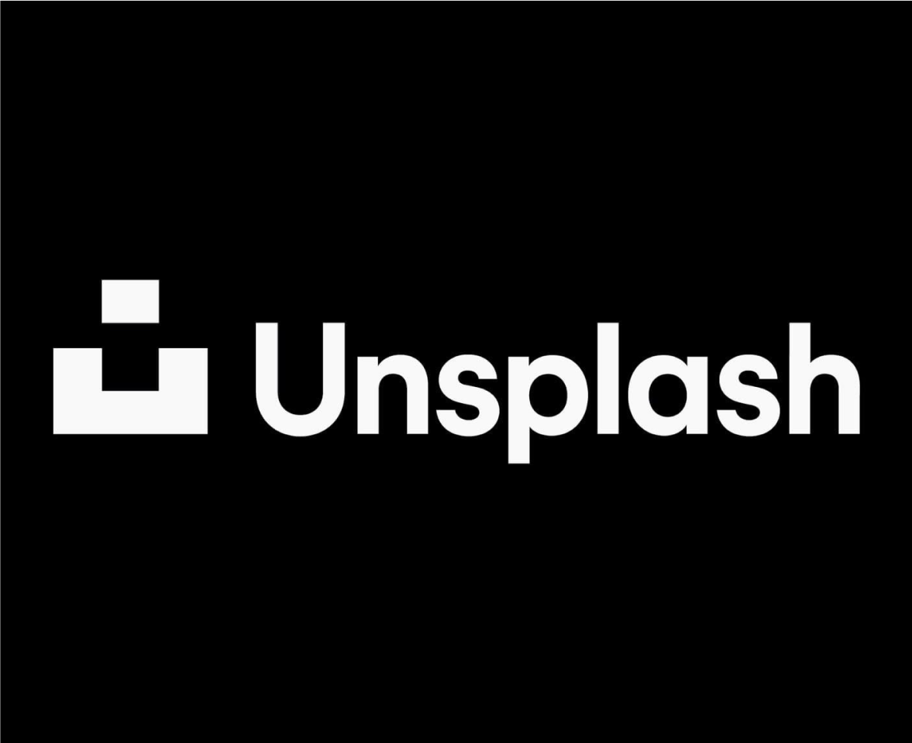
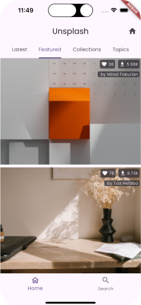
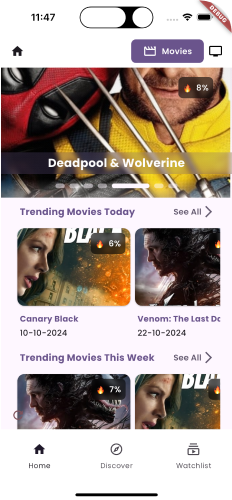
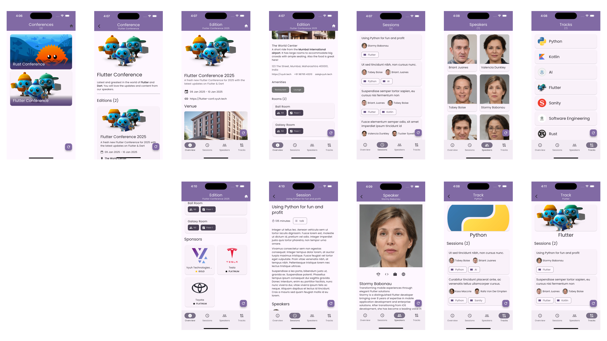

# Examples Overview

The Vyuh framework has been designed from the ground-up to handle large scale development of features (aka **Mini-Apps**), across multiple distributed teams without falling into the trap of a monolithic App.

It allows you to compose an App out of several Mini-Apps and design all the customer journeys on a CMS. This gives a phenomenal advantage in exploring various journeys and connecting even unrelated mini-apps.

## Chakra

In this section we have built a single App that is composed out of several mini-Apps. This is our own Super App, called the **Vyuh Chakra Demo**.

Each example has a breakdown of how the mini-App was built. Many of them use advanced techniques that are generally seen in production-grade applications.

### Counter

The classic Flutter counter example, as a Vyuh Feature.

[Read more](counter)

### Food

A simple restaurant menu with item details.

[Read more](food)

### Puzzle

A puzzle with levels managed from the CMS.

[Read more](puzzles)

### Unsplash App

An image gallery app that allows browsing different images, their details and searching by a variety of criteria.

[Read more](unsplash)

### Wonderous App

A classic example used in the Flutter community to demonstrate a rich, animated experience of browsing the wonders of the world. This is our own take on Wonderous.

[Read more](wonderous)

### Movies App

Explore movies, TV series, cast and crew using the TMDB API.

[Read more](movies)

### Conference App

A full-featured conference management application showcasing schema design, content modeling, flexible layouts, and navigation patterns.

[Read more](conference)
