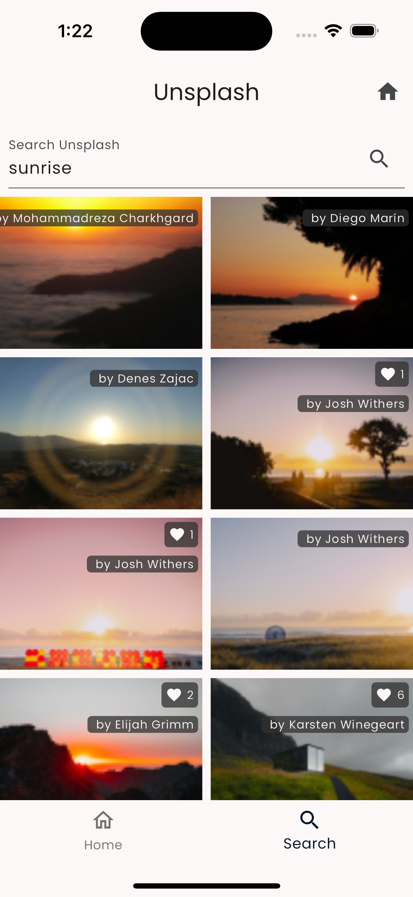

# Unsplash

The Unsplash mini-app is a bit different than all the other features (aka mini-apps) described in this section. It focuses on the modularity aspect of the framework with all of the blocks and user-journeys built right into the feature itself. In this regard, it **does not include any CMS driven rendering** and is completely self-contained.

## Capabilities

This feature includes most of the capabilities that you might expect in the Unsplash app:

- Seeing the latest and featured photos
- Searching photos
- Seeing the details of photos
- Exploring the other information associated with a photo
- Built-in navigation between the listing and the details
- Using the Unsplash Client from pub.dev to invoke all server calls


## The FeatureDescriptor

The entry point for the Unsplash feature is a straightforward `FeatureDescriptor`. It sets up metadata, initializes the Unsplash API client with keys from environment variables, and configures routes:

```dart
final feature = FeatureDescriptor(
  name: 'unsplash',
  title: 'Unsplash',
  description: 'View photos, collections and users on Unsplash',
  icon: Icons.photo_camera,
  init: () async {
    await dotenv.load(fileName: '.env');
    final accessKey = dotenv.get('UNSPLASH_ACCESS_KEY');
    final secretKey = dotenv.get('UNSPLASH_SECRET_KEY');
    vyuh.di.register(
      UnsplashStore(accessKey: accessKey, secretKey: secretKey),
    );
  },
  routes: routes,
);
```

::: tip Metadata Matters
Although it might seem unnecessary, take your time to specify good metadata for a feature. This helps identify the feature in the developer tools and makes it easier for your team members to understand what the feature contains.
:::


## Navigation and Routes


The navigation inside the Unsplash feature consists of two tab routes: **Home** and **Search**.

The Home tab shows listings of photos under various categories (Latest, Featured, Collections, Topics). Tapping on a photo navigates to photo details. The Search tab has a similar pattern with search results leading to photo details.

The route setup uses `StatefulShellRoute` with two tabs:

```dart
List<RouteBase> routes() {
  return [
    StatefulShellRoute.indexedStack(
      branches: [
        StatefulShellBranch(routes: [
          GoRoute(
            path: '/unsplash/home',
            builder: (context, state) => const UnsplashHome(),
            routes: [
              GoRoute(path: 'photos/:id', builder: ...),
              GoRoute(path: 'collections/:id', builder: ...),
              GoRoute(path: 'topics/:id', builder: ...),
            ],
          ),
        ]),
        StatefulShellBranch(routes: [
          GoRoute(
            path: '/unsplash/search',
            builder: (_, __) => const SearchView(),
          ),
        ]),
      ],
    ),
  ];
}
```

## Separation of Concerns


The feature follows a clean separation between three actors:

1. **The Unsplash Store** -- Makes the API calls to the Unsplash client and fetches details. Uses the API key set up in the `init()` method of the `FeatureDescriptor`.
2. **The API Client** -- Responsible for making server calls via the `unsplash_client` pub package.
3. **The Widgets** -- The rendering surface for information fetched from API calls and serviced through the store. Widgets always talk to the store and never have direct access to the API client.

## Widgets

The three core widgets forming a mini design system include:

1. **PhotoCard** -- Appears everywhere there is a list of photos
2. **CollectionView** -- Shows a list of photos in a grid layout
3. **PhotoDetail** -- Displays full details of a selected photo


The Home tab uses an enumeration-based approach for its sub-tabs (Latest, Featured, Collections, Topics), simplifying widget creation per sub-tab and improving code readability.



## Summary

Building a feature in Vyuh without any CMS integration feels like regular Flutter development. You get all the niceties of Flutter (e.g., hot reload) without compromising on any of the development experience.

Additionally, the use of the Vyuh Framework gives you **modularity**: the ability to neatly tuck all feature-related functionality into a separate package.

::: tip Read the Code
See the code for the example on GitHub:
[Unsplash](https://github.com/vyuh-tech/vyuh/tree/main/examples/unsplash)
:::
