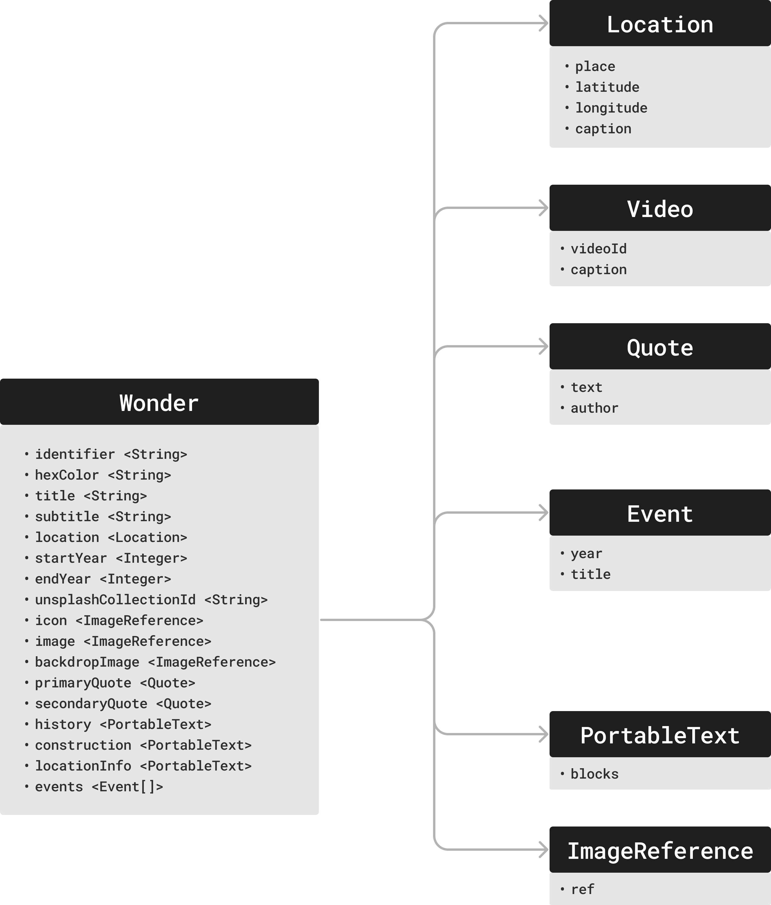
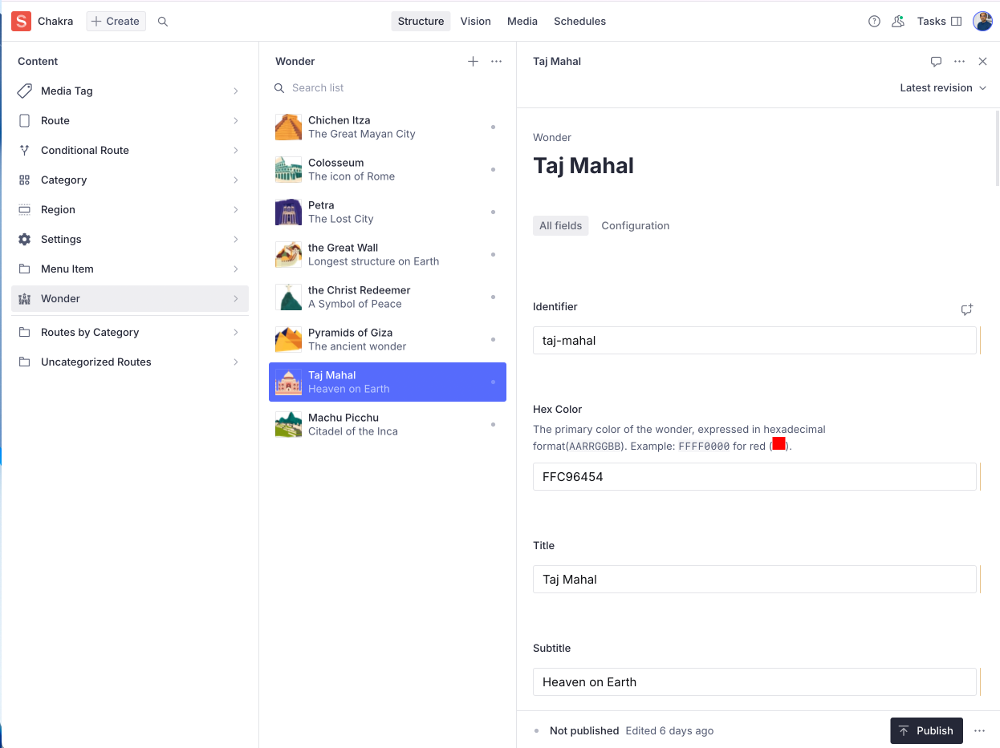
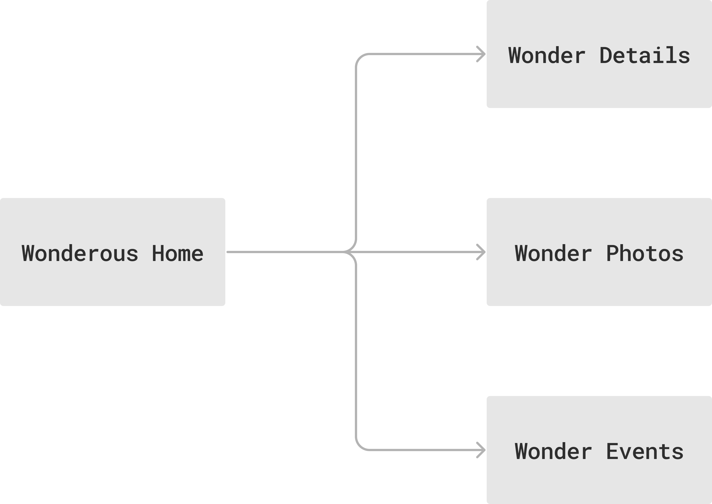
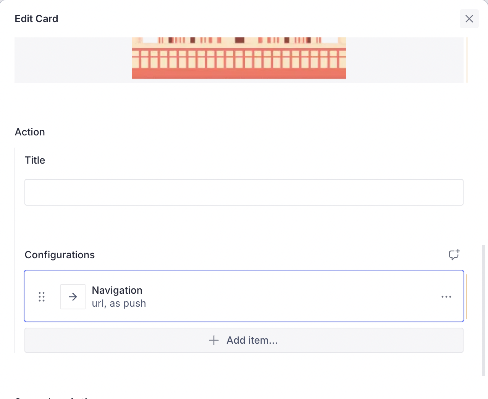

# Wonderous


For someone long enough in the Flutter community, it is hard to miss the **Wonderous App**, a beautiful App built by the talented folks at [GSkinner](https://flutter.gskinner.com/wonderous/). This is a great example of a _content-rich_ app showcasing wonders around the world with slick animations.

The Vyuh Framework was designed to work well with _Content_ of all kinds, especially where the _CMS-hosted Content_ becomes the centerpiece of your experience. The Wonderous App fits perfectly with this idea, and we decided to _rebuild it_ using the Vyuh Framework.

## Framework Features at Play

A variety of features from the framework are demonstrated:

1. **Custom content types** -- The Wonder schema and its sections
2. **Custom documents** with configurable section-based rendering
3. **Navigation** between pages and templated routing
4. **Custom actions** for user interactions
5. **API integrations** with Unsplash for photos
6. **Google Maps** integration for location display
7. **YouTube** player for wonder videos

## Distilling Wonderous


The app centers around the _8 Wonders_ of the world. Each Wonder is a compiled set of information such as: facts and history, the construction process, location details, photos, and a timeline of events. The app experience is a _master-detail_ scenario with the landing screen showing all the wonders and allowing navigation into each wonder's detail screens organized by bottom tabs.


## A Schema-first Approach

The approach starts with defining the Wonder as structured content. After identifying all content aspects of a wonder, a schema was created that describes the Wonder details including facts, history, construction information, location, photos, and timeline events.



This schema translates to a CMS schema with Sanity.io. Each wonder is a separate document of type `wonderous.wonder`, created inside the CMS Studio with all the details gathered from the original Wonderous app.

```typescript
export const wonder: SchemaTypeDefinition = defineType({
  name: 'wonderous.wonder',
  type: 'document',
  title: 'Wonder',
  fields: [
    defineField({ name: 'identifier', title: 'Identifier', type: 'string' }),
    defineField({ name: 'hexColor', title: 'Hex Color', type: 'string' }),
    defineField({ name: 'title', title: 'Title', type: 'string' }),
    defineField({ name: 'subtitle', title: 'Subtitle', type: 'string' }),
    // ... additional fields for video, dates, photos, etc.
  ],
});
```



## Navigation and Structure



The journey starts with a list of Wonders and navigates into each wonder's details. Routes are defined on the CMS and linked to application routes using GoRouter.


All wonders share the same visual structure -- they act as _template routes_ where only the wonder-specific content changes. The Vyuh Framework supports this through `CMSRoute` (a subclass of `GoRoute`):

```dart
Future<List<RouteBase>> routes() async {
  return [
    CMSRoute(path: '/wonderous'),
    CMSRoute(
      path: '/wonderous/wonder/:wonder([^/]+)',
      routes: [
        StatefulShellRoute.indexedStack(
          branches: [
            StatefulShellBranch(routes: [
              CMSRoute(path: 'details', cmsPathResolver: wonderPathResolver),
            ]),
            StatefulShellBranch(routes: [
              CMSRoute(path: 'events', cmsPathResolver: wonderPathResolver),
            ]),
            StatefulShellBranch(routes: [
              CMSRoute(path: 'photos', cmsPathResolver: wonderPathResolver),
            ]),
          ],
        ),
      ],
    ),
  ];
}
```

The `wonderPathResolver` maps dynamic paths like `/wonderous/wonder/taj-mahal/details` to the CMS path `/wonderous/wonder/details` for content rendering.

Linking the wonder cards on the CMS is a matter of locating the card, editing its navigation action, and linking to the wonder details:





## Rendering Wonder Sections


Each wonder is divided into sections (Hero, Facts & History, Construction, Location Info) as separate Content Blocks. This allows changing their order or adding more content between sections from the CMS.

The `WonderSection` content item and its layout are defined as a `ContentBuilder` within the `FeatureDescriptor`:

```dart
final feature = FeatureDescriptor(
  name: 'wonderous',
  title: 'Wonderous',
  description: 'The Wonderous app as a Vyuh Feature',
  icon: Icons.castle_outlined,
  init: () async {
    // Initialize API keys for Unsplash
  },
  routes: routes,
  extensions: [
    ContentExtensionDescriptor(
      contentBuilders: [
        ContentBuilder<WonderSection>(
          content: WonderSection.typeDescriptor,
          defaultLayout: WonderSectionLayout(),
          defaultLayoutDescriptor: WonderSectionLayout.typeDescriptor,
        ),
      ],
    )
  ],
);
```

The `WonderSectionLayout` renders each section type appropriately, and a shared `Future<Wonder>` ensures no duplicate network calls are made when fetching wonder data.

## Managing Wonders


With the CMS-driven approach, adding new wonders is a matter of gathering the visual assets, collecting the facts, creating a wonder document, and publishing. Updates to existing wonders are live to customers in minutes rather than requiring a new app release.

::: info Disclaimer
All assets used in building this version of Wonderous are the property of GSkinner. They are used purely for a technical exploration to demonstrate the abilities of the Vyuh Framework.
:::

::: tip Read the Code
See the code for the example on GitHub:
[Wonderous](https://github.com/vyuh-tech/vyuh/tree/main/examples/wonderous)
:::
