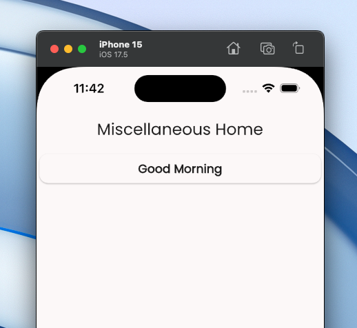

# Conditions

_Condition_ is one of the core elements built into the Vyuh Framework. It allows
you to express a _runtime_ condition that evaluates to one of many values. This
can be used to control different aspects of the framework. Conditions are
evaluated _**asynchronously**_, to accommodate making network calls or using
local values.


## Need for Conditions

Just like conditions are necessary for any programming language (think of your
`if-else`/`ternary`/`switch-case` constructs), conditions are also useful for a
framework like Vyuh. They allow controlling the runtime behavior from a CMS
without hardcoding the behavior in your app, giving you powerful and dynamic
control.

### The Switch-Case Analogy

Conditions in Vyuh evaluate to one of many pre-determined **String** values.
Think of it as a `Switch-Case` from a programming language with the result being
a value from an enumeration. A simple `If-Else` condition can be expressed as a
`Switch-Case` with two possible values: `false` and `true`.

## Built-in Conditions

There are several conditions built into the Framework:

- **Current Theme Mode**: one of `light` or `dark`
- **Current Screen Size**: one of `small`, `medium`, `large`
- **Current Platform**: `ios` | `android` | `web`
- **User Authenticated**: `true` | `false`
- **Feature Flag**: one of many values from a [Feature Flagging](./feature-flags) service
- **Simple Boolean**: `true` | `false`

## Where Can a Condition Be Used?

Conditions are applicable in all the following areas:

1. **Content Items**: a _Conditional Content Item_ can show, hide, or switch
   between different content items based on a condition.
2. **Routes**: a [_Conditional Route_](./conditional-routes) can navigate to one of many routes
   depending on the condition.
3. **Layouts**: a _Conditional Layout_ can switch between different layouts for
   a content item.
4. **Actions**: a _Conditional Action_ can decide between one of many actions
   based on a condition.

## Creating a Custom Condition

You are not limited to the built-in conditions. Any feature can contribute more
conditions that are relevant for the application.

### 1. Define the Schema

Let us create a custom condition that returns the current **part of a day**:

- **`morning`**: 5 am to 12 pm
- **`afternoon`**: 12 pm to 5 pm
- **`evening`**: 5 pm to 9 pm
- **`night`**: 9 pm to 5 am

```typescript
import { defineField, defineType } from 'sanity'
import { GoClock as Icon } from 'react-icons/go'

export const partOfDay = defineType({
  name: 'misc.condition.partOfDay',
  title: 'Part of Day',
  description:
    'Uses the following values: morning | afternoon | evening | night',
  type: 'object',
  icon: Icon,
  fields: [
    defineField({
      name: 'title',
      title: 'Title',
      type: 'string',
      readOnly: true,
      initialValue: 'Part of Day',
    }),
  ],
  preview: {
    prepare(selection) {
      return {
        title: 'Part of Day',
        subtitle: 'morning | afternoon | evening | night',
      }
    },
  },
})
```

::: tip Naming Schemas
It is a good practice to use the feature name as a prefix in all your schemas to
avoid any conflicts. We recommend following a dotted notation
(`feature.type.name`) for naming schemas.
:::

### 2. Export the Condition Schema

Export the schema in the `FeatureDescriptor`:

```typescript
import { FeatureDescriptor } from '@vyuh/sanity-schema-core'
import { partOfDay } from './condition/part-of-day.ts'

export const misc = new FeatureDescriptor({
  name: 'misc',
  title: 'Miscellaneous',
  conditions: [partOfDay],
})
```

The _part-of-day_ condition will now be visible when you try associating this
condition for a conditional block.


### 3. Create the Flutter Counterpart

The Flutter side is where we bring the condition to life by extending
`ConditionConfiguration` and implementing its `execute()` method:

```dart
import 'package:flutter/material.dart';
import 'package:json_annotation/json_annotation.dart';
import 'package:vyuh_core/vyuh_core.dart';
import 'package:vyuh_extension_content/vyuh_extension_content.dart';

part 'part_of_day.g.dart';

@JsonSerializable()
final class PartOfDayCondition extends ConditionConfiguration {
  static const schemaName = 'misc.condition.partOfDay';

  static final typeDescriptor = TypeDescriptor(
    schemaType: schemaName,
    fromJson: PartOfDayCondition.fromJson,
    title: 'Part of Day',
  );

  PartOfDayCondition()
      : super(schemaType: schemaName, title: 'Part of Day');

  factory PartOfDayCondition.fromJson(Map<String, dynamic> json) =>
      _$PartOfDayConditionFromJson(json);

  @override
  Future<String?> execute(BuildContext context) {
    final now = DateTime.now();
    final hour = now.hour;

    if (hour < 12) {
      return Future.value('morning');
    } else if (hour < 17) {
      return Future.value('afternoon');
    } else if (hour < 21) {
      return Future.value('evening');
    } else {
      return Future.value('night');
    }
  }
}
```

::: info Code Generation
The `part_of_day.g.dart` file is generated by `json_serializable`. Run the following command in your feature package whenever you add or change a `@JsonSerializable` class:

```shell
dart run build_runner build
```
:::

### 4. Export Inside the Feature

Include the condition in the Flutter `FeatureDescriptor`:

```dart
final feature = FeatureDescriptor(
  name: 'misc',
  title: 'Misc',
  icon: Icons.miscellaneous_services_outlined,
  routes: () async {
    return [
      CMSRoute(path: '/misc', pageBuilder: defaultRoutePageBuilder),
    ];
  },
  extensions: [
    ContentExtensionDescriptor(
      conditions: [
        PartOfDayCondition.typeDescriptor,
      ],
    ),
  ],
);
```

### 5. Apply the Condition

Create a _Conditional Block_ in the CMS and define the content items to show for
the different condition values.


And here is the app in action, showing the appropriate greeting based on the
current part of the day.



## Examples

Here are some scenarios where conditions are useful:

1. Switching between various layouts for Mobile, Tablet, and Desktop with a
   Conditional Layout
2. Navigating to a Profile page or the Login page based on User Auth state, via
   a Conditional Route
3. Showing full content for an article or only partially based on
   subscription status, via Conditional Blocks
4. Testing different user journeys based on a Feature Flag, as part of A/B/N
   testing with Conditional Routes
5. Switching themes on a page based on a user preference

## Control from the CMS

Conditions can be controlled from the CMS. This gives you a lot of control to
try various possibilities without committing to it in code. You can explore
various journeys, layouts, content types, and actions all inside the comfort of
your CMS.


Designers and developers can work together to construct the building blocks and
try out various permutations for a demo. Pick the one that makes the most sense
at build time or release it to your customers to decide based on the winning
A/B/N variation.

## Summary

The Vyuh Framework allows you to define conditions that can be used to control
different aspects of the application, like layouts, routes, actions, and content
items. This makes the application more dynamic and adaptable without requiring
code changes. Conditions can be controlled from the CMS, giving designers and
developers flexibility to try out different variations during development.

## Related

- [Feature Flags](./feature-flags) -- use feature flags as conditions for A/B/N testing
- [Conditional Routes](./conditional-routes) -- route users based on condition outcomes
- [Actions](./actions) -- combine conditions with actions via Conditional Actions
