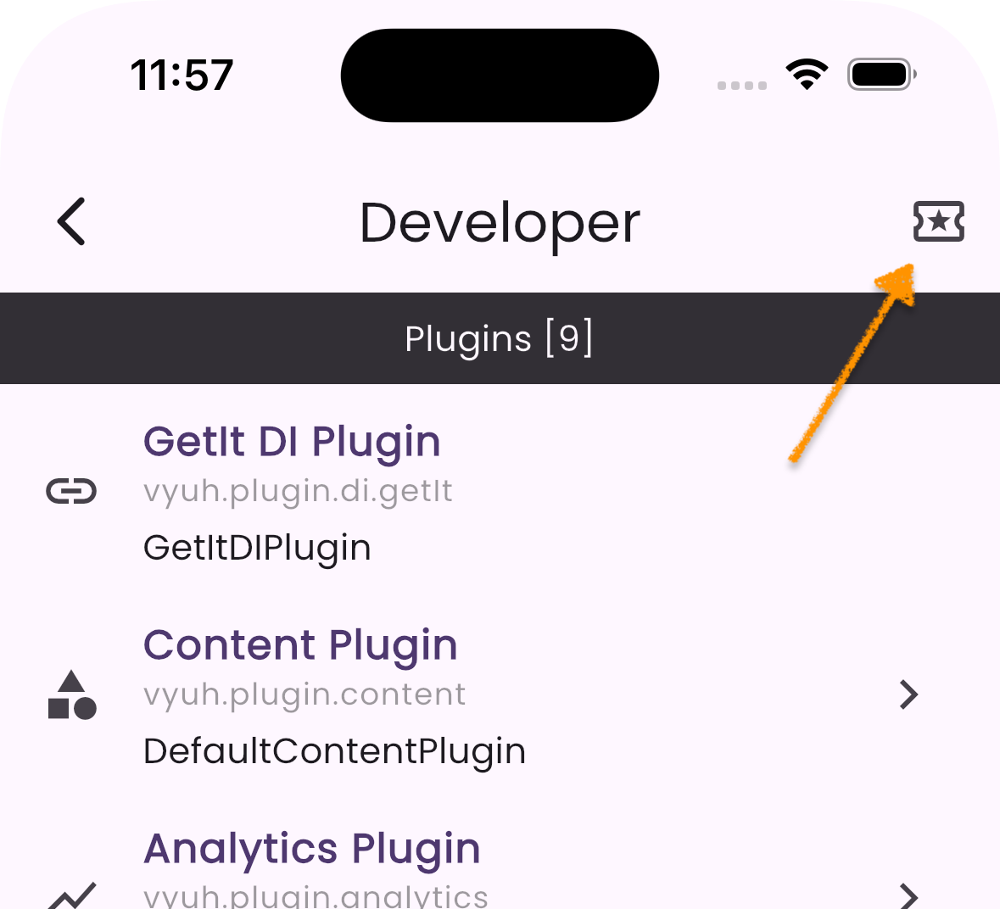

# Content Previews

The Preview feature is a powerful development tool in Vyuh that enables rapid
content and layout testing. Key aspects include:

- **Content Previews**: Generate sample content without needing actual CMS data
- **Layout Testing**: Visualize how layouts handle different content variations
- **Development Tools**: Use the Content Playground to experiment with content
  and layouts
- **Type Safety**: Maintain type safety while testing with preview data
- **Quick Iteration**: Rapidly test and refine layouts during development

## Implementing Previews

### Content Type Preview

Every content type in Vyuh can define a preview example. This is done through
the `preview` parameter in the `TypeDescriptor`:

```dart
static final typeDescriptor = TypeDescriptor(
  schemaType: 'vyuh.card',
  title: 'Card',
  fromJson: Card.fromJson,
  preview: () => Card(
    title: 'Title for the Card',
    description: 'A description for the card',
    imageUrl: Uri.parse('https://picsum.photos/300/200'),
  ),
);
```

### Layout Preview

Similarly, layouts can also define previews to demonstrate how they render
content.

**Default Layout:**

```dart
static final typeDescriptor = TypeDescriptor<LayoutConfiguration<Card>>(
  schemaType: 'vyuh.card.default',
  title: 'Default Card Layout',
  fromJson: DefaultCardLayout.fromJson,
  preview: () => DefaultCardLayout(
    title: 'Default',
    showImage: true,
    imageAspectRatio: 16 / 9,
  ),
);
```

**List Item Layout:**

```dart
static final typeDescriptor = TypeDescriptor<LayoutConfiguration<Card>>(
  schemaType: 'vyuh.card.list',
  title: 'List Item Layout',
  fromJson: ListItemCardLayout.fromJson,
  preview: () => ListItemCardLayout(
    title: 'List Item',
    showImage: true,
    compact: true,
  ),
);
```

## Using the Content Playground

Vyuh provides a Content Playground where you can:

1. Browse all available content types
2. View their different layout options
3. See how content looks with preview data

To access the playground:

1. Open your Vyuh app in development mode
2. Navigate to the Developer Tools section (hosted on the `/developer` route)
3. Select "Content Playground", which is available as an icon in the top-right
   corner of the Developer Tools main page



### Features of the Playground

- **Content Selection**: Browse and select from all registered content types
- **Layout Options**: Try different layouts for the selected content
- **Live Preview**: See immediate updates as you switch between layouts
- **Source Feature**: Identify which feature provides the chosen layout. Note
  that although a feature provides the `ContentItem`, the layouts can be
  provided by other features. This is one area of extensibility within Vyuh.

## Best Practices

1. **Representative Data**: Use realistic preview data that represents typical
   content
2. **Edge Cases**: Include previews that test layout behavior with:
   - Long text
   - Missing optional fields
   - Maximum content length
   - Different image aspect ratios
3. **Consistent Previews**: Keep preview data consistent across development to
   easily spot layout issues
4. **Documentation**: Use preview examples in your documentation to show
   intended usage

## Troubleshooting

If your previews are not working as expected:

1. **No Preview Shows**
   - Ensure the `preview` parameter is defined in your `TypeDescriptor`
   - Check that all required fields are included in the preview data

2. **Layout Issues**
   - Verify that the layout configuration matches the content type
   - Check if the layout handles null or optional fields correctly

3. **Performance Issues**
   - Keep preview data generation simple
   - Avoid heavy computations in preview callbacks
   - Use static assets instead of network resources when possible

## Summary

The Preview feature in Vyuh allows you to test and visualize your content
layouts during development. It provides a powerful tool for rapid content and
layout testing, ensuring that your layouts handle different content variations
efficiently.

By using realistic preview data and consistent previews, you can ensure a smooth
development experience and minimize the need for actual CMS content.
