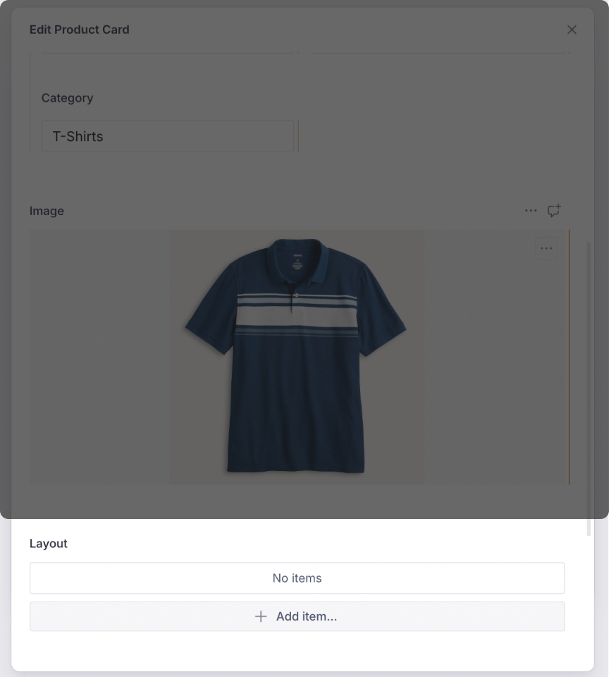

# Content Types

Real-world apps need a variety of content types and it is only natural that the
Vyuh Framework supports such a scenario. Extensibility is one of the primary
qualities of this framework and in this guide we will see how to introduce a new
_Custom Content Type_. We will add the schema on the CMS and build its
implementation on Flutter.

A quick summary of all the steps:

#### CMS Side

1. [Create a schema for the content type](#_1-a-product-card-content-type)
2. [Register it with the FeatureDescriptor](#exporting-it-in-the-featuredescriptor)
3. [Add a few instances of the new content type for testing](#creating-a-product-card-on-the-cms)

#### Dart/Flutter Side

1. [Create the Dart equivalent of the content type](#building-the-dart-equivalent-of-the-schema)
2. [Create its ContentBuilder with a default LayoutConfiguration](#rendering-with-a-layoutconfiguration)
3. [Register it with the FeatureDescriptor on the Dart side](#registering-the-product-content-type)
4. [See the cards rendered live on the screen](#_3-seeing-the-products-in-action)

## 1. A Product Card Content Type

Cards have become one of the most prominent types of visual metaphors for
real-world objects. Let us create a **Product Card** that stands for products
you would present to your customers. These could be products from Fashion,
Sports, Finance, Healthcare, or any other industry.

### Defining the Schema

The first step is to define a schema that represents a product. A typical
product would consist of the following properties: `title`, `description`,
`price`, `category`, `skuId`, and an `image`. The following schema captures all
of this in a Sanity schema:

```typescript
import { defineField, defineType } from 'sanity'
import { IoShirt as Icon } from 'react-icons/io5'

export const productCard = defineType({
  name: 'misc.productCard',
  title: 'Product Card',
  type: 'object',
  icon: Icon,
  fieldsets: [
    {
      name: 'name',
      title: 'Name',
      options: { columns: 2 },
    },
    {
      name: 'details',
      title: 'Product Details',
      options: { columns: 2 },
    },
  ],
  fields: [
    defineField({
      name: 'title',
      title: 'Title',
      type: 'string',
      validation: (Rule) => Rule.required(),
      fieldset: 'name',
    }),
    defineField({
      name: 'description',
      title: 'Description',
      type: 'text',
      rows: 4,
      validation: (Rule) => Rule.required(),
      fieldset: 'name',
    }),
    defineField({
      name: 'skuId',
      title: 'SKU Id',
      type: 'string',
      validation: (Rule) => Rule.required(),
      fieldset: 'details',
    }),
    defineField({
      name: 'price',
      title: 'Price',
      type: 'number',
      validation: (Rule) => Rule.required(),
      fieldset: 'details',
    }),
    defineField({
      name: 'category',
      title: 'Category',
      type: 'string',
      validation: (Rule) => Rule.required(),
      fieldset: 'details',
    }),
    defineField({
      name: 'image',
      title: 'Image',
      type: 'image',
    }),
  ],
  preview: {
    select: {
      title: 'title',
      price: 'price',
      category: 'category',
      skuId: 'skuId',
      image: 'image',
    },
    prepare(selection) {
      const { title, image, price, category, skuId } = selection
      return {
        title: `ProductCard | ${title} (${skuId})`,
        subtitle: `${category} - $${price}`,
        media: image,
      }
    },
  },
})
```

### Exporting it in the FeatureDescriptor

Export this schema for usage inside the CMS using the `FeatureDescriptor`.
Notice that we export it as a custom content within the
`contentSchemaBuilders` property and also add it to the `regionItems` of the
`RouteDescriptor`:

```typescript
import {
  BuiltContentSchemaBuilder,
  FeatureDescriptor,
} from '@vyuh/sanity-schema-core'
import { RouteDescriptor } from '@vyuh/sanity-schema-system'
import { productCard } from './content/product-card.ts'

export const misc = new FeatureDescriptor({
  name: 'misc',
  title: 'Miscellaneous',
  contents: [
    new RouteDescriptor({
      regionItems: [{ type: productCard.name }],
    }),
  ],
  contentSchemaBuilders: [
    new BuiltContentSchemaBuilder({
      schema: productCard,
      schemaType: productCard.name,
    }),
  ],
})
```

### Creating a Product Card on the CMS

Now that we have the schema defined, you can add products to your page in the
CMS. Since the _Product Card_ has been added to the route's region items, it
will appear in the list of content items for the Region.


After adding some of the details of the Product, we have the card ready to be
displayed on the app.


## 2. Rendering the Product Card

Having an item defined on the CMS is only half the story. To render it on
Flutter, we need to create its Dart equivalent. If we fail to do so, we will
be greeted with a message indicating the missing piece of the content definition.


### Building the Dart Equivalent of the Schema

The Dart version of the Product schema is the type-safe version of the JSON we
get from the CMS:

```dart
import 'package:json_annotation/json_annotation.dart';
import 'package:vyuh_core/vyuh_core.dart';
import 'package:vyuh_extension_content/vyuh_extension_content.dart';

part 'product_card.g.dart';

@JsonSerializable(createToJson: false)
final class ProductCard extends ContentItem {
  static const schemaName = 'misc.productCard';
  static final typeDescriptor = TypeDescriptor(
    schemaType: schemaName,
    title: 'Product Card',
    fromJson: ProductCard.fromJson,
  );

  static final contentBuilder = ContentBuilder<ProductCard>(
    content: ProductCard.typeDescriptor,
    defaultLayout: DefaultProductCardLayout(),
    defaultLayoutDescriptor: DefaultProductCardLayout.typeDescriptor,
  );

  final String title;
  final String description;
  final ImageReference? image;
  final double price;
  final String skuId;
  final String category;

  ProductCard({
    required this.title,
    required this.description,
    this.image,
    required this.price,
    required this.skuId,
    required this.category,
    super.layout,
  }) : super(schemaType: schemaName);

  factory ProductCard.fromJson(Map<String, dynamic> json) =>
      _$ProductCardFromJson(json);
}
```

Notice the static fields: **`schemaName`**, **`typeDescriptor`**, and the
**`contentBuilder`**. These are by convention a way of keeping the meta details
about the content item together. The `typeDescriptor` helps in defining the way
to hydrate a Dart version of the Product from its JSON equivalent. The
`contentBuilder` helps in creating the visual representation of the Product.

::: info
The `ProductCard`'s `ContentBuilder` is simple and does not rely on
`ContentDescriptor` at this point. More complex `ContentBuilder` instances will
also work with their corresponding `ContentDescriptor` elements to collect
configurations across features.
:::

### Rendering with a LayoutConfiguration

To render any `ContentItem`, we need a `LayoutConfiguration` that tells the
framework how to represent it in Flutter. A `ContentItem` can have multiple
`LayoutConfiguration` definitions and any feature can add more layouts for the
content type.

```dart
@JsonSerializable()
final class DefaultProductCardLayout extends LayoutConfiguration<ProductCard> {
  static const schemaName = '${ProductCard.schemaName}.layout.default';
  static final typeDescriptor = TypeDescriptor(
    schemaType: schemaName,
    title: 'ProductCard',
    fromJson: DefaultProductCardLayout.fromJson,
  );

  DefaultProductCardLayout() : super(schemaType: schemaName);

  factory DefaultProductCardLayout.fromJson(Map<String, dynamic> json) =>
      _$DefaultProductCardLayoutFromJson(json);

  @override
  Widget build(BuildContext context, ProductCard content) {
    final theme = Theme.of(context);

    return Card(
      clipBehavior: Clip.antiAlias,
      child: Padding(
        padding: const EdgeInsets.all(8.0),
        child: Row(
          children: [
            if (content.image != null)
              ContentImage(
                ref: content.image!,
                width: 200,
              ),
            Expanded(
              child: Column(
                crossAxisAlignment: CrossAxisAlignment.start,
                children: [
                  Text(content.category,
                      style: theme.textTheme.labelSmall),
                  Text(content.title,
                      style: theme.textTheme.titleMedium),
                  Padding(
                    padding: const EdgeInsets.symmetric(vertical: 8.0),
                    child: Text(content.description,
                        style: theme.textTheme.bodySmall),
                  ),
                  Text('\$${content.price}',
                      style: theme.textTheme.bodyMedium
                          ?.apply(fontWeightDelta: 2)),
                ],
              ),
            ),
          ],
        ),
      ),
    );
  }
}
```

::: tip Multiple Layouts
A `ContentItem` like _ProductCard_ can have one of many layouts applied to it.
This is configurable from the CMS, as shown with the highlighted _Layout_ field.
Each layout is a different configuration and can contain specific parameters to
tweak the visual representation.


:::

### Registering the Product Content Type

Just like on the CMS side, register this content type on Flutter using the
`FeatureDescriptor`:

```dart
final feature = FeatureDescriptor(
  name: 'misc',
  title: 'Misc',
  icon: Icons.miscellaneous_services_outlined,
  extensions: [
    ContentExtensionDescriptor(
      contentBuilders: [
        ProductCard.contentBuilder,
      ],
    ),
  ],
);
```

## 3. Seeing the Products in Action

With the schema on the CMS and its equivalent `ContentBuilder` created on
Flutter, you can now see it rendered in your app. It uses the default layout to
render the product as a simple `Card` widget.


## Summary

In this guide we described the process of adding a new content type within an
app. We started with the schema for the _ProductCard_ content type and
registered it with the `FeatureDescriptor` to be visible inside the CMS.

On the Dart/Flutter side we did an equivalent registration where we created the
`ProductCard` `ContentItem` type that knows how to deserialize the JSON schema.
Using the combination of a `ContentBuilder` for the Product type with a
`DefaultProductCardLayout` we could render the _ProductCard_ on the screen.

In this guide we created a single default layout. However, it is possible to
have several different layouts for the `ProductCard`. We cover creating
additional custom layouts in the guide on
[Layouts](/docs/guides/layouts).
