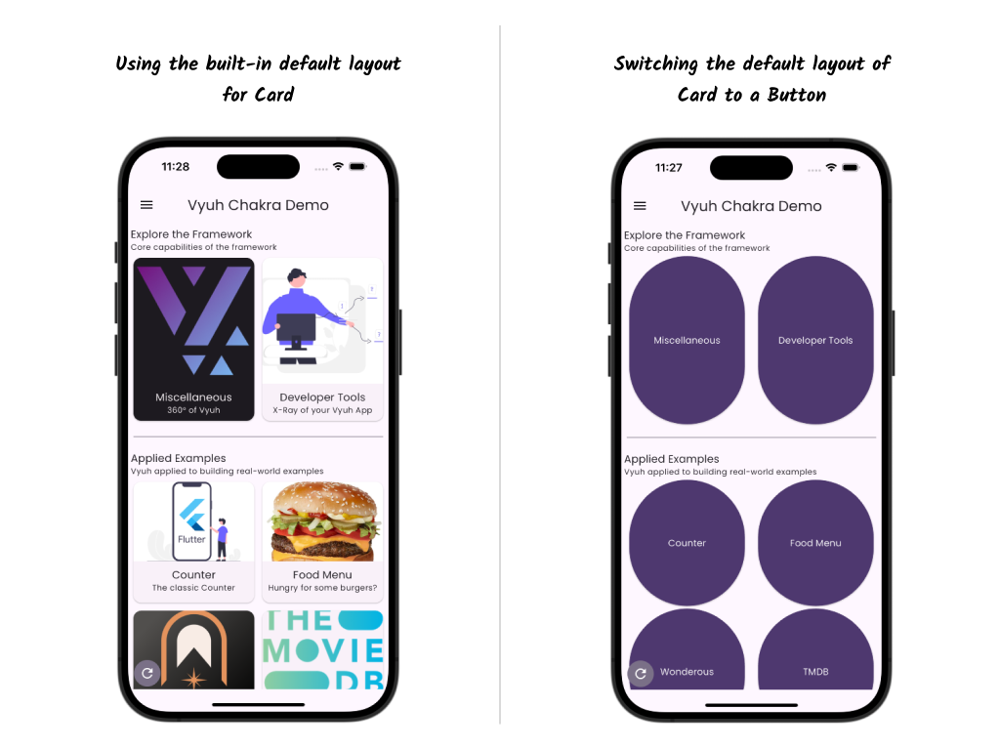

# Layouts

The default layouts that are normally used with a content item will rarely be
sufficient for all app scenarios. For example, the default `Card` layout that is
available out of the box is a good start but may not be applicable for all pages.
In some cases, you would want an enlarged view and in some cases a mini-view.

To cater to all of these scenarios, the Vyuh Framework allows extending a
content item with _additional layouts_. In fact, any feature can provide these
layouts, allowing even unrelated features to contribute to the overall list of
layouts for a content item.

## Creating a Custom Layout

In this guide, let us add a custom layout for the `ProductCard` item created in
the [Content Types](/docs/guides/content-types) guide. The default layout for
the `ProductCard` item looks like below.


### 1. Creating the Layout Schema

The schema for a mini-view layout configuration is simple. We will have a
boolean to control whether the `category` should be shown:

```typescript
export const productMiniViewLayout = defineType({
  name: `${ProductCardDescriptor.schemaType}.layout.miniView`,
  title: 'Mini View',
  type: 'object',
  fields: [
    defineField({
      name: 'showCategory',
      title: 'Show Category',
      type: 'boolean',
      initialValue: true,
    }),
  ],
  preview: {
    select: {
      showCategory: 'showCategory',
    },
    prepare(selection) {
      return {
        title: 'Mini View',
        subtitle: `Show Category: ${selection.showCategory ?? false}`,
      }
    },
  },
})
```

::: info ContentDescriptor and ContentSchemaBuilder
A **`ContentDescriptor`** allows extending the capabilities of a `ContentItem`
such as layouts and other types of custom configuration. An associated
**`ContentSchemaBuilder`** for the content item collects all its descriptors and
uses that to build the final set of configurations for the `ContentItem`. This
assembly by the builder is also necessary to create the final _master_ schema
for the CMS.
:::

### 2. Exporting in the FeatureDescriptor (CMS)

Export the layout in the `FeatureDescriptor`:

```typescript
export const misc = new FeatureDescriptor({
  name: 'misc',
  title: 'Miscellaneous',
  contents: [
    new RouteDescriptor({
      regionItems: [{ type: ProductCardDescriptor.schemaType }],
    }),
    new ProductCardDescriptor({
      layouts: [
        defaultLayoutConfiguration(ProductCardDescriptor.schemaType),
        productCardMiniViewLayout,
      ],
    }),
  ],
  contentSchemaBuilders: [new ProductCardContentBuilder()],
})
```

::: tip
The **`defaultLayoutConfiguration`** is a convenience method that creates a
schema for a default layout. It uses the schemaType of the content as a prefix.
For the `ProductCard`, it would be **`misc.productCard.layout.default`**.
:::

Now we have an option to choose this layout when creating the Product item in
the CMS:


### 3. Creating the Dart LayoutConfiguration

The Dart counterpart for the layout is a type-safe version of the JSON schema:

```dart
@JsonSerializable()
final class MiniViewProductCardLayout
    extends LayoutConfiguration<ProductCard> {
  static const schemaName = '${ProductCard.schemaName}.layout.miniView';
  static final typeDescriptor = TypeDescriptor(
    schemaType: schemaName,
    title: 'Mini View Layout',
    fromJson: MiniViewProductCardLayout.fromJson,
  );

  final bool showCategory;

  MiniViewProductCardLayout({this.showCategory = true})
      : super(schemaType: schemaName);

  factory MiniViewProductCardLayout.fromJson(Map<String, dynamic> json) =>
      _$MiniViewProductCardLayoutFromJson(json);

  @override
  Widget build(BuildContext context, ProductCard content) {
    final theme = Theme.of(context);

    return Card(
      clipBehavior: Clip.antiAlias,
      child: Padding(
        padding: const EdgeInsets.all(8.0),
        child: Row(
          children: [
            if (content.image != null)
              ContentImage(ref: content.image!, width: 64),
            Expanded(
              child: Column(
                crossAxisAlignment: CrossAxisAlignment.start,
                children: [
                  if (showCategory)
                    Text(content.category,
                        style: theme.textTheme.labelSmall),
                  Text(content.title,
                      style: theme.textTheme.titleMedium),
                  Text('\$${content.price}',
                      style: theme.textTheme.bodyMedium
                          ?.apply(fontWeightDelta: 2)),
                ],
              ),
            ),
          ],
        ),
      ),
    );
  }
}
```

### 4. Exporting in the Flutter Feature

Include the layout in the `FeatureDescriptor` via the `ProductCardDescriptor`:

```dart
final feature = FeatureDescriptor(
  name: 'misc',
  title: 'Misc',
  icon: Icons.miscellaneous_services_outlined,
  extensions: [
    ContentExtensionDescriptor(
      contents: [
        ProductCardDescriptor(layouts: [
          DefaultProductCardLayout.typeDescriptor,
          MiniViewProductCardLayout.typeDescriptor,
        ]),
      ],
      contentBuilders: [
        ProductCard.contentBuilder,
      ],
    ),
  ],
);
```

By simply changing the layout on the CMS, you can affect the change on the app
without any special deployment. Below you can see two product cards, each
rendered with the mini and default layouts.


## Default Layouts

Every content item inside the Vyuh Framework comes with a **default layout**.
When you register a content item with the content builder, you specify this
default layout. It is used when none is specified on the CMS.

```dart
static final contentBuilder = ContentBuilder<ProductCard>(
  content: ProductCard.typeDescriptor,
  defaultLayout: DefaultProductCardLayout(),
  defaultLayoutDescriptor: DefaultProductCardLayout.typeDescriptor,
);
```

### Overriding Default Layouts

If you are building your own design system, most content items (including
standard content items) may have a completely different appearance. Instead of
explicitly setting this layout on the CMS for every item, you can change the
default layouts programmatically.

You can do this inside your feature `init()` by listening to the
`SystemReadyEvent` and swapping out all the default layouts:

```dart
final feature = FeatureDescriptor(
  name: 'root',
  title: 'Vyuh Root Feature',
  init: () async {
    vyuh.event.once<SystemReadyEvent>((event) {
      vyuh.content.setDefaultLayout(
        schemaType: Card.schemaName,
        layout: ButtonCardLayout(),
        fromJson: ButtonCardLayout.fromJson,
      );
    });
  },
  routes: () => [
    GoRoute(path: '/chakra', pageBuilder: defaultRoutePageBuilder),
  ],
);
```

::: tip
In a typical application you may swap out several such layouts for the standard
content items. It is a good practice to move all these calls to a separate file
(e.g., `default_layouts_override.dart`) and invoke it from the feature `init()`.
:::

Default layouts can be changed with the `vyuh.content.setDefaultLayout()` method.



## Summary

This guide showed you how to create multiple layouts for a `ContentItem` and how
to manage default layouts. By simply changing the layout on the CMS, you can
affect how content renders in the app without any code deployment. Under
different contexts, different layouts are useful, and this capability is now
available to you as you build more complex applications.
