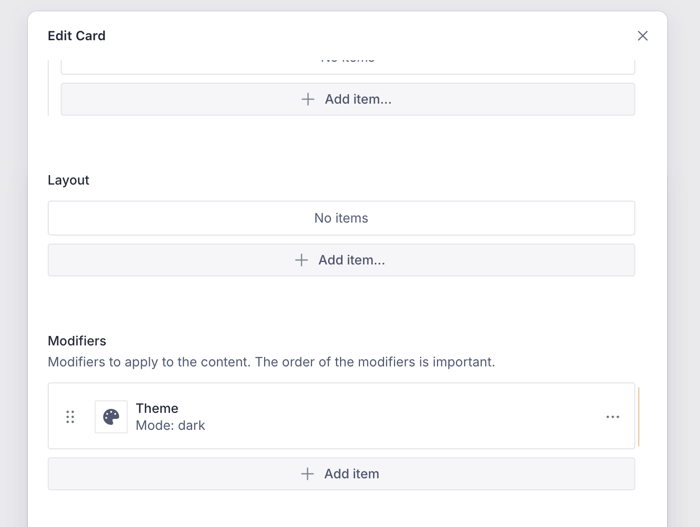

# Modifiers

We have seen earlier that custom layouts can be used to modify the appearance of
a content item. You can create several layouts, exposed by different features
across the application.

That is great for creating different layouts, but what if you want to apply the
same visual behavior across all instances of a content item? That is where
**modifiers** come in.

`Modifiers` allow you to attach a visual behavior to every instance of a content
item, and you can configure that from the CMS with the corresponding
implementation in Flutter.

## Chain of Modifiers

Unlike layouts, there can be multiple modifiers for a content item. These can be
applied as a chain with each modifier getting the output of the previous
modifier.


The input to the modifier is the output of the _layout_ for the content item,
which is a `Widget`. Each modifier can modify the `Widget` and pass it on to the
next modifier in the chain. The output of the last modifier is the final
`Widget` that is rendered on the screen.

::: tip Creative Combination
You can combine Modifiers, Dependency Injection, and Layouts to
create sophisticated visual structures for your content items. The modifiers can
construct a tree that leverages state management via DI, `InheritedWidget`s,
custom layouts, and other Flutter features.
:::

## Implementing a Custom ThemeModifier

Flutter allows us to change the themes of certain widget trees by using a
`Theme` widget at the right places. This is the perfect use case for a modifier
that can wrap the layout widget for the content item with a Theme widget.

```dart
@JsonSerializable()
final class ThemeModifier extends ContentModifierConfiguration {
  static const schemaName = 'vyuh.content.modifier.theme';

  static final typeDescriptor = TypeDescriptor(
    fromJson: ThemeModifier.fromJson,
    schemaType: schemaName,
    title: 'Theme Modifier',
  );

  final ThemeMode mode;

  ThemeModifier({this.mode = ThemeMode.light})
      : super(schemaType: schemaName);

  factory ThemeModifier.fromJson(Map<String, dynamic> json) =>
      _$ThemeModifierFromJson(json);

  @override
  Widget build(BuildContext context, Widget child, ContentItem content) {
    final service = vyuh.di.get<ThemeService>();
    final themeData = service.theme(mode);

    return themeData != null
        ? Theme(data: themeData, child: child)
        : child;
  }
}
```

This modifier takes a `ThemeMode` as input and wraps the child widget with a
`Theme` widget. It leverages Dependency Injection to fetch the `ThemeService`
that provides the `ThemeData` object.

## CMS Configuration

On the CMS side, configure the theme modifier with the available modes:

```typescript
import { defineType } from 'sanity'
import { FaPalette as Icon } from 'react-icons/fa6'

export const themeModifier = defineType({
  name: 'vyuh.content.modifier.theme',
  type: 'object',
  title: 'Theme',
  icon: Icon,
  fields: [
    {
      name: 'mode',
      title: 'Mode',
      type: 'string',
      initialValue: 'light',
      options: {
        list: [
          { title: 'Light', value: 'light' },
          { title: 'Dark', value: 'dark' },
          { title: 'System', value: 'system' },
        ],
      },
    },
  ],
})
```

Include this in the CMS `FeatureDescriptor`:

```typescript
export const system = new FeatureDescriptor({
  name: 'system',
  title: 'System',
  contentModifiers: [themeModifier],
})
```

## Flutter Configuration

On the Flutter side, include the modifier in the `FeatureDescriptor`:

```dart
final feature = FeatureDescriptor(
  name: 'system',
  title: 'System',
  icon: Icons.hub,
  init: () async {
    vyuh.di.register(ThemeService());
  },
  extensions: [
    ContentExtensionDescriptor(
      contentModifiers: [
        ThemeModifier.typeDescriptor,
      ],
    ),
  ],
);
```

## In Action

You can see the configuration for the `ThemeModifier` in the CMS. In this case,
we are changing the theme of a `Card` to a dark theme.



While the rest of the app might be using a light theme, this content item will
always render with a dark theme.


## Summary

Modifiers are a powerful way to apply a visual behavior to a content item. They
can be chained together to create a rich visual experience. You can use them to
apply a theme, localization, or any other visual behavior.

Modifiers can be configured from the CMS and applied to content items in
Flutter, which reduces the amount of custom widget code you need to write.
