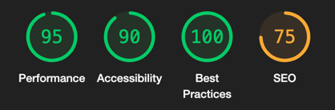

import { LinkCard, Tabs, TabItem, Aside } from '@astrojs/starlight/components'

We're excited to announce the release of **Vyuh for React** - bringing the
powerful CMS-driven approach of the Vyuh framework to the React ecosystem!

## Vyuh Expands Beyond Flutter

While Vyuh has been transforming how developers build Flutter applications with
headless CMS integrations, we've heard from many of you who wanted to bring this
same approach to your React projects. Today, we're thrilled to deliver exactly
that.

Vyuh for React provides the same core benefits that made the Flutter version so
powerful:

- **CMS-driven UI development** - connect your React apps to Sanity.io and other
  headless CMS platforms
- **Dynamic content updates** without code changes or redeployments
- **Modular architecture** for building scalable applications with composable
  features and standardized plugins.
- **Live content editing** for real-time preview of CMS changes

## Getting Started

Adding Vyuh to your React project is straightforward with your favorite package
manager. We need the following packages:

- `@vyuh/react-core`: Core package for Vyuh React
- `@vyuh/react-extension-content`: Extension for working with CMS content
- `@vyuh/react-feature-system`: Core feature for working with a CMS
- `@vyuh/react-plugin-content-provider-sanity`: Content provider for Sanity.io

<Tabs>
  <TabItem label="pnpm">

    ```bash
    pnpm add @vyuh/react-core @vyuh/react-extension-content @vyuh/react-feature-system @vyuh/react-plugin-content-provider-sanity
    ```

  </TabItem>
  <TabItem label="npm">

    ```bash
    npm install @vyuh/react-core @vyuh/react-extension-content @vyuh/react-feature-system @vyuh/react-plugin-content-provider-sanity

    ```

  </TabItem>
  <TabItem label="yarn">

    ```bash
    yarn add @vyuh/react-core @vyuh/react-extension-content @vyuh/react-feature-system @vyuh/react-plugin-content-provider-sanity

    ```

  </TabItem>
</Tabs>

Then integrate it with your React application. The connection to the CMS is
handled by the `SanityContentProvider` via the `DefaultContentPlugin`.

```tsx
import { PluginDescriptor, VyuhProvider } from '@vyuh/react-core'
import {
  RouteLoader,
  DefaultContentPlugin,
} from '@vyuh/react-extension-content'
import { SanityContentProvider } from '@vyuh/react-plugin-content-provider-sanity'
import { system } from '@vyuh/react-feature-system'
import { shop } from './features/shop'

/**
 * Plugin configuration
 */
const plugins = new PluginDescriptor({
  content: new DefaultContentPlugin(
    new SanityContentProvider({
      projectId: '<your-project-id>',
      dataset: 'production',
      perspective: 'drafts',
      useCdn: false,
      token: '<your-token>',
    }),
  ),
})

const getFeatures = () => [system, shop]

function App() {
  return (
    <VyuhProvider features={getFeatures} plugins={plugins}>
      <YourAppComponent />
    </VyuhProvider>
  )
}

// For rendering CMS-driven pages
function ProductsPage() {
  return <RouteLoader path="/products" live={true} />
}
```

Notice the use of the `RouteLoader` component that allows you to load a document
at a `path`. You can also pass it the `live` property and make this route
automatically update whenever there are changes to that particular document.

> #### Note for Next.js users
>
> If you're using Vyuh with Next.js, you can integrate it into your pages or app
> router:
>
> ```tsx
> // pages/products.tsx or app/products/page.tsx
> import { RouteLoader } from '@vyuh/react-extension-content'
>
> export default function ProductsPage() {
>   return <RouteLoader path="/products" />
> }
> ```
>
> Make sure to wrap your Next.js app with the `VyuhProvider` in your `_app.tsx`
> or root layout component.

## Vyuh + Sanity


Vyuh for React is designed to work seamlessly with
[Sanity.io](https://sanity.io), our preferred CMS platform. Sanity provides a
powerful and flexible content management system that integrates well with Vyuh's
CMS-driven approach.

<Aside title={'App Fundamentals'} type={'note'}>
All the fundamentals of building large React apps are covered by the framework,
including essential performance optimizations, security measures, and best
practices. These can be seen by the lighthouse scores of the demo app, where we
are rendering content-rich pages from the CMS:



> The SEO scores are low because we haven't done any setup for the meta headers.

</Aside>

## Documentation

For comprehensive documentation on using Vyuh with React, check out our new
React-specific guides:

<LinkCard href="/react/intro/get-started" title="React Getting Started Guide" />

## What's Next?

This is just the beginning for Vyuh React. We're working on bringing more
features from the Flutter version to React, including:

- Enhanced developer tools for React
- More pre-built components, plugins and templates
- Additional CMS integrations

We're excited to see what you build with Vyuh for React! Share your projects
with us on [GitHub](https://github.com/vyuh-tech/vyuh) or join our
[Discord community](https://discord.gg/b49sbjqszG) to connect with other Vyuh
developers.
