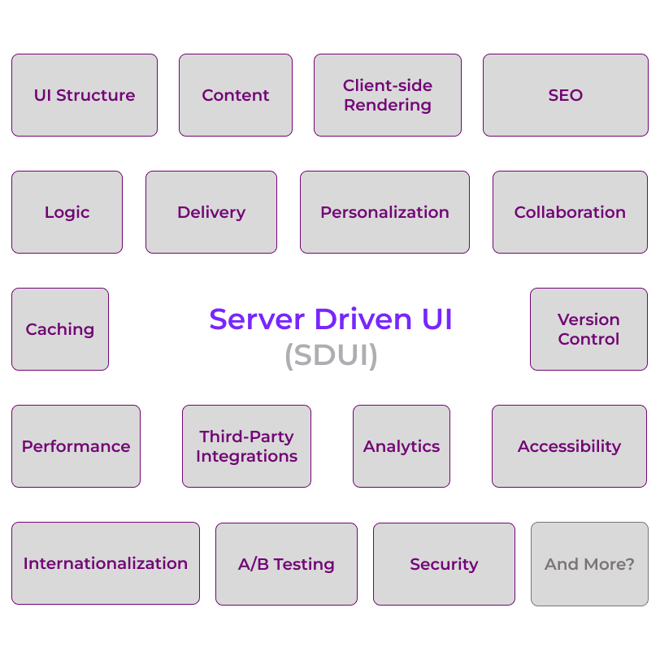
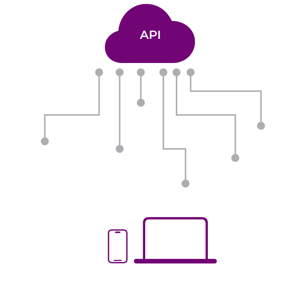
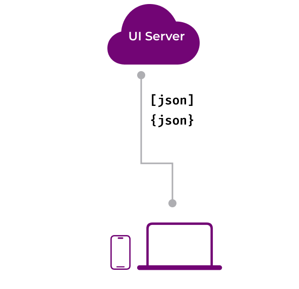
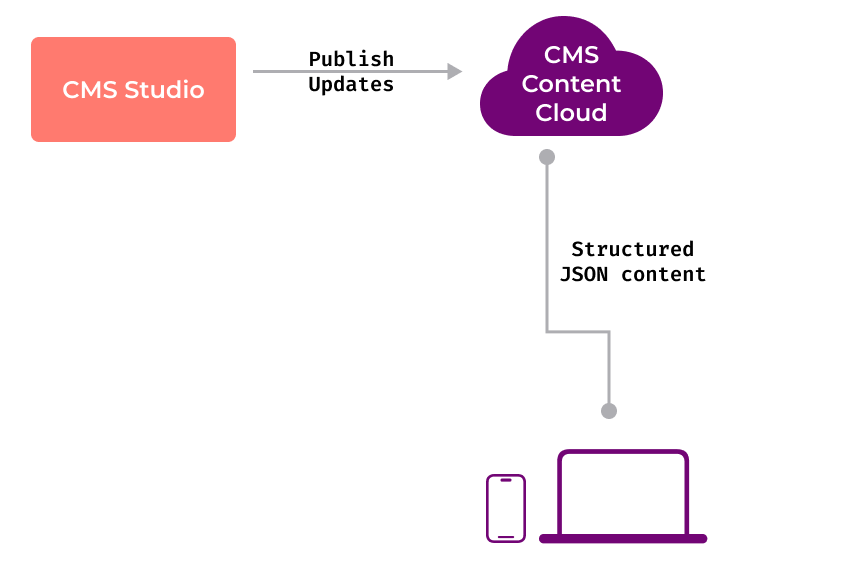
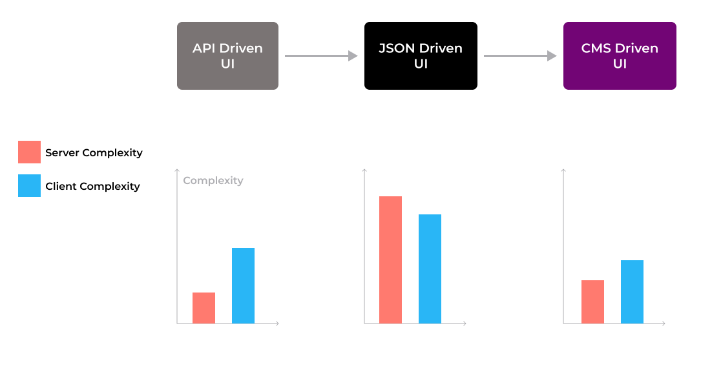

Server-Driven UI is an approach to building user interfaces where the server
controls the UI structure and content, allowing for dynamic updates without
requiring app releases. This approach decouples the UI logic from the client,
enabling greater flexibility, scalability, and maintainability.

## The Building Blocks of Server-Driven UI

Most of us seem to focus heavily on the fact that you could render the UI
directly from the server. But there are lot more considerations to look at when
creating a server-driven UI experience.

Let's dive into some of the key components that are involved over here:

- **UI Structure:** The server defines the structure of the UI, including
  components, layouts, and styles.
- **Content:** The server provides the content to be displayed in the UI, such
  as text, images, and media and also more complex content such as products,
  themes, pages, navigation, etc.
- **Logic:** The server can also control the behavior and interactions of the
  UI, enabling dynamic updates and personalized experiences. This can also
  include conditional control over the UI elements.
- **Delivery:** The UI structure, content, and logic are delivered to the client
  over the network, typically using JSON or other data formats.
- **Rendering:** The client renders the UI based on the data received from the
  server, dynamically updating the display as needed.
- **Caching:** To improve performance, the server can cache UI data and deliver
  it efficiently to the client, reducing latency and bandwidth usage.
- **Personalization:** By customizing the UI based on user data and preferences,
  the server can deliver personalized experiences that enhance engagement and
  satisfaction.
- **Analytics:** The server can track user interactions and behavior, providing
  valuable insights for optimization and improvement. This is a combination of
  client-side and server-side analytics.
- **A/B Testing:** By serving different UI variants to different users, the
  server can test and compare different designs, layouts, and content to
  determine the most effective approach.
- **Internationalization:** The server can deliver localized content and UI
  elements based on the user's language, region, or other preferences, enabling
  global reach and accessibility.
- **Accessibility:** By ensuring that the UI is accessible to users with
  disabilities, the server can improve usability and compliance with standards.
- **SEO:** By optimizing the UI for search engines, the server can improve
  visibility and ranking in search results, driving traffic and engagement.
- **Collaboration:** Server-Driven UI enables collaboration between designers,
  developers, content creators, and other stakeholders, streamlining the
  workflow and improving efficiency. There is a lot to be said about the overall
  **developer experience** of working with a Server-Driven UI.
- **Integration:** By integrating with third-party services and APIs, the server
  can enhance the UI with additional features, data, and functionality,
  expanding the capabilities of the application.
- **Version Control:** By managing UI data and configurations in a
  version-controlled system, the server can track changes, roll back to previous
  states, and ensure consistency and reliability.
- **Security:** By securing the UI data and communications, the server can
  protect against unauthorized access, data breaches, and other security
  threats, ensuring the integrity and confidentiality of the application.
- **Performance:** By optimizing the delivery, rendering, and caching of UI
  data, the server can improve performance, responsiveness, and scalability,
  providing a fast and reliable user experience.

> As you can tell, there are many building blocks required in creating a true
> Server-Driven UI experience. And it's not just about transferring serialized
> UI from the server to client.

## The Evolution of Server-Driven UI

Server-Driven UI has evolved through several stages, each building on the
previous approach:

### 1. API-Driven UI

In this approach, the server provides data through APIs, but the UI structure is
hardcoded in the client.

**Pros:**

- Simple to implement
- Full control over UI on client side
- Fast initial development

**Cons:**

- UI updates require app releases
- Limited flexibility for dynamic changes
- Tight coupling between client and server

### 2. JSON-Serialized UI

Here, the server sends both data and UI structure as JSON, which the client
renders dynamically.

**Pros:**

- Dynamic UI updates without app releases
- More flexible than API-driven approach
- Single source of truth for UI structure

**Cons:**

- More complex implementation
- Requires robust client-side rendering engine
- Potential performance overhead
- Tight coupling between client and server as the client can only understand
  specific JSON structures
- Very limited forms of extensibility by default
- Limited support for non-technical users. Editing the UI on the server side can
  be very cumbersome without proper tooling.
- No type-safety guarantees as JSON is untyped. Requires additional validation
  and error handling on the client side.
- Potential security vulnerabilities due to untrusted JSON data. Requires
  careful validation and sanitization on the client side.

### 3. CMS-Driven UI

The most advanced approach where a CMS manages both content and UI structure,
providing complete control to non-technical users. At the same time, it also
allows sophisticated control to the Engineering teams to manage the UI
implementation.

**Pros:**

- Complete separation of concerns
- Non-technical users can manage UI
- Maximum flexibility and customization
- Powerful source-of-truth for rendering experiences on all screens
- Schema-driven Type-safe UI definitions
- Enhanced security through trusted CMS
- Improved performance through optimized delivery
- Reduced development time and costs
- Easier A/B testing and personalization
- Better support for internationalization and localization
- Enhanced analytics and tracking capabilities
- Improved collaboration between teams
- Easier integration with third-party services
- Enhanced version control and rollback capabilities
- Improved caching and CDN support

**Cons:**

- Requires creating a holistic framework that can render the UI based on the CMS
  data.
- Requires integration with a headless CMS such as
  [Sanity.io](https://www.sanity.io/), [Strapi](https://strapi.io/),
  [Payload](https://payloadcms.com/), [Contentful](https://www.contentful.com/)
  or similar ones.
- Some learning curve for non-technical users to understand the CMS interface.

## Visualizing the Progression

The evolution of Server-Driven UI can be visualized as a spectrum, with
API-Driven UI at one end and CMS-Driven UI at the other.

Looking at the progression images, we can see how the architectural complexity
evolves across different approaches:

### API-Driven UI Complexity

In the API-driven approach, the architecture is relatively straightforward. The
server simply provides data endpoints, while the client handles all UI rendering
logic. This simplicity comes at the cost of flexibility - any UI changes require
client updates and app releases.

### JSON-Driven UI's Hidden Complexity

The JSON-driven approach appears deceptively simple at first glance, but
introduces significant complexity:

1. **Client-Side Complexity:**

- Need to build a robust UI rendering engine that can interpret JSON structures
- Complex type validation and error handling for untyped JSON data
- Security considerations for untrusted JSON parsing
- Performance optimization for dynamic rendering
- Complex state management for UI updates

2. **Server-Side Complexity:**

- Maintaining JSON schema consistency
- Version management for UI definitions
- Limited tooling for UI editing
- Complex deployment process for UI changes

3. **Development Workflow:**

- Difficult collaboration between teams
- Manual testing required for UI changes
- Complex debugging process
- Limited ability to preview changes

### CMS-Driven UI's Modern Simplicity

While CMS-driven UI might seem more complex initially, modern headless CMS
systems like Sanity.io actually reduce overall complexity:

1. **Reduced Development Complexity:**

- Schema-driven development with type safety
- Built-in validation and error handling
- Sophisticated content modeling tools
- Real-time preview capabilities
- Robust version control and rollback

2. **Improved Workflow:**

- Visual editing interface for non-technical users
- Structured content modeling
- Built-in collaboration tools
- Automated deployment workflows
- Integrated preview environments

3. **Sanity.io Advantages:**

- GROQ query language for flexible content querying
- Real-time content updates
- Powerful customization capabilities
- Extensive plugin ecosystem
- Built-in image optimization
- Global CDN for content delivery
- Robust security and access controls

The maturity of modern headless CMS systems has transformed what was once a
complex architectural choice into a streamlined solution. While JSON-driven UI
requires building and maintaining many systems from scratch, CMS-driven UI
leverages battle-tested platforms that handle the complexity for you. This is
particularly evident when using systems like Sanity.io, which provide:

- **Developer Experience:** Type-safe schemas, modern tooling, and extensive
  documentation
- **Content Editor Experience:** Intuitive interfaces, real-time collaboration,
  and powerful customization
- **Operations:** Automated deployments, CDN integration, and robust security
- **Scalability:** Enterprise-grade infrastructure without the maintenance
  burden

This explains why, despite the apparent initial complexity, CMS-driven UI often
results in lower long-term complexity and better maintainability compared to
JSON-driven approaches.

## Why Vyuh Chose CMS-Driven UI

At Vyuh, we believe that the future of Server-Driven UI lies in CMS-driven
architectures. By leveraging modern headless CMS systems like **Sanity.io**, we
can provide a powerful, flexible, and scalable solution that meets the needs of
developers, content creators, and end-users alike.

Also our choice of **Flutter** as the Cross Platform UI toolkit is a perfect
match for the CMS-Driven UI approach. Flutter provides a robust framework for
building dynamic, responsive, and beautiful user interfaces, while Sanity.io
enables content creators to manage and update content with ease.

By combining these technologies, we can deliver a seamless Server-Driven UI
experience that empowers teams to collaborate, iterate, and innovate faster than
ever before.

To learn more about implementing Server-Driven UI with Vyuh, check out our
comprehensive documentation at [docs.vyuh.tech](https://docs.vyuh.tech).
