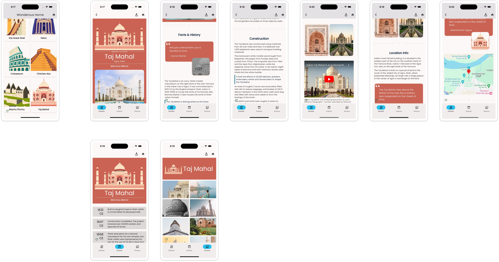
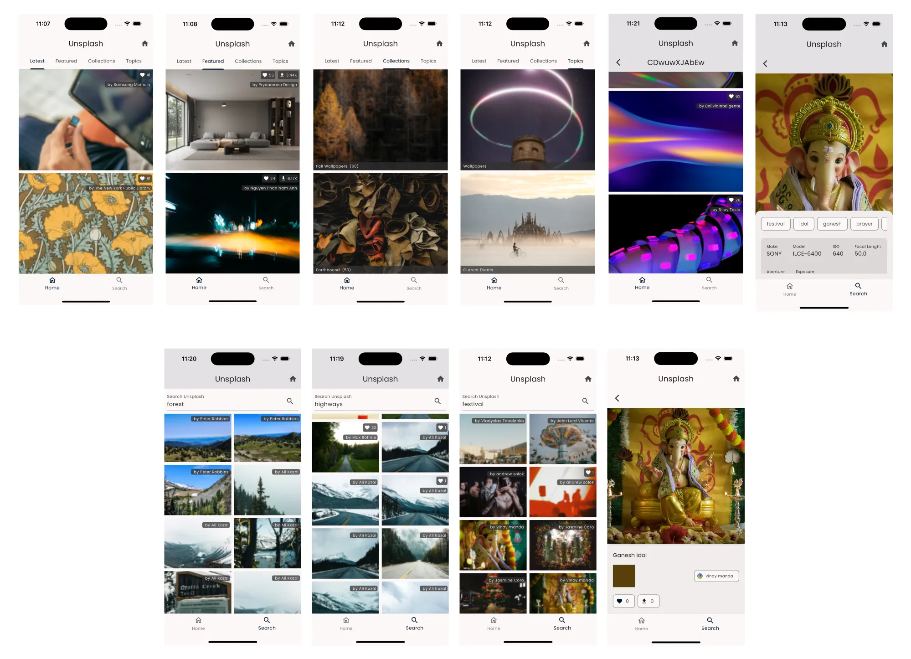

import { LinkCard } from '@astrojs/starlight/components'

## Wonderous

We have published a detailed walkthrough of how the Wonderous App was put
together using the Vyuh Framework.

<LinkCard href="/examples/wonderous" title="Read the Wonderous Walkthrough" />

These set of articles give the visual breakdown, the use of schemas and how they
are rendered in the framework. For those of you already using Vyuh, it should
give some interesting ideas of composing content and rendering it with
flexibility built in.

## Unsplash

A similar breakdown has also been done for the Unsplash Feature, which
interestingly does not use a CMS at all for its journeys.

<LinkCard href="/examples/unsplash" title="Read the Unsplash Walkthrough" />
