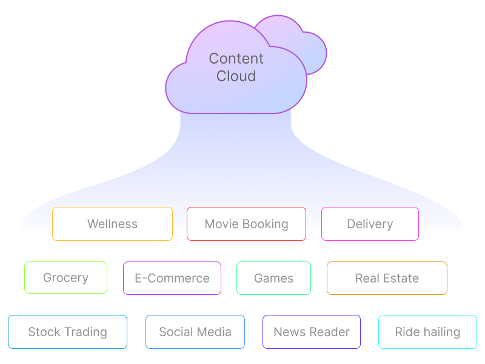
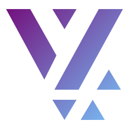
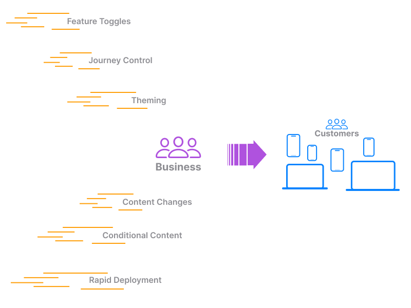

Apps today are heavily content-driven. If you take a quick scan of the apps
installed on your phone, you will see that they are all powered by content
sitting on the cloud.

A small sampling of your installed apps could be:

- Social Media app
- News Reader
- E-Commerce app
- Ride hailing app
- Grocery app
- Instant Delivery app
- Movie booking app
- Wellness app
- Real Estate app
- Stock trading app
- Games
- etc.

Most of the app content could be sitting remotely and downloaded on the fly. In
some cases, the navigation, page content and visibility of information is
controlled by factors such as your subscription tier, login status, past order
history, etc. These Apps are very dynamic and will morph as per external
factors, customer profile and availability of new features.

#### Need of the hour

Businesses today want to retain such dynamic control over the content and in
some cases automate with AI-powered recommendations. Building apps where you can
give that control to the business could be a crucial game changer. This means
the app must have a set of capabilities that become non-negotiable:

- Ability to control navigation remotely
- Ability to control page content remotely
- Ability to conditionally show content based on some runtime condition
- Change themes remotely
- Control visibility of some feature with feature-toggles
- Give teams the ability to independently build features
- Have a simplified No-Code like interface to control the App Experience
  remotely
- Try different design variations of a Content Block or Page without having to
  rebuild a new App
- Explore different API integrations quickly

Several companies have attempted this in the past and have created proprietary
solutions. Some have focused heavily on the UI design process and made that into
a _no-code experience_. Some make use of Generative-AI solutions for designing
screens. However, adding more complex business functions, conditional checks and
complex logic requires taking a different route. This is where the No-Code
experience falls short and teams resort to going back to their IDE and building
it out in code.

#### A New framework

Building apps for the Content-Driven age requires a ground-up rethink of how
apps should be put together. The **Vyuh Framework** takes a holistic view of
this process and brings a set of techniques that make app development an easier
process with the ability to control things remotely.

It gives the **No-Code** control to the Business teams and **Full-Code** control
to the Engineering. This is a good balance and achieves having best of both
worlds. Businesses get a simplified interface to manage pages, navigation,
feature-toggles, with a gallery of components that expose minimal configuration.

The complexity of the components are hidden away neatly in code by the
Engineering teams. They only expose the minimal configuration that should be
made visible to the Business. In this process, both Business and Engineering can
each have their tools of choice, without compromise.

**Hidden powers**

This combo is a hidden superpower that can propel an Enterprise into a new world
with greater flexibility and control. It does mean shifting the mindset towards
minimal configuration and being very deliberate about it. There is also a
stronger push needed to hide complexity where not required. The teams are all
trying to power the Enterprise towards success and doing that requires
absolutely no compromise in tooling.

When Business and Engineering teams work together in a collaborative manner,
with high velocity, the Enterprise stands to benefit and so does the end
Customer! The tools that the Enterprise adopts has a direct bearing on such an
outcome.

The Vyuh Framework is one such super-power that can change the way Apps are
built for the Content Age.

> Best teams use the best tools to get the right outcomes.
