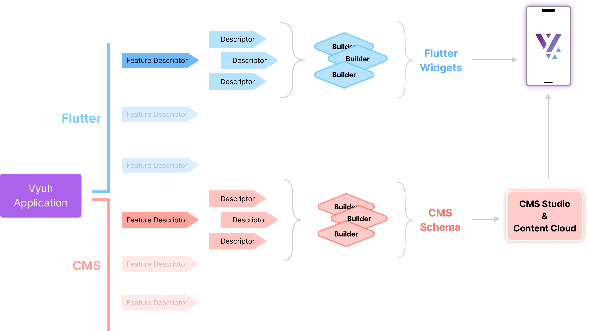

The Vyuh framework is an extensible framework for building large scale apps
using a CMS (or some content-source) for driving the experience. It is not
mandatory to use a CMS, but eventually you will find it useful to have it in
your toolkit. It can fast track the development and deployment of your
application.

To provide an extensible surface, there are two concepts that you will see time
and again: `Descriptors` and `Builders`. Let's understand why are they required
and what purpose they serve.

You already know that a Vyuh-enabled app is a collection of features. Each
feature is an independent logical unit of functionality that exposes a set of
components and routes. When not using a CMS, the **routes** are good enough to
stitch together the journeys. However, the real power comes in using a CMS to
drive the entire experience.

### Harvesting Content

Content in the world of a CMS has two counterparts. One sitting on the CMS where
it gets exposed as a block that is used by the CMS Studio. The other is the
Flutter side Widget that renders this content. The connecting glue is the
_framework_ that converts the JSON schema from the CMS into a Flutter Widget.

#### Descriptors

Since an app can have lots of features, there has to be a way to describe the
feature's content for the framework to understand and render. A _descriptor_ in
the most general sense is a way to _describe this content_. Common descriptors
include the `FeatureDescriptor` (describes the feature), the `ContentDescriptor`
(describes the content), the `ExtensionDescriptor` (describes extensions in the
framework), etc.

Every feature describes its contribution to the app using a `FeatureDescriptor`
and the content using the `ContentDescriptor`. Descriptors are content specific
as there could be several properties that are specific to the content you are
describing.

> Descriptors are used to describe the `schemas` for the CMS and also have a
> counterpart in Flutter. The Flutter side is mostly a converter from the JSON
> schema of the content to a `Widget`.

#### Builders

Describing the feature is just one half of the story. The other half is about
collecting all these descriptors across all features and _assembling an App_
from them. This is where the `Builder` comes into play. A `Builder` is a class
that works with a specific descriptor and collects it across all features. For
example, for every `ContentDescriptor`, there is a corresponding
`ContentBuilder` that collects all the descriptors and assembles it. The
descriptors and builders are _type-safe_ to ensure they work together correctly.

Ultimately, the framework works with the various builders to render the content
at runtime. In fact, if you are guessing there would be some kind of `build()`
method inside the builder, you are right. The `build()` method is the one that
takes a `BuildContext` and the `content` instance and creates a Flutter `Widget`
out of it.

```dart
abstract class ContentBuilder {
  // Rest of the class definition...

  /// Builds the content into a Flutter Widget
  ///
  /// The [content] is the instance of the content that needs to be rendered.
  Widget build(BuildContext context, ContentItem content);
}
```

### Assemble and Render

Once you have the descriptors and builders in place, the framework can now
orchestrate the rendering of the content. When a new page is fetched from the
CMS, the framework identifies the correct builder for the various content types
and renders them. The builders are maintained in a type-safe registry for easy
lookup based on a schema name.



Note that from a framework's perspective even the page is a content type and has
its own builder. The process works recursively down into the items of the page.
Of course, the framework does lot of error checking, validation and provides
debug-hints to ensure you implement correctly.

### Power of Exploration

With a system like this in place, the content can change dynamically on the CMS,
and the Flutter side will adapt automatically and render it. This is the power
of a CMS driven UI. Once the _Design System_ of your app is bolted down, the CMS
becomes your playground to quickly set up a page, link it to other pages and
compose the content on various pages.

After you start using a system like Vyuh, you realize that it can be a tool even
for **quick prototyping** and trying different design variations, without
sacrificing time with elaborate code changes. It is truly a framework that can
grow with your needs from the early days of an **MVP** -> **Production v1** and
evolving further with multiple versions. You can also build a **Family of Apps**
or a **Platform** for creating white-labeled Apps!&#x20;

> Continue exploring the Vyuh framework to see this power in action.
