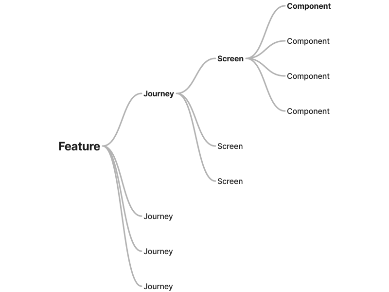
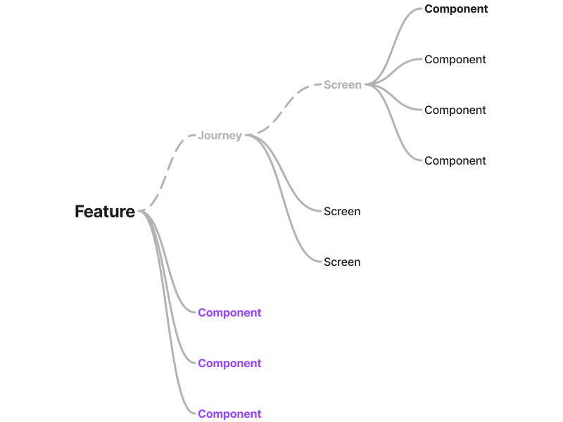

### Features

Your app is a collection of features. In fact, when you describe your app to
somebody else, you are most likely describing its features, without worrying
about how its implemented. That is exactly how you should break down the
user-facing capabilities of your app. Thinking in terms of features gives the
nice boundary and separates one feature from another.

For example, in an app that deals with **E-Commerce**, you could potentially
have the following features:

- Authentication using Social logins, Email-Password or SAML
- The Dashboard page that shows the highlights for the user
- Search
- Account management
- Order history and tracking
- Subscription management
- Payments
- Wishlists

To accomplish each feature, you will construct a set of user-journeys, which are
a set of screens that show content and help accomplish the task in that feature.
The user will navigate these screens and carry out the task. Thus, a
hierarchical view of a feature could look like so:

The interesting part about a Feature _in the context of the Vyuh Framework_ is
that **we don't include Journeys and Screens** by default. That might seem a bit
counter-intuitive but let's understand why.

A feature is meant to expose a set of components to the CMS, which is the
No-Code tool that a business uses. **It is up to the business teams to construct
the journeys** and decide how they want the navigation to happen and what
content should each screen contain. This is done purely in terms of **blocks of
content**, rather than designing the pixels of the screen.

 **Feature and Components**

A Feature does not hard-code a journey and instead exposes components that the
business teams can use. The journey control stays with the business.

Thinking in terms of the **components** gives you freedom to explore different
journeys and screen structures. This is a benefit not just for business but also
during development where you can check different navigational patterns and
ensure consistency of state and other behaviors. 

Now this does not mean that a feature should never have a hardcoded journey. _It
only means that it is not the default approach_. Certain journeys will have a
fixed internal navigation which will never change, eg: a payment journey. Those
journeys can be built into the feature for simplicity.

Thus, a more realistic hierarchy of the feature looks like so:

The _dashed lines_ to the `Journey` and `Screen` suggests that they are optional
and not the standard way of packaging a feature.

Thus, to summarize, a feature:

- is a collection of components that are used by business to construct the
  screens and journeys.
- may contain a fixed internal journey for some standard tasks.
- abstracts the business-logic of the component and exposes a minimal
  configuration to the business
- exposes the components that show up on the CMS, a no-code tool for the
  business

### Plugins

While a feature is a user-facing capability exposed to the customer, a
**Plugin** is a capability that is available app-wide across all features. It
powers the foundational elements that is required of any app, such as:

- Authentication
- Storage
- Secure Storage
- Networking
- Dependency Injection
- Analytics
- and many more...

As you can tell, plugins manage the cross-cutting concerns of an application and
are available to all features. At the outset, we have included a few important
plugin types in the framework. As we grow to support more apps, this set will
increase to include more integrations.

Plugins are **extensible** in two ways. One by adding new type of plugins into
the framework and the other by adding specific providers for some plugin types.
For example, the _Analytics Plugin_ is a fixed plugin that cannot be extended.
However, you can add new _Providers_ for Analytics that adds the extensibility
and integrations with third-party vendors such as Firebase or Adobe. The
`Provider` model works well when the core functionality of the plugin stays the
same with vendor specific adjustments.

**Features** and **Plugins** form the basic building blocks of the framework and
everything you can possibly imagine in an App can be built with just these
building blocks.

