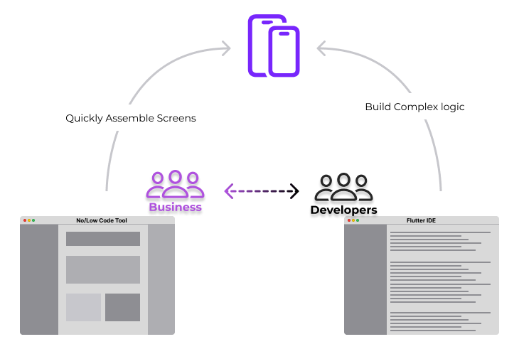
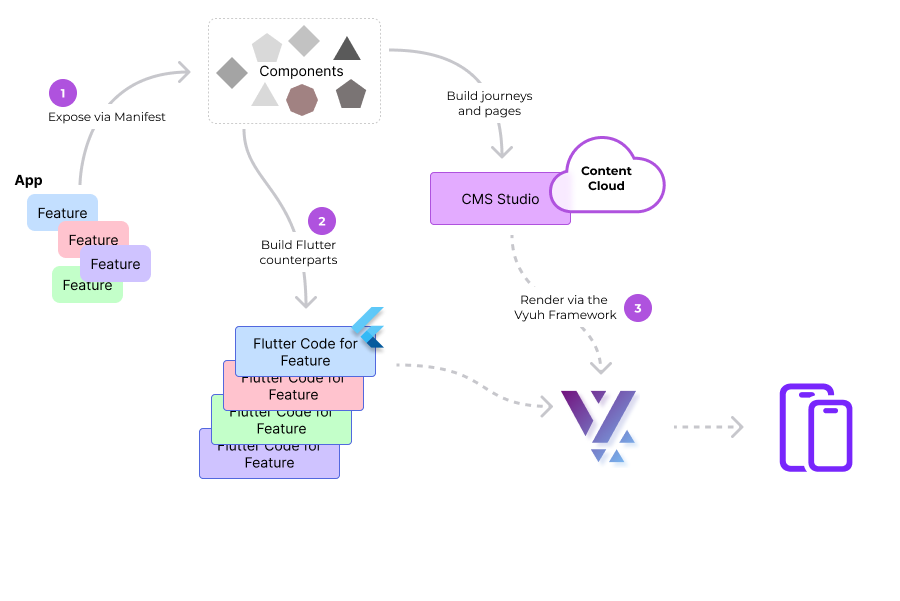
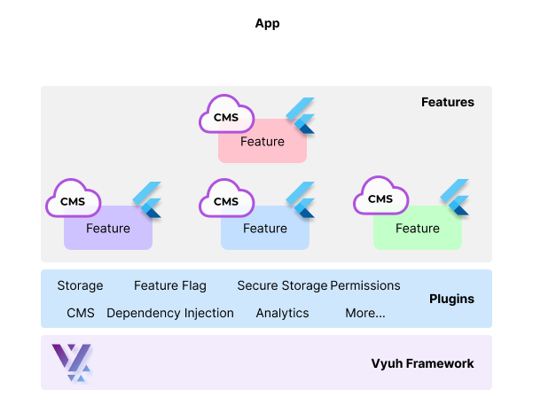

Building large scale apps with diverse and growing features, with a large team
of developers, requires a different approach than building a monolithic app
amongst a small group of people. When you start out, everything seems simple and
the universe is not that complex. As you keep adding more features, managing the
complexity can get challenging. Making things more modular and composable is the
only way forward. Additionally, given that most apps today are _content-driven_,
you would also need dynamic updates on the App without an App-Store release.

The Business teams are always looking to add more features to stay competitive
in the market. No-Code/Low-Code tools are one option that can be used to get
there faster. However, as the complexity of the features increase, these tools
fail to address the complexity and become cumbersome. You have to fallback on
Engineering to build the complex logic in code. This is where the promise of
No-Code/Low-Code starts diminishing.

> Businesses need the power, flexibility and efficiency of a **No-Code tool**
> whereas Engineering needs the power of a **Full-Code IDE** to build complex
> business logic. There has to be a middle ground where we keep both parties
> happy.

### The Genesis

Born out of a need to build a large scale app that had multiple teams, multiple
business verticals, with a diverse set of content-driven features, a complete
rethink was required on how Mobile Apps should be built. A few things were
abundantly clear to us:

- A **CMS** can be lot more than just a container of content. It could even be
  used to drive the entire App Experience. This is the No-Code companion for the
  business teams where there is a deliberate abstraction of the complex UI
  components.
- We wanted to use a **Cross-platform toolkit** like _Flutter_ which has a sound
  type-safe language like _Dart_ backing it. _Type-safety_ is paramount to build
  safe and solid code, which is often underrated.
- We didn't want to expose the ability to design screens to the Business. In
  fact, they want to stay focused on the **building blocks of the page** rather
  than how they look and behave. Some control and configuration is still
  required but not to the extent of setting padding, margins, border-radii,
  colors, layout, etc.
- Features must be built in a **modular fashion** and composed at the app layer.
  These features can be **built independently** by teams without impacting each
  other.
- Leverage the **community packages** instead of creating proprietary
  technology. This keeps the learnability-curve on the lower side, making it
  easier to adopt for newer members.

### Taking a different approach

Since many of the features were content-driven, the role of a **CMS** was
pivotal. When we explored the space of headless-CMS systems, many showed up in
our radar. After a fair amount of deliberation we decided to go ahead with
[Sanity.io](https://sanity.io). Our reasons to pick Sanity were the following:

- Has the ability to define **schemas in code** rather than a drag-and-drop
  interface of constructing content-types
- Has a fully **customizable studio** that can be tailored for the content
  authors
- Has **collaborative** features built into the studio
- Has a **comprehensive programmatic API** to create and mutate documents. This
  allows easy migration of content from other systems.

After we built the first feature in Sanity, we made an important discovery:

> Sanity can be lot more than just a container of data. Given its flexibility,
> we could use it to drive our entire App Experience.

Thus began the effort to explore Sanity in more depth and build a framework to
_drive the App Experience from a CMS_. After 4 versions of evolution, we now
have a simpler model of building features, composing them on the app and a
plugin-based system to integrate with third-party systems.

### Presenting the Vyuh framework

> Vyuh is a framework to build _modular_, _scalable_ **Flutter** apps driven by
> a Content Management System (**CMS**)

Rather than thinking of your App in terms of screens of content, you make an
important mind-shift: _"Think of your app as a collection of features where each
feature contributes a set of components"_. These components could be as simple
as a _Button_ or a _Card_ or more complex like a _Payment_ component.

Features define all the components they expose in a _manifest_, which also
become available on the CMS. A bootstrapping process goes through all the
feature-manifests and builds a gallery of components, that are **available on
the CMS**. With these components, business teams can now create journeys and
compose pages. Since these components are at a high level, they are semantic in
nature and hide all implementation details.

There is a **corresponding Flutter counterpart** to these components that
actually contains all the implementation and aesthetic details. Inside the
framework, these Flutter components will get used upon parsing the JSON payload
coming from the CMS.

#### Divide and Conquer

With this clear separation of responsibilities, we are able to offer a simple,
intuitive interface to the business, via the CMS.

> The CMS Studio becomes the _No-Code_ companion.

At the same time, the engineering folks have the _full power of Flutter_ to
build the counterpart for the CMS components.

We meet in the middle with the **Vyuh Framework**, where the CMS components come
to life via Flutter. Of course, the framework does lot more than just rendering
pages from a CMS. Here is a much longer list of capabilities:

- Every feature is **modular** in nature and can be composed together at the App
  layer. Features only expose components and other aspects like actions,
  layouts, etc.
- Features are **transferable** and can be moved between a family of
  Vyuh-enabled apps. This works well for larger companies with a host of apps.
- **Navigation** is almost entirely controlled from the CMS. You also have the
  ability to do a fixed local navigation. This allows you to compose customer
  journeys on the fly and even do A/B testing.
- The content inside a page and the navigation can be **conditionally
  controlled**
- There is a stronger focus on building a **Design System** of components right
  from Day 1.
- All third-party integrations are exposed as **Plugins**, which are horizontal
  and universally available to all features. These include:
  - Analytics
  - Feature Flag
  - Storage
  - Secure Storage
  - Dependency Injection
  - Routing
  - Content handling from a CMS
  - Ads, etc.

#### We are just getting started

Our first set of integrations are with:

- `Sanity.io` for CMS
- `Flutter` for the rendering layer
- `Firebase` for Authentication, Remote Config, Firestore, Realtime Database,
  Analytics, Performance, Crashlytics
- `get_it` for Dependency Injection
- `go_router` for Routing
- `http` for Networking

If this sounds interesting, continue the next steps with the
[Get Started](../../intro/get-started.md) guide.

### In Summary

The Vyuh Framework bridges the gap of a No-Code/Low-Code tool by separating the
concerns of Business and Engineering. By taking a CMS-driven approach to
constructing Flutter apps, we become more modular and scalable. The CMS becomes
the No-Code companion for business, where a gallery of high-level semantic
components are exposed.

The Engineering teams build features in Flutter which are counterparts of the
CMS components. They get full power of Dart, Flutter and their chosen IDE to
build sophisticated logic without sacrificing any of the power.

The framework becomes the balancing act where it marries the CMS content to
Flutter and drives the entire App Experience.

> **Welcome to a new way of building Flutter Apps!**
>
> — Vyuh
