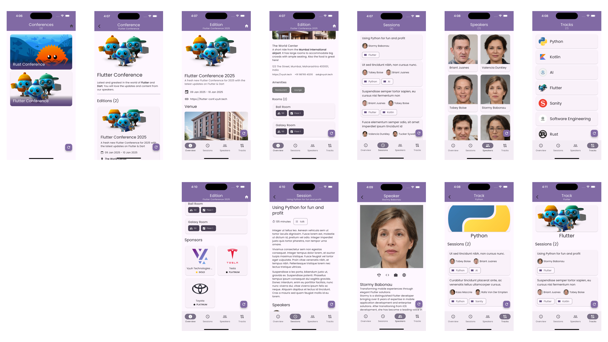

import { Aside } from '@astrojs/starlight/components'

The Conference example demonstrates how to build a full-featured conference
management application using Vyuh and Sanity.io. It showcases schema design,
content modeling, flexible layouts, and navigation patterns.



## Schema Design

The conference schema is built around several key content types that model a
typical tech conference. Each content type is defined using Sanity.io's schema
definition language and has corresponding Dart models in the Flutter
application.

### Core Content Types

#### Conference

The root content type representing a conference brand.

```typescript
export const conference = defineType({
  name: 'conf.conference',
  title: 'Conference',
  type: 'document',
  fields: [
    defineField({
      name: 'title',
      title: 'Title',
      type: 'string',
      validation: Rule => Rule.required(),
    }),
    defineField({
      name: 'description',
      title: 'Description',
      type: 'text',
    }),
    defineField({
      name: 'editions',
      title: 'Editions',
      type: 'array',
      of: [
        {
          type: 'reference',
          to: [{ type: 'conf.edition' }],
          weak: true,
        },
      ],
    }),
  ],
});
```

#### Edition

Represents a specific occurrence of a conference.

```typescript
export const edition = defineType({
  name: 'conf.edition',
  title: 'Conference Edition',
  type: 'document',
  fields: [
    defineField({
      name: 'title',
      title: 'Title',
      type: 'string',
      validation: Rule => Rule.required(),
    }),
    defineField({
      name: 'startDate',
      title: 'Start Date',
      type: 'datetime',
      validation: Rule => Rule.required(),
    }),
    defineField({
      name: 'endDate',
      title: 'End Date',
      type: 'datetime',
      validation: Rule => Rule.required(),
    }),
    defineField({
      name: 'venue',
      title: 'Venue',
      type: 'reference',
      to: [{ type: 'conf.venue' }],
      validation: Rule => Rule.required(),
    }),
    defineField({
      name: 'tracks',
      title: 'Tracks',
      type: 'array',
      of: [
        {
          type: 'reference',
          to: [{ type: 'conf.track' }],
          weak: true,
        },
      ],
    }),
    defineField({
      name: 'sponsors',
      title: 'Sponsors',
      type: 'array',
      of: [
        {
          type: 'reference',
          to: [{ type: 'conf.sponsor' }],
          weak: true,
        },
      ],
    }),
  ],
});
```

### Supporting Content Types

- **Venue**: Physical location where the conference takes place
- **Track**: Conference track containing related sessions
- **Session**: Individual talk or workshop
- **Speaker**: Presenter giving a session
- **Sponsor**: Conference sponsor or partner
- **Room**: Physical space within a venue

### Content Relationships

The schema establishes relationships between content types:

1. **Conference → Editions**

   - One-to-many relationship
   - Each conference can have multiple editions

2. **Edition → Venue**

   - One-to-one relationship
   - Each edition is held at a specific venue

3. **Edition → Tracks**

   - One-to-many relationship
   - Each edition can have multiple parallel tracks

4. **Track → Sessions**

   - One-to-many relationship
   - Each track contains multiple sessions

5. **Session → Speakers**

   - Many-to-many relationship
   - Sessions can have multiple speakers
   - Speakers can present multiple sessions

6. **Venue → Rooms**

   - One-to-many relationship
   - Each venue contains multiple rooms

7. **Edition → Sponsors**

   - Many-to-many relationship
   - Editions can have multiple sponsors
   - Sponsors can support multiple editions
   - Sponsorship details (tier, package) are edition-specific

## Layout System

The conference example demonstrates Vyuh's flexible layout system by providing
multiple ways to display the same content.

### Edition Layouts

1. **Default Layout**

   - Full conference schedule view
   - Shows all tracks and sessions
   - Includes venue information

2. **Card Layout**

   - Compact view for edition listings
   - Shows key information: dates, venue, track count

3. **Hero Layout**
   - Landing page style
   - Features prominent imagery
   - Highlights key speakers and sponsors

### Session Layouts

1. **Schedule Layout**

   - Compact view for schedule grid
   - Shows time, title, speakers

2. **Detail Layout**
   - Full session information
   - Speaker bios
   - Room details

### Speaker Layouts

1. **Card Layout**

   - Grid view of speakers
   - Photo, name, and role

2. **Profile Layout**
   - Detailed speaker profile
   - Bio, sessions, social links

## Navigation Structure

The conference example implements a hierarchical navigation structure:

```
/conference
  /{conferenceId}
    /editions
      /{editionId}
        /schedule
        /speakers
        /sponsors
        /venue
    /speakers
      /{speakerId}
    /sessions
      /{sessionId}
    /venues
      /{venueId}
```

### Route Handlers

1. **Conference Routes**

   - List all conferences
   - Show conference details

2. **Edition Routes**

   - Show edition details
   - Display schedule
   - List speakers and sponsors

3. **Content Routes**
   - Speaker profiles
   - Session details
   - Venue information

### Navigation Features

- Nested Navigation
- Deep linking
- Responsive layouts
- Persistent navigation state
- Back/forward navigation
- URL-based routing

## Content Provider Integration

The example uses Sanity.io as the content provider, demonstrating:

1. **Content Fetching**

   - GROQ queries for content
   - Real-time updates
   - Content preview

2. **Asset Handling**

   - Image optimization
   - Responsive images

3. **Content Caching**
   - Local content cache
   - Cache invalidation
   - Offline support

## Feature Modularity

The conference feature is designed as a self-contained module that can be easily
integrated into any Vyuh application. This modularity is achieved through the
`FeatureDescriptor`, which encapsulates all the necessary components:

```dart
final feature = FeatureDescriptor(
  name: 'conference',
  title: 'Conference Feature',
  description: 'Conference management and scheduling system',

  // Initialize feature dependencies
  init: () async {
    // Register feature-specific API client
    vyuh.di.register(ConferenceApi(vyuh.content.provider));
  },

  // Register content types and their builders
  extensions: [
    ContentExtensionDescriptor(
      contentBuilders: [
        // Core content types
        Conference.contentBuilder,
        Edition.contentBuilder,
        Session.contentBuilder,
        Speaker.contentBuilder,
        Venue.contentBuilder,

        // Supporting content types
        Track.contentBuilder,
        Room.contentBuilder,
        Sponsor.contentBuilder,
      ],
    ),
  ],

  // Feature-specific routes
  routes: routes,
);
```

### Feature Independence

The conference feature maintains its independence through several design
principles:

1. **Self-contained Dependencies**

   - All required services are registered during initialization
   - Uses dependency injection for loose coupling
   - Manages its own API client for content operations

2. **Isolated Content Models**

   - Content types are scoped to the feature (`conf.*`)
   - Models include their own serialization logic
   - Layouts are feature-specific

3. **Encapsulated Navigation**
   - Routes are defined within the feature
   - Navigation logic is self-contained
   - Deep linking handled internally

### Integration Flexibility

Any Vyuh application can integrate the conference feature by:

1. Including the feature package dependency
2. Adding the feature to the application's feature list
3. Configuring the content provider with conference schemas

The feature automatically:

- Registers its content types
- Sets up its routes
- Initializes required services

This modular approach enables:

- Plug-and-play feature integration
- Clear separation of concerns
- Independent feature development
- Reusability across applications

This example demonstrates how Vyuh's feature-based architecture enables building
complex, modular applications while maintaining clean separation of concerns
between content, presentation, and business logic.

<Aside title="Read the Code" type="tip">
  View the complete implementation in the [conference example source
  code](https://github.com/vyuh-tech/vyuh/tree/main/examples/conference).
</Aside>
