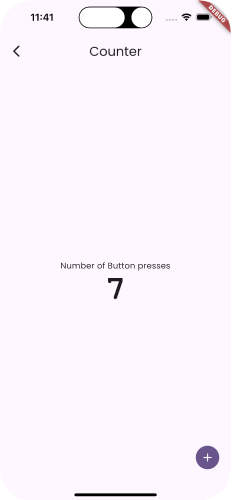

import { Aside } from '@astrojs/starlight/components'

This shows the most fundamental aspect of the Vyuh Framework - _creating
features_. In this example we create a simple feature and expose it on the
`/counter` route.

This is the classic Flutter counter example wrapped up in a feature.

An in-depth coverage of this example is done with the
[Get Started](/intro/get-started) guide. Take a look over there if you haven't
already.

<Aside type={'tip'} title={'Read the Code'}>
  See the code for the example on Github:
  [Counter](https://github.com/vyuh-tech/vyuh/blob/main/examples/feature_counter)
</Aside>
