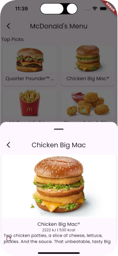

import { Aside } from '@astrojs/starlight/components'

An example of building a Restaurant Menu App where we show the menu of items and
navigate into it for more details.

<Aside type={'tip'} title={'Read the Code'}>
  See the code for the example on Github:
  [Food](https://github.com/vyuh-tech/vyuh/tree/main/examples/food)
</Aside>
