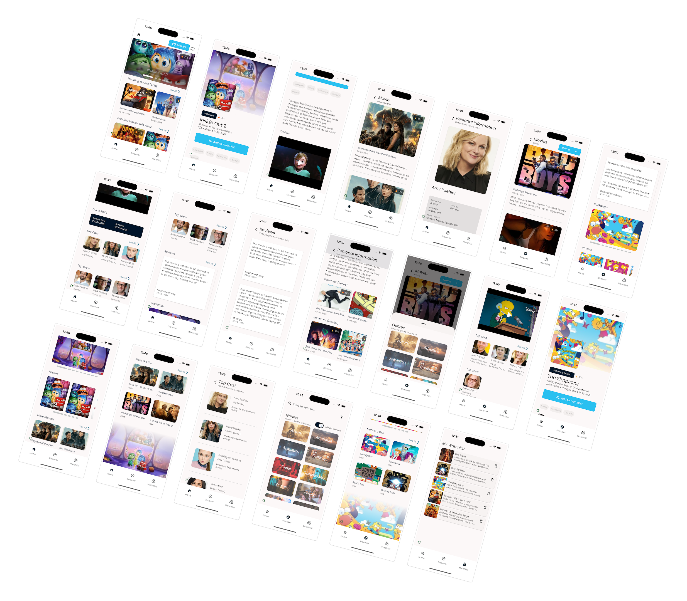

The Movies App is a much more _sophisticated_ example of applying the Vyuh
Framework. It has a host of features that covers the breadth and depth of the
framework including:

1. **Navigating** using a combination of template routes from the CMS and
   Application routes defined with GoRouter.
2. **Page content** rendered from the CMS
3. Custom **routing** configuration
4. Controlling **bottom tabs** from the CMS
5. Pages and Dialogs
6. **Custom content blocks** for rendering a Movie or TV Series
7. **Configurable sections** for Movie/Series
8. **Custom layouts** for pages
9. **Custom actions** such as "Add to Watchlist"
10. **API driven content** using the TMDB API
11. Using custom packages from **pub.dev**
12. Building custom packages such as the **tmdb_client**
13. **App Experience** across Movies / TV Series
    - **Trending**, popular, upcoming movies / series
    - **Searching** by title, genres and other attributes
    - **Trailers**
    - Inline and full screen **video player**
    - Adding movies/series to **watchlist**
    - **Nested navigation** into:
      - Cast and Crew
      - Biographies of people
      - Reviews
      - Similar Movies / Series
      - Backdrops and Posters
    - Custom **Design System**
    - **Onboarding pages** that talk about the feature

<figure><figcaption>
Gallery of screens in the Movies Mini-App
</figcaption></figure>
