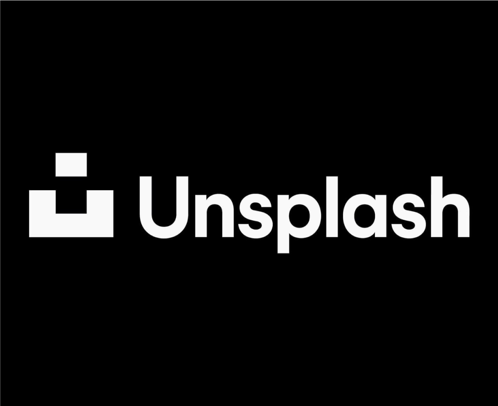

import { Card, CardGrid } from '@astrojs/starlight/components'

The Vyuh framework has been designed from the ground-up to handle large scale
development of features (aka **Mini-Apps**), across multiple distributed teams
without falling into the trap of a monolithic App.

It allows you to compose an App out of several Mini-Apps and design all the
customer journeys on a CMS. This gives a phenomenal advantage in exploring
various journeys and connecting even unrelated mini-apps.

## Chakra

In this section we have built a single App that is composed out of several
mini-Apps. This is our own Super App, called the **Vyuh Chakra Demo**.&#x20;

Each example has a breakdown of how the mini-App was built. Many of them use
advanced techniques that are generally seen in production-grade applications.

<CardGrid>
<Card title={'Unsplash App'} icon={'open-book'}>
  
  An image gallery app that allows browsing different images, their details and searching by a variety of criteria.
</Card>

  <Card title={'Wonderous App'} icon={'open-book'}>
    
    A classic example used in the Flutter community to demonstrate a rich, animated experience of browsing the wonders of the world. This is our own take on Wonderous.
  </Card>
  <Card title={'Movies App'} icon={'open-book'}>
  
  Explore movies, tv series, cast and crew using the TMDB API
</Card>
  <Card title={'News App'} icon={'open-book'}>
  
  Locate articles and breaking news headlines from news sources and blogs across the web
</Card>
</CardGrid>
