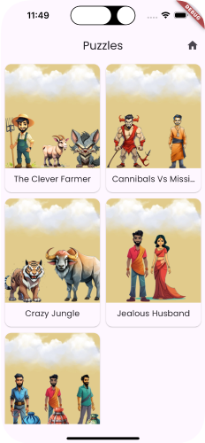

import { Aside } from '@astrojs/starlight/components'

A fun example where we create a puzzle game with the levels controlled from the
CMS.

<Aside type={'tip'} title={'Read the Code'}>
  See the code for the example on Github:
  [Puzzle](https://github.com/vyuh-tech/vyuh/tree/main/examples/puzzles)
</Aside>
