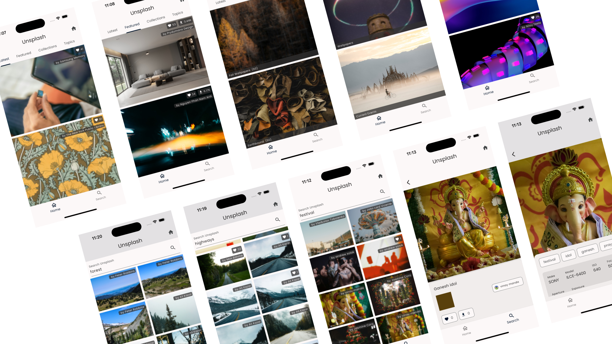

The Unsplash mini-app is a bit different than all the other features (aka
mini-apps) that are described over here. It focuses on the modularity aspect of
the framework with all of the blocks and user-journeys built right into the
feature itself. In this regard, it **does not include any CMS driven rendering**
and is completely self-contained.

## Capabilities

This feature includes most of the capabilities that you might expect in the
Unsplash app:

- Seeing the latest and featured photos
- Searching on photos
- Seeing the details of the photos
- Exploring the other information that is associated with the photo
- Built-in navigation between the listing and the details
- Using the Unsplash Client from pub.dev to invoke all of the server calls.

## Outline


[the-featuredescriptor.md](the-featuredescriptor.md) 


[navigation-and-routes.md](navigation-and-routes.md) 


[separation-of-concerns.md](separation-of-concerns.md) 

 [the-widgets.md](the-widgets.md)


## Summary

Building a feature in Vyuh, without any CMS integration, can feel like regular
Flutter development. You get all the niceties of Flutter (e.g. hot reload)
without compromising on any of the development experience.&#x20;

Additionally, the use of the Vyuh Framework gets you **modularity:** the ability
to neatly tuck all feature related functionality into a separate package.
