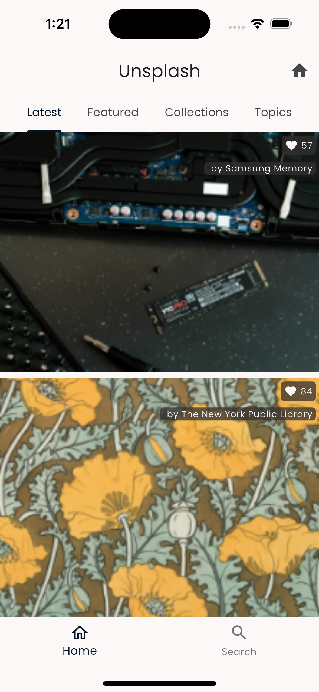
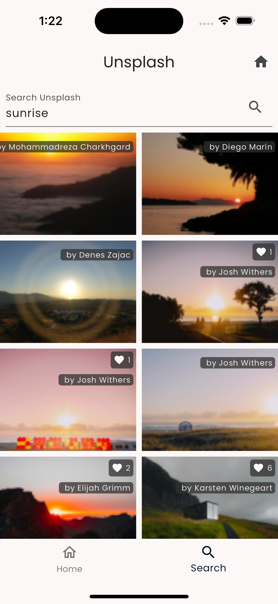

The screens in the Unsplash feature are mostly meant for listing a set of
photos, such as the **Latest** and **Featured** list of photos.&#x20;

You also have a listing for **Collections** and **Topics**, which takes you to a
list of photos again for a collection or topic.&#x20;

The **Search** screen is also very similar, consisting of a listing page which
shows the results of the search, and then tapping on each of those results takes
you to the photo-detail page.&#x20;

Thus, the 3 core widgets which are part of our mini design system include:

1. The `PhotoCard` that appears pretty much everywhere you are see a list of
   photos.
2. The `CollectionView` that shows you the list of photos.
3. The `PhotoDetail` view.

## Home Tab



Here is the snippet of code from the Home tab that shows these widgets in use.

```dart
import 'package:feature_unsplash/ui/collection_view.dart';
import 'package:feature_unsplash/ui/photo_card.dart';
import 'package:feature_unsplash/unsplash_store.dart';
import 'package:flutter/material.dart';
import 'package:unsplash_client/unsplash_client.dart';
import 'package:vyuh_core/vyuh_core.dart';

class UnsplashHome extends StatefulWidget {
  const UnsplashHome({super.key});

  @override
  State<UnsplashHome> createState() => _UnsplashHomeState();
}

class _UnsplashHomeState extends State<UnsplashHome>
    with SingleTickerProviderStateMixin {
  late final TabController _controller;

  @override
  void initState() {
    super.initState();

    _controller =
        TabController(length: UnsplashSections.values.length, vsync: this);
  }

  @override
  Widget build(BuildContext context) {
    return Scaffold(
      body: SafeArea(
        child: Column(
          children: [
            TabBar(
              controller: _controller,
              isScrollable: true,
              tabAlignment: TabAlignment.center,
              tabs: UnsplashSections.values
                  .map((section) => Tab(text: section.title))
                  .toList(),
            ),
            Expanded(
              child: TabBarView(
                  controller: _controller,
                  children: UnsplashSections.values
                      .map((section) => section.buildWidget(context))
                      .toList(growable: false)),
            ),
          ],
        ),
      ),
    );
  }
}

enum UnsplashSections {
  latest,
  featured,
  collections,
  topics;

  String get title => name.characters.first.toUpperCase() + name.substring(1);

  Widget buildWidget(BuildContext context) {
    final store = vyuh.di.get<UnsplashStore>();

    switch (this) {
      case UnsplashSections.latest:
        return CollectionView<Photo>(
          future: () =>
              store.fetchPhotos(count: 10, orderBy: PhotoOrder.latest),
          itemBuilder: (photo) => PhotoCard(
            photo: photo,
            showStats: true,
            onTap: () => vyuh.router.push('/unsplash/home/photos/${photo.id}'),
          ),
        );
      case UnsplashSections.featured:
        return CollectionView<Photo>(
          future: () => store.fetchFeaturedPhotos(count: 10),
          itemBuilder: (photo) => PhotoCard(
            photo: photo,
            showStats: true,
            onTap: () => vyuh.router.push('/unsplash/home/photos/${photo.id}'),
          ),
        );
      case UnsplashSections.collections:
        return CollectionView<Collection>(
          future: () => store.fetchCollections(count: 10),
          itemBuilder: (collection) => collection.coverPhoto != null
              ? PhotoCard(
                  title: '${collection.title}  (${collection.totalPhotos})',
                  photo: collection.coverPhoto!,
                  onTap: () => vyuh.router
                      .push('/unsplash/home/collections/${collection.id}'),
                )
              : const Icon(Icons.question_mark),
        );
      case UnsplashSections.topics:
        return CollectionView<Topic>(
          future: () => store.fetchTopics(count: 10),
          itemBuilder: (topic) => PhotoCard(
            title: topic.title,
            photo: topic.coverPhoto,
            onTap: () => vyuh.router.push('/unsplash/home/topics/${topic.id}'),
          ),
        );
    }
  }
}

```

An interesting thing to note in the Home tab is the way we've managed the
various sub-sections (or sub-tabs) of the Home screen. The `latest`, `featured`,
`collections`, and `topics` are part of an enumeration for which we have the
corresponding widgets.&#x20;

This simplifies the creation of the widgets per sub-tab and also makes it easier
to read the code.&#x20;

 **Maintainability**

An important guideline of writing large-scale code is to continuously improve
its readability and maintainability. The use of the enumeration is a step in
that direction. 

## Search Tab



The Search Tab has a very similar structure and again relies on the
`CollectionView` to render its listing of results. This can be seen in the code
below.

```dart
import 'package:feature_unsplash/ui/collection_view.dart';
import 'package:feature_unsplash/ui/photo_card.dart';
import 'package:feature_unsplash/unsplash_store.dart';
import 'package:flutter/material.dart';
import 'package:unsplash_client/unsplash_client.dart';
import 'package:vyuh_core/vyuh_core.dart';

class SearchView extends StatefulWidget {
  const SearchView({super.key});

  @override
  State<SearchView> createState() => _SearchViewState();
}

class _SearchViewState extends State<SearchView> {
  Future<List<Photo>> _resultsFuture = Future.value([]);

  @override
  Widget build(BuildContext context) {
    return Column(children: [
      SearchBox(
        onResults: (results) => setState(() {
          _resultsFuture = results;
        }),
      ),
      Expanded(
        child: CollectionView<Photo>(
            columns: 2,
            future: () => _resultsFuture,
            itemBuilder: (photo) => PhotoCard(
                  photo: photo,
                  showStats: true,
                  onTap: () =>
                      vyuh.router.push('/unsplash/home/photos/${photo.id}'),
                )),
      ),
    ]);
  }
}

class SearchBox extends StatefulWidget {
  final Function(Future<List<Photo>>) onResults;
  const SearchBox({super.key, required this.onResults});

  @override
  State<SearchBox> createState() => _SearchBoxState();
}

class _SearchBoxState extends State<SearchBox> {
  final TextEditingController _searchController = TextEditingController();

  void _searchPhotos() {
    final store = vyuh.di.get<UnsplashStore>();
    final future = store.searchPhotos(query: _searchController.text);

    widget.onResults(future);
  }

  @override
  Widget build(BuildContext context) {
    return Padding(
      padding: const EdgeInsets.all(8.0),
      child: TextField(
        controller: _searchController,
        onSubmitted: (_) => _searchPhotos(),
        textInputAction: TextInputAction.search,
        autocorrect: false,
        decoration: InputDecoration(
          labelText: 'Search Unsplash',
          suffixIcon: IconButton(
            icon: const Icon(
              Icons.search,
            ),
            onPressed: _searchPhotos,
          ),
        ),
      ),
    );
  }
}

```
