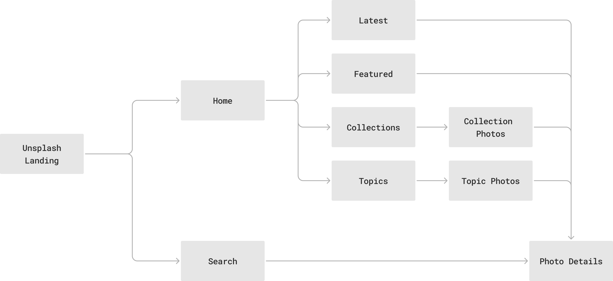

The navigation inside the Unsplash feature is quite simple. It consists of two
tab routes: **Home** and **Search**.&#x20;

The Home tab consists of a set of listings that show you all the photos under
various categories. Tapping on a photo takes you to the details of the photo.
The same behavior exists in the Search tab as well. When you type on search, you
get a listing of all the photos. Tapping on the photo will take you to its
details.

This navigation structure can be visualized in the diagram below.



## Route Setup

The route setup is done through the `StatefulShellRoute` with two tabs: Home and
Search. Within the home tab, you can also navigate to the individual photo
details, the collection details and the topic details. The collection and topic
detail pages are a type of listing pages for the photos. When you tap on a photo
in the list, it takes you to the photo details.

The Search tab behaves in a similar way with the listing of search results.
Tapping in each result takes you to the photo details page.

The snippet below shows the route setup in action.

```dart
import 'package:feature_unsplash/ui/collection_detail.dart';
import 'package:feature_unsplash/ui/home.dart';
import 'package:feature_unsplash/ui/photo_detail.dart';
import 'package:feature_unsplash/ui/search_view.dart';
import 'package:feature_unsplash/ui/topic_detail.dart';
import 'package:flutter/material.dart';
import 'package:go_router/go_router.dart' as go;
import 'package:go_router/go_router.dart';
import 'package:vyuh_core/vyuh_core.dart';

final _homeKey = GlobalKey<NavigatorState>();
final _searchKey = GlobalKey<NavigatorState>();

List<go.RouteBase> routes() {
  return [
    StatefulShellRoute.indexedStack(
      branches: [
        StatefulShellBranch(
          navigatorKey: _homeKey,
          routes: [
            GoRoute(
              path: '/unsplash/home',
              builder: (context, state) {
                return const UnsplashHome();
              },
              routes: [
                GoRoute(
                  path: 'photos/:id',
                  builder: (context, state) {
                    return PhotoDetail(id: state.pathParameters['id']!);
                  },
                ),
                GoRoute(
                  path: 'collections/:id',
                  builder: (context, state) {
                    return CollectionDetailView(
                        id: state.pathParameters['id']!);
                  },
                ),
                GoRoute(
                  path: 'topics/:id',
                  builder: (context, state) {
                    return TopicDetailView(id: state.pathParameters['id']!);
                  },
                ),
              ],
            ),
          ],
        ),
        StatefulShellBranch(
          navigatorKey: _searchKey,
          routes: [
            GoRoute(
                path: '/unsplash/search',
                builder: (_, __) => const Scaffold(
                      body: SafeArea(child: SearchView()),
                    )),
          ],
        ),
      ],
      builder: (context, __, shell) {
        final theme = Theme.of(context);

        return Scaffold(
          body: shell,
          appBar: AppBar(
            title: const Text('Unsplash'),
            actions: [
              IconButton(
                  onPressed: () => vyuh.router.go('/chakra'),
                  icon: const Icon(Icons.home))
            ],
          ),
          bottomNavigationBar: BottomNavigationBar(
            selectedItemColor: theme.colorScheme.primary,
            type: BottomNavigationBarType.fixed,
            elevation: 2,
            items: const [
              BottomNavigationBarItem(
                label: 'Home',
                icon: Icon(Icons.home_outlined),
              ),
              BottomNavigationBarItem(
                label: 'Search',
                icon: Icon(Icons.search_outlined),
              ),
            ],
            currentIndex: shell.currentIndex,
            onTap: (index) => shell.goBranch(
              index,
              initialLocation: index == shell.currentIndex,
            ),
          ),
        );
      },
    ),
  ];
}

```
