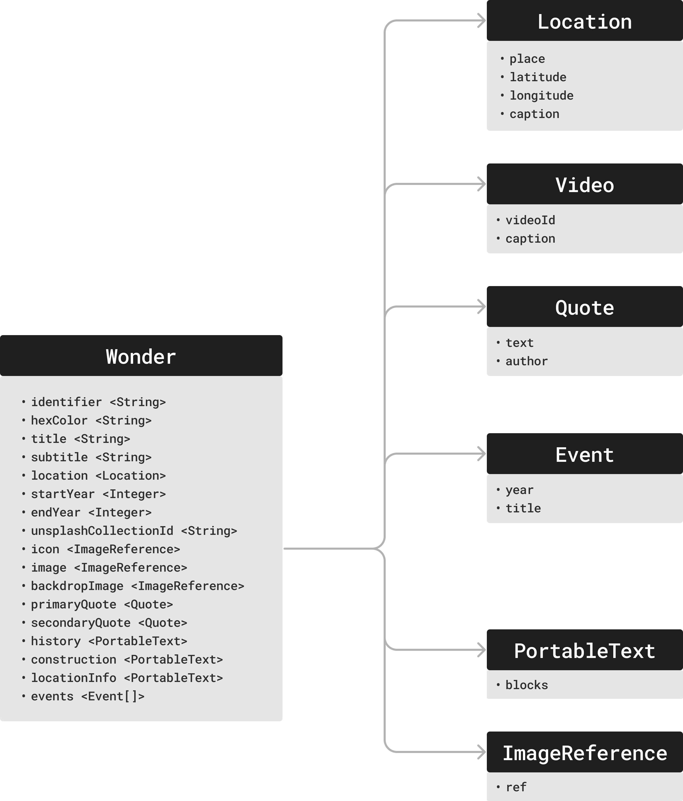
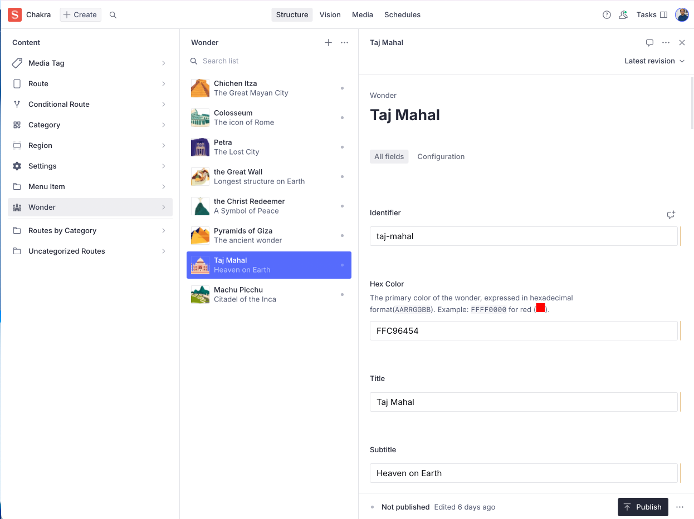

import { Aside } from '@astrojs/starlight/components'

Let's start with the most important entity in the entire App: a **Wonder**.

We are dealing with a collection of wonders, where each wonder can have a fairly
complex structure that describes various aspects such as _facts, history,
construction, location, photos_, etc. It is best to treat this as _Structured
Content_ and build a **schema** that can define a Wonder. This is our starting
point.

<Aside>
 **Structured Content** is a common concept discussed in
the context of headless CMS, schema-driven development or Model-driven
development. The idea is to make deliberate separation between the _content_ and
_presentation_. No presentation details are mentioned in the structured-content
and it is purely a container of data that describes the entity.

This, by no means is a new concept. In fact, it is how Software Development was
meant to be from the very beginning. Software is a structured representation of
the real-world, represented as a collection of data-entities. This acts as the
_**Content**_** layer**. The _**Presentation layer**_ is simply a visual
projection of this content, using various display technologies to make it come
live on the screen, with various affordances for _user-interaction_.

</Aside>

## Identifying the Schema

After digging through the content aspects of a wonder, we came up with a schema
that described most of the Wonder details. Note that there are a few exclusions
(such as the `artifacts`, as mentioned in the previous post).



<Aside>
 When we tackle **Localization**, in a _future
version_, this exact schema will serve to create a localized Wonder.

</Aside>

Some of the entities might seem new, such as the `PortableText` and
`ImageReference`. These are entities from the CMS that help in describing rich
text and images respectively. The Vyuh Framework can comfortably handle very
complex and sophisticated Rich Text, all rendered in Flutter.

<Aside>
  On the CMS, the rich text is defined using an open format called [Portable
  Text](https://github.com/portabletext/portabletext). Vyuh natively understands
  this and renders it using **Flutter**, with support for custom blocks and
  custom styles.
</Aside>

## Defining the Schema

With a rich schema in hand, we have now described a single wonder, as
_**structured content**_. This neatly translates to a _CMS schema_ with a system
like [Sanity](https://sanity.io), which is supported as the default CMS for
Vyuh.

On Sanity, we define the schema in TypeScript and export it for consumption
inside the CMS Studio. A snippet of the schema definition is shown below.

```typescript
// wonder.tsx

export const wonder: SchemaTypeDefinition = defineType({
  name: 'wonderous.wonder',
  type: 'document',
  title: 'Wonder',
  icon: Icon,
  fields: [
    defineField({
      name: 'identifier',
      title: 'Identifier',
      type: 'string',
    }),
    defineField({
      name: 'hexColor',
      title: 'Hex Color',
      description: (
        <div>
          The primary color of the wonder, expressed in hexadecimal format(
          <code>AARRGGBB</code>). Example: <code>FFFF0000</code> for red (
          <span
            style={{
              display: 'inline-block',
              width: '1rem',
              height: '1rem',
              backgroundColor: '#FF0000',
            }}
          ></span>
          ).
        </div>
      ),
      type: 'string',
    }),
    defineField({
      name: 'title',
      title: 'Title',
      type: 'string',
    }),
    defineField({
      name: 'subtitle',
      title: 'Subtitle',
      type: 'string',
    }),

    defineField({
      name: 'video',
      title: 'YouTube Video',
      type: 'object',
      options: {
        columns: 2,
      },
      fields: [
        defineField({
          name: 'videoId',
          title: 'Video Id',
          type: 'string',
        }),
        defineField({
          name: 'caption',
          title: 'Caption',
          type: 'string',
        }),
      ],
    }),
    defineField({
      name: 'startYear',
      title: 'Start Year',
      description:
        'The year when construction started. Years in BCE should be negative.',
      type: 'number',
      fieldset: 'timeframe',
    }),
    defineField({
      name: 'endYear',
      title: 'End Year',
      description:
        'The year when construction ended. Years in BCE should be negative.',
      type: 'number',
      fieldset: 'timeframe',
    }),
    defineField({
      name: 'unsplashCollectionId',
      title: 'Unsplash Collection Id',
      type: 'string',
    }),

    // Rest of the fields ...
});


```

## Creating Wonders

Each wonder is a separate document of type `wonderous.wonder`. We can create
that inside the CMS Studio and feed all details for each wonder. We went through
and extracted all the content for each wonder, as defined in the Wonderous App.
Each wonder was created as a separate document inside the CMS Studio.

<Aside>
  In the [Wonderous
  Repo](https://github.com/gskinnerTeam/flutter-wonderous-app), the data is
  distributed across a set of files, with images, colors and textual information
  defined in different places. There was a fair amount of jumping around as we
  gathered all the data for each _wonder-document_.
</Aside>

With Vyuh, your Wonder information stays in one place and its easy to manage it
as you keep adding more wonders, well beyond the 8 we have today.



Once the wonders were all setup in the Studio, it was now time to focus on the
_Presentation_ side of the content. In the next article, we will cover the setup
for defining the User Journeys on the CMS.
