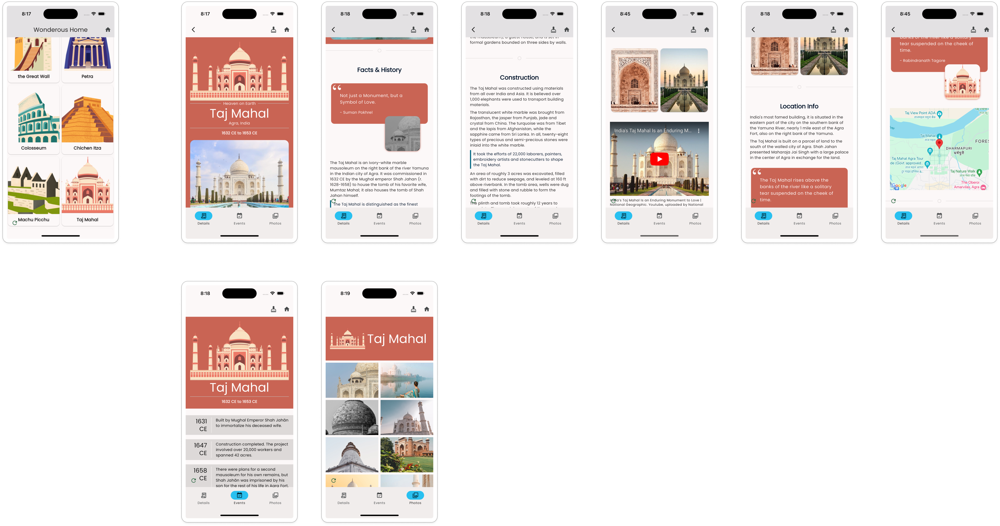

import { LinkCard, Aside } from '@astrojs/starlight/components'

For someone long enough in the Flutter community, it is hard to miss the
**Wonderous App**, a beautiful App built by the talented folks at
[GSkinner](https://flutter.gskinner.com/wonderous/). This is a great example of
a _content-rich_ app showcasing wonders around the world with slick animations.

As you know, the Vyuh Framework was designed to work well with _Content_ of all
kinds, especially where the _CMS-hosted Content_ becomes the centerpiece of your
experience. The Wonderous App fits perfectly with this idea, and we decided to
_rebuild it_ using the Vyuh Framework.

A variety of features from the framework are at play:

1. **Custom content types**
2. **Custom documents** with configurable section-based rendering
3. **Navigation** between pages and templated routing
4. **Custom actions**
5. **API integrations** with Unsplash
6. **Google Maps** integration
7. **YouTube** player

These set of posts will walk you through how it was built and the various
choices made to reimagine the experience with Vyuh.

### Table of Contents

<LinkCard
  href="/examples/wonderous/distilling-wonderous"
  title="Distilling Wonderous"
/>

<LinkCard
  href="/examples/wonderous/a-schema-first-approach"
  title="A Schema-first Approach"
/>

<LinkCard
  href="/examples/wonderous/navigation-and-structure"
  title="Navigation and Structure"
/>

<LinkCard
  href="/examples/wonderous/rendering-a-wonder-section"
  title="Rendering a Wonder-section"
/>

<LinkCard
  href="/examples/wonderous/managing-wonders"
  title="Managing Wonders"
/>

Let's get going.

<Aside>
 **Disclaimer**

All assets used in building this version of Wonderous, are the property of
GSkinner. We have used it with no intention of creating or promoting this app on
the App Store / Play Store. It is purely a technical exploration to demonstrate
the abilities of the Vyuh Framework.

</Aside>
