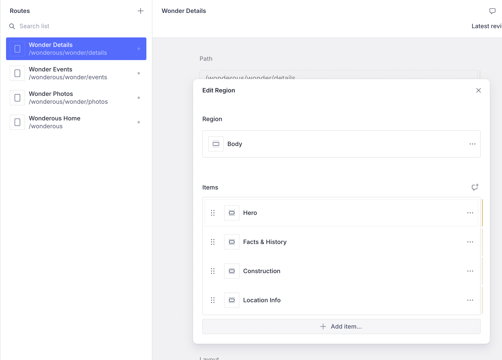

Dividing the Wonder into a set of sections gives us some flexibility to play
around with the layout of the Wonder on the screen. As we saw earlier, these
sections can be changed on the CMS with the UI automatically reflecting it.
Because these sections are just a type of Content Block, you could even add
other kinds of Content Blocks in between, if needed.



## The Flutter counterpart of a Wonder Section

Defining the section on the CMS is only half the job. The other half lies in
creating a Flutter counterpart that can deserialize the json of the
wonder-section and render it using a Flutter Widget. This is managed by a custom
`ContentBuilder` for the `WonderSection` (a custom `ContentItem`).&#x20;

We define this inside a `FeatureDescriptor` that represents the entire Wonderous
feature.

 In the _Vyuh Framework_, a `feature.dart` represents one
logical feature of your application. Dividing your application into a set of
composable features allows us to build large scale apps with great benefits.

For our demo app, the entire _Wonderous_ App has been represented as a feature,
with the `FeatureDescriptor`. This descriptor exposes the content items, layouts
and other aspects of a feature. 



```dart
final feature = FeatureDescriptor(
    name: 'wonderous',
    title: 'Wonderous',
    description: 'The Wonderous app as a Vyuh Feature',
    icon: Icons.castle_outlined,
    init: () async {
      // initializes the API keys for Unsplash and loads other environment variables
    },
    routes: routes, // The routes we saw in the earlier article
    extensions: [
      ContentExtensionDescriptor(
        // Content builder for the WonderSection type
        contentBuilders: [
          ContentBuilder<WonderSection>(
            content: WonderSection.typeDescriptor,
            defaultLayout: WonderSectionLayout(),
            defaultLayoutDescriptor: WonderSectionLayout.typeDescriptor,
          ),
        ],
      )
    ]);

```



And finally the `WonderSection` itself is shown below, which represents one
visual part of a Wonder. The `WonderSectionLayout` is the default layout that
knows how to render these sections, which you can see in the `build()` method.

 Notice that all of this is **completely type-safe**
and ensures you get the **best developer-experience** when dealing with CMS
content. 



```dart
import 'package:flutter/material.dart';
import 'package:json_annotation/json_annotation.dart';
import 'package:vyuh_core/vyuh_core.dart';

part 'section.g.dart';

@JsonSerializable()
final class WonderSection extends ContentItem {
  static const schemaName = 'wonderous.wonder.section';
  static final typeDescriptor = TypeDescriptor(
    schemaType: schemaName,
    title: 'Wonder Section',
    fromJson: WonderSection.fromJson,
  );

  final String title;
  final WonderSectionType type;

  WonderSection({
    required this.title,
    required this.type,
  }) : super(schemaType: schemaName);

  factory WonderSection.fromJson(Map<String, dynamic> json) =>
      _$WonderSectionFromJson(json);
}

enum WonderSectionType {
  hero,
  history,
  construction,
  locationInfo,
  events,
  photos,
}

@JsonSerializable()
final class WonderSectionLayout extends LayoutConfiguration<WonderSection> {
  static const schemaName = '${WonderSection.schemaName}.layout.default';
  static final typeDescriptor = TypeDescriptor(
    schemaType: schemaName,
    title: 'Wonder Section Layout',
    fromJson: WonderSectionLayout.fromJson,
  );

  WonderSectionLayout() : super(schemaType: schemaName);

  factory WonderSectionLayout.fromJson(Map<String, dynamic> json) =>
      _$WonderSectionLayoutFromJson(json);

  @override
  Widget build(BuildContext context, WonderSection content) {
    return switch (content.type) {
      WonderSectionType.hero => const WonderHeroSection(),
      WonderSectionType.history => WonderHistorySection(title: content.title),
      WonderSectionType.construction =>
        WonderConstructionSection(title: content.title),
      WonderSectionType.locationInfo =>
        WonderLocationInfoSection(title: content.title),
      WonderSectionType.events => const WonderEventsSection(),
      WonderSectionType.photos => const WonderPhotosSection(),
    };
  }
}

```



Notice how the `WonderSection` type mirrors the schema in TypeScript with the
same fields. As mentioned before, you get a _type-safe_ version that you can
reliably use in your Flutter code.

## Rendering a single WonderSection

The previous code snippet shows how we render the various parts of the `Wonder`.
Each section fetches the `Wonder` document from the CMS and renders the parts
which are relevant. Instead of every section making parallel calls to fetch the
`Wonder`, we manage all of that inside the `WonderSectionBuilder` . This makes
use of a shared `Future<Wonder>` to ensure there are no duplicate network calls
to fetch the `Wonder`.

This is shown below. The shared future is inside the `WonderClient`, mapped to
the wonder's **`identifier`**. This identifier is extracted from the
`GoRouterState` of the current route.

Once a wonder has been fetched, we delegate to the `builder` to do rest of the
rendering.



```dart
final class WonderSectionBuilder extends StatefulWidget {
  final Widget Function(BuildContext, Wonder) builder;
  const WonderSectionBuilder({super.key, required this.builder});

  @override
  State<WonderSectionBuilder> createState() => _WonderSectionBuilderState();
}

class _WonderSectionBuilderState extends State<WonderSectionBuilder> {
  ObservableFuture<Wonder?> _future = ObservableFuture.value(null);

  @override
  void initState() {
    super.initState();
  }

  @override
  void didChangeDependencies() {
    super.didChangeDependencies();

    final wonder = GoRouterState.of(context).pathParameters['wonder'] ?? '---';
    _future = vyuh.di.get<WonderClient>().fetchWonder(wonder);
  }

  @override
  Widget build(BuildContext context) {
    return Observer(
      builder: (context) {
        final status = _future.status;
        final wonder = _future.value;

        switch (status) {
          case FutureStatus.pending:
            return vyuh.widgetBuilder.contentLoader();
          case FutureStatus.rejected:
            return vyuh.widgetBuilder.errorView(
                title: 'Failed to fetch Wonder', error: _future.error);
          case FutureStatus.fulfilled:
            if (wonder == null) {
              return vyuh.widgetBuilder
                  .errorView(title: 'Failed to fetch Wonder');
            }

            return Column(
              crossAxisAlignment: CrossAxisAlignment.stretch,
              children: [
                widget.builder(context, wonder),
                const SectionDivider(),
              ],
            );
        }
      },
    );
  }
}

```



## Aside on fetching Wonders

The `WonderClient` fetches the wonders from the Sanity CMS and deserializes to a
Dart type: `Wonder`. It also takes care of fetching photos from the Unsplash
collection.

Fetching the wonder from the CMS follows a simple query that looks up the wonder
by its `identifier`. Here is the `fetchWonder()` method of the `WonderClient`,
in its entirety.

```dart
  final Map<String, ObservableFuture<Wonder?>> _wonderFutures = {};

    ObservableFuture<Wonder?> fetchWonder(String id) {
    if (_wonderFutures.containsKey(id)) {
      return _wonderFutures[id]!;
    }

    final wonderFuture = vyuh.content.provider.fetchSingle(
        '*[_type == "wonderous.wonder" && identifier == "$id"][0]',
        fromJson: Wonder.fromJson);

    _wonderFutures[id] = ObservableFuture(wonderFuture);

    return _wonderFutures[id]!;
  }

```

Notice the use of the `_wonderFutures` cache to ensure only one network call
goes out for the `Wonder`.
