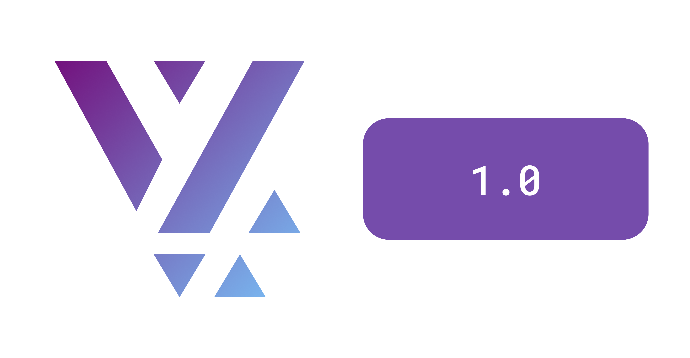

## Dec 2024 Update

- Added support for **Scoped DI** that allows registering dependencies only at
  the Route level. This avoids polluting the global DI container.
- Several updates to the **Forms** package that supports complex Multi-Step
  forms, validations, custom fields and layouts
- Split the Analytics Plugin into **Telemetry Plugin** + Analytics Plugin.
  Telemetry focuses on logs, metrics and traces whereas Analytics is about
  user-level analytics and tracking User behavior.
- Added a new abstraction called **Modifiers** that allows a Content Item to
  have more complex visual behaviors, such as Themes, Localization, Visual
  Annotations, etc.
- Introduced **Events** for communicating between Features and Plugins. Events
  are type-safe and can be used to build custom events with necessary type-safe
  payloads.
- Complete refresh of the https://vyuh.tech **Website** which is now built with
  Astro

Read more on our [Blog](https://vyuh.tech/blog/december-updates/).

## 1.x series

- Launched **1.0** with foundation capabilities that are required by all
  CMS-driven and Modular Vyuh Apps
- **Core API** to run a Vyuh App using modular Features and Plugins
- **Core Plugins** for Content, Analytics, Navigation, Network, Authentication,
  Logging, Storage, Feature Flag, Dependency Injection
- **Integrations** with Firebase, Sentry, Hive, GetIt and others
- Core **Content Items** such as Card, Group, Accordion, Route (_Pages_ &
  _Dialogs_), Portable Text, Web View, Divider, VideoPlayer.
- **API Content Item** for showing content from third party APIs with custom
  configurations and rendering
- **Layouts** that allows a single Content Item to have switchable dynamic
  layouts, configured from a CMS
- **Actions** allow invoking standard and custom actions for various user
  events. They are system wide and can be used by any Content Item.
- **Conditional** elements for Routes, Content Items, Layouts and Actions
- **Developer Tool** to give an X-Ray view of your Vyuh App
- **Navigation** is done via **GoRouter** including full support for dynamic
  routes loaded at runtime and templated routes.
- **Vyuh CLI** to quickly scaffold your Vyuh App, Feature package and a Sanity
  schema package
- Sample Apps, built as features:
  - **Movies app** that integrates with the TMDB API to browse Movies, Series
    and much more
  - **Wonderous App** that showcases the 8 wonders of the world. Each wonder is
    a separate document on the CMS for easy management.
  - **Miscellaneous feature** that shows the raw capabilities of the Framework
    to serve as simpler examples
