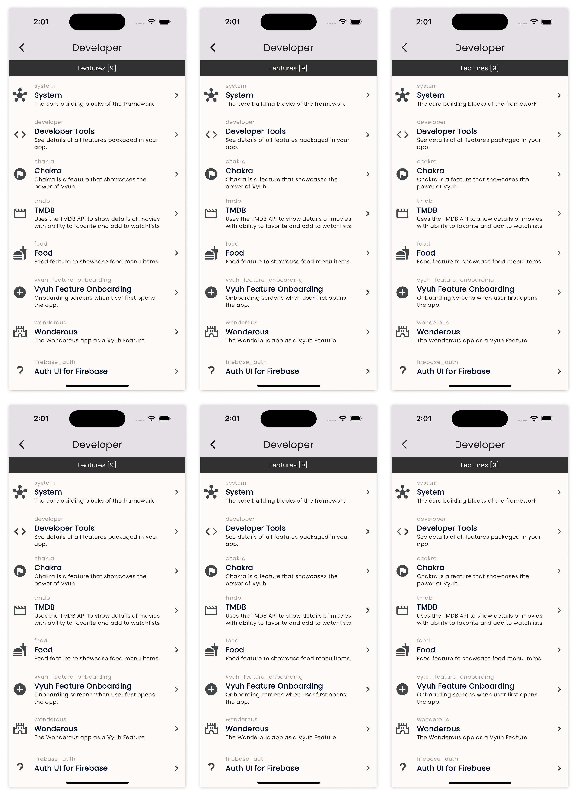



Once you start building larger apps, it is useful to see how the App was put
together and explore its details. This is the purpose of the _Developer Tools_
feature, which gives you this breakdown, organized by features and plugins.



It shows you all the features and goes into details about the various elements
exposed by each feature. This is a great way to verify that the right
configurations have been exposed.

When you describe your Feature with the `FeatureDescriptor`, make sure to add
proper `title`, `icon` and `description`. This will be used when rendering it
inside the _Developer Tool_. For example, this is how the System feature has
been declared with all these parameters.

```dart
final feature = FeatureDescriptor(
  name: 'system',
  title: 'System',
  description: 'The core building blocks of the framework',
  icon: Icons.hub,

  // ... rest of the fields ...
);
```

You can also drill down into the plugins and see its contained elements. This is
especially useful for the _Content_ and _Analytics_ plugins.

 In future versions, we will make this more extensible
and allow every feature and plugin to provide its own information views, in
addition to the standard details. 
