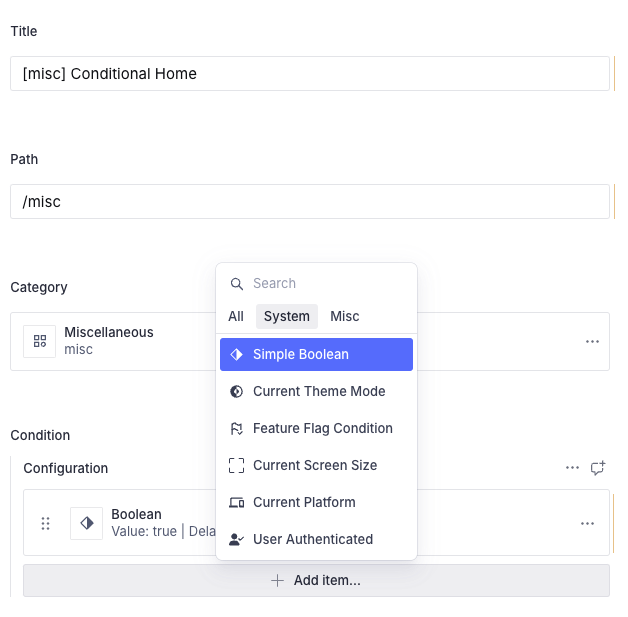
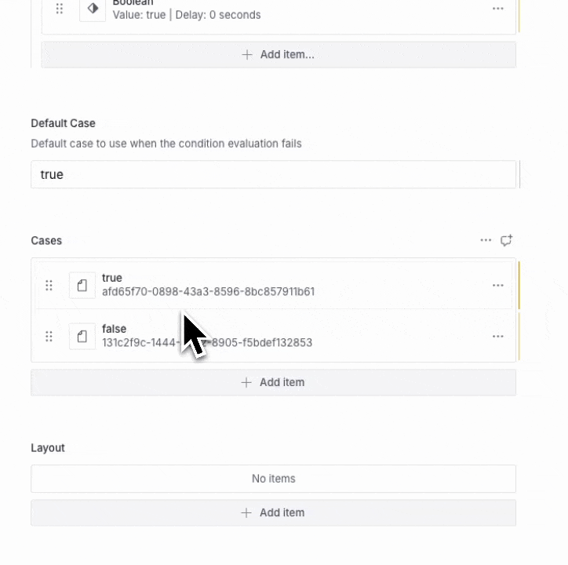

import { Aside } from '@astrojs/starlight/components'
import { YouTube } from 'astro-embed'

In the Vyuh framework, routes are a great way to set up a single screen of
content. But sometimes, you don't want to always go to the same screen for every
user or for every situation in your app. That is where conditional routing comes
into play.

A conditional route leverages the **Condition** to branch between two or more
routes. Having a conditional route means you can do things like showing a
different screen for different types of subscribers. You could show a plain
screen for the basic user, a more premium looking screen for the premium user,
and a more luxurious one for the luxury user. These things can be pretty easily
done using a singular condition that tells you the subscription status and using
that to drive the conditional route.

The good part about a **Conditional Route** is that all of the configuration is
done from the CMS, so you don't really have to do anything in code to make it
work.

## Choosing a Condition

Since we are looking at an example of how to use a conditional route, let's pick
a condition which is fairly simple. In this case, a **Boolean** condition works
very well; it's already built into the system. Let's use this condition to drive
the two branches of the conditional route.

Notice that in the above picture, we have created a new route called
`Conditional Home` with a path of `/misc`. We have also selected the **Simple
Boolean** condition, which is built into the system.

## Deciding the various branches

The next step is to set up the two branches of this particular condition. Since
it's a Boolean condition, we'll obviously create a **`true`** route and a
**`false`** route. We set up those two as cases, as you can see in the GIF
below. The `true` route is pointing to the _Miscellaneous Home_, and the `false`
route points to an Empty page.

<Aside>

**A Route for each case**

One thing to note over here is that these conditions will return a string value
which could be used as an enumeration for deciding the different routes. So in
the case of the Boolean route, we know that there are only two possible values
(true and false). Hence, we only setup two routes.

But in case of a different condition (such as the subscription-status or the
current-platform), the values can be more than two, in which case you would have
to set up a route for all the possible values.

</Aside>

## Testing it in the App

Now for testing it in the app, make sure you are linking to this particular
route **through a URL** and NOT by a Route reference. The framework uses the URL
to decide whether there is a conditional route existing against the same path.
If so, it will evaluate the conditional-route and pick the final route to
render.

Since we have already set up the **`/misc`** route, let's now load it up inside
our app and see how it behaves when we switch the condition from **`true`** to
**`false`** and back to **`true`**.

<YouTube
  id="https://youtu.be/Cq9qBUQOOkk"
  title={'Testing the conditional route with the true and false conditions'}
/>

## Summary

As you can tell from this article, there is no need to write any code to setup a
Conditional Route. It is all done in the CMS with a simple configuration. You
select the condition and setup the routes for its various cases. At runtime,
depending on the value of the condition, the correct route will be rendered.

<Aside type={'tip'}>
**Nested Conditional Routes**

A fun fact to note here is that you could have a Conditional Route itself as a
case! This means you can have a tree of Conditional Routes that can be used for
more complex scenarios. Give that a shot when you get a chance.

</Aside>
