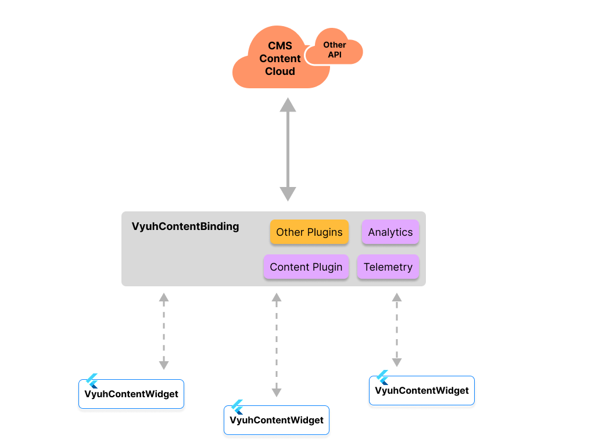
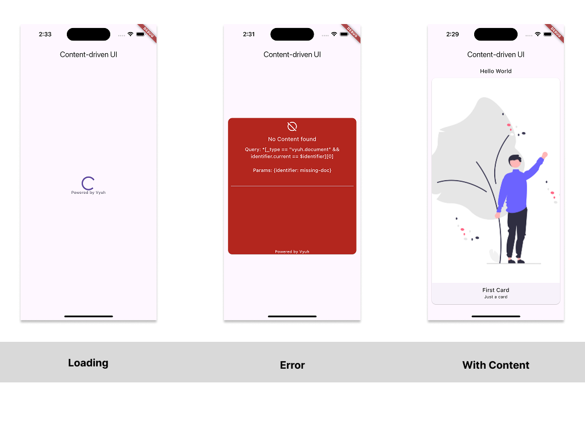
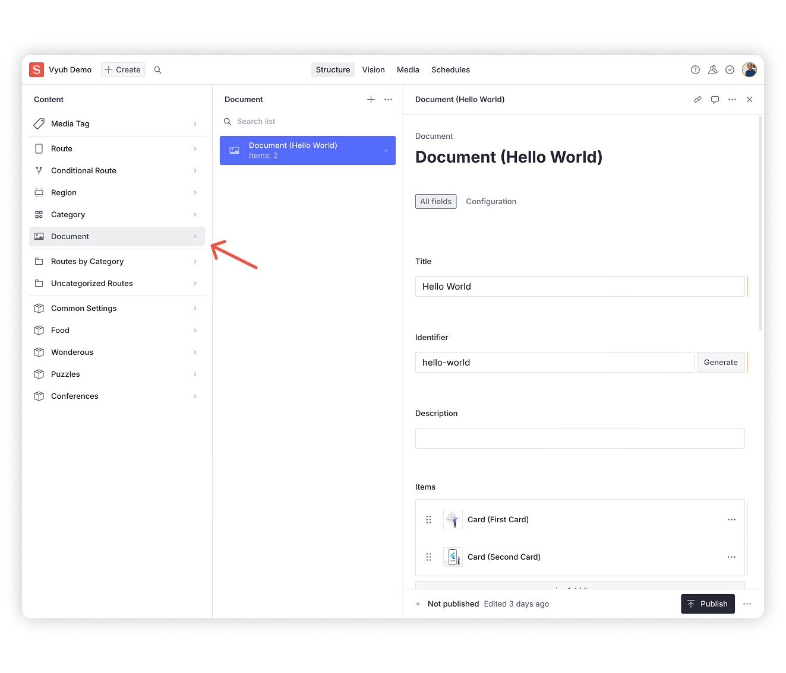
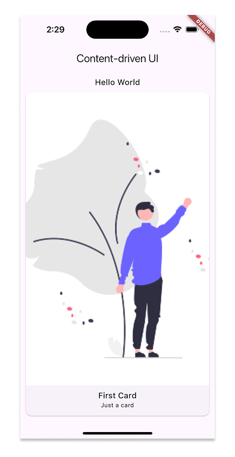
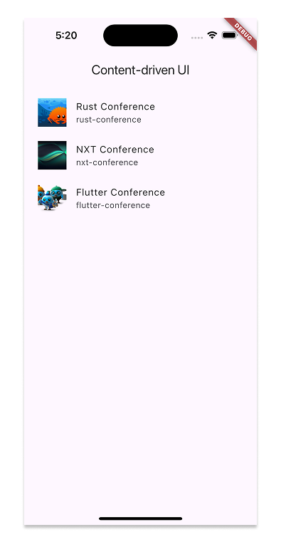

import { PubBadge } from '@/components/PubBadge'
import { Aside } from '@astrojs/starlight/components'

<PubBadge name="vyuh_content_widget" />

The `VyuhContentWidget` is a powerful, standalone Flutter widget that simplifies
content management and rendering in your Flutter applications. It provides a
seamless bridge between your CMS (Content Management System) and Flutter UI,
handling all the complexities of data fetching, error handling, and content
rendering.

It follows a simple binding-based architecture (via the `VyuhContentBinding`)
that is integrated into your app's initialization code. This approach allows you
to easily switch between different content providers and content types without
affecting the rest of your app's structure.

> In fact, you can be creative with your queries and support multiple
> `ContentProvider` options within the same App.



<Aside title={'Gradual Adoption from a Widget to the full Framework'} type={'tip'}>
The `VyuhContentWidget` offers a gradual approach to integrating CMS-driven 
content into existing Flutter applications. It provides several advantages for 
apps that aren't ready to fully migrate to the Vyuh framework:

1. **Incremental Adoption**: You can start using CMS-driven content in specific
   parts of your app without overhauling the entire architecture.

2. **Minimal Dependencies**: The widget has a focused set of dependencies,
   reducing potential conflicts with your existing app structure.

3. **Seamless Integration**: Easily incorporate dynamic content into your
   current UI components without major refactoring.

4. **Performance Optimization**: The widget handles caching and efficient data
   fetching, improving your app's performance for content-heavy sections.

5. **Future-Proofing**: As you become more familiar with CMS-driven development,
   you'll be better prepared for a potential full migration to the Vyuh
   framework in the future.

By using the `VyuhContentWidget`, you can experience the benefits of
content-driven development while maintaining your current app structure.

</Aside>

### Benefits

- **Simplified CMS Integration**: Connect to your CMS with minimal boilerplate
  code
- **Type-safe Content**: Strongly typed content models ensure compile-time
  safety
- **Flexible Content Rendering**: Support for both single items and lists of
  content
- **Built-in Error Handling**: Comprehensive error handling with retry
  capabilities
- **Loading States**: Automatic handling of loading states with customizable
  loaders
- **Query Parameters**: Support for parameterized queries for dynamic content



## Getting Started

### 1. Add Dependencies

Add the following to your `pubspec.yaml`:

```yaml
dependencies:
  vyuh_content_widget: ^1.0.0
  vyuh_feature_system: ^1.0.0
```

<Aside type={'note'}>

The `vyuh_feature_system` dependency is required for the standard system
content-blocks. This enhances the `VyuhContentWidget` to work with a wider
variety of content.

</Aside>

#### Setup your CMS

Please refer to the [Integrating a CMS](/intro/integrating-cms) guide for
setting up your CMS and creating content types. We will leverage the `Document`
(`vyuh.document`) schema as the primary content type.



### 2. Initialize VyuhContentBinding

Before using the widget, you need to initialize the content binding with your
desired plugins and configurations. This is typically done in your app's
initialization code. The below code shows the initialization with
`SanityContentProvider`.

```dart {7,19,27}
import 'package:sanity_client/sanity_client.dart';
import 'package:vyuh_content_widget/vyuh_content_widget.dart';
import 'package:vyuh_core/vyuh_core.dart' hide runApp;
import 'package:vyuh_feature_system/vyuh_feature_system.dart' as system;
import 'package:vyuh_plugin_content_provider_sanity/vyuh_plugin_content_provider_sanity.dart';

// Configure your Sanity provider
final sanityProvider = SanityContentProvider.withConfig(
  config: SanityConfig(
    projectId: 'your-project-id',
    dataset: 'production',
    perspective: Perspective.previewDrafts,
    useCdn: false,
    token: 'your-sanity-token', // Optional: for authenticated requests
  ),
  cacheDuration: const Duration(seconds: 5), // Optional: configure cache duration
);

void main() {
  VyuhContentBinding.init(
    plugins: PluginDescriptor(
      content: DefaultContentPlugin(provider: sanityProvider),
      // Add other plugins as needed, e.g., telemetry
    ),
    // Optional: Add custom content descriptors
    descriptors: [
      system.descriptor,
      ContentExtensionDescriptor(
        contents: [MyContent.descriptor()],
        contentBuilders: [MyContent.contentBuilder],
      ),
    ],
  );

  runApp(MyApp());
}
```

This initialization step is crucial as it:

- Sets up the Sanity content provider for fetching CMS content
- Sets up content type descriptors for your custom models. By default, it only
  sets up the `vyuh.document` content type for `Document` models. We are
  enhancing the range of content-blocks by including the system content types
  from the [`vyuh_feature_system`](/framework/packages/vyuh-feature-system)
  package.
- Enables additional plugins like telemetry if needed

### 3. Basic Usage

The simplest way to use `VyuhContentWidget` is with a `Document`. A Document
(`vyuh.document`) is a built-in content type that provides a standard structure
for content in Vyuh applications. This is part of the
[`@vyuh/sanity-schema-system`](https://www.npmjs.com/package/@vyuh/sanity-schema-system)
NPM package.

> If you would like to work with your own content sources, make sure to send the
> document in the same schema. You will also have to create a custom
> `ContentProvider` that can fetch your content.

#### Document Schema in Sanity

```typescript title="document.ts"
{
  name: 'vyuh.document',
  type: 'document',
  title: 'Document',
  fields: [
    {
      name: 'title',
      title: 'Title',
      type: 'string',
      validation: Rule => Rule.required()
    },
    {
      name: 'identifier',
      title: 'Identifier',
      type: 'slug',
      validation: Rule => Rule.required(),
      options: {
        source: 'title',
        maxLength: 96
      }
    },
    {
      name: 'description',
      title: 'Description',
      type: 'string'
    },
    {
      name: 'items',
      title: 'Items',
      type: 'array',
      validation: Rule => Rule.min(1),
      of: [] // Populated with allowed content types
    }
  ]
}
```

#### Using the `identifier`

Using the widget with a `Document` is straightforward by providing an identifier
for the `Document` instance.

```dart
VyuhContentWidget.fromDocument(
  identifier: 'hello-world',  // matches document's identifier
);
```

#### Using the `builder` for custom rendering

If you need more control over the rendering, you can pass in a builder that gets
the instance of the `Document`.

```dart {1-3,15-18}
VyuhContentWidget.fromDocument(
  identifier: 'hello-world',  // matches document's identifier
  builder: (context, document) {
    return Column(
      children: [
        if (document.title != null)
          Text(
            document.title!,
            style: Theme.of(context).textTheme.titleMedium,
          ),
        if (document.description != null)
          Text(document.description!),
        if (document.items != null && document.items!.isNotEmpty)
          Expanded(
            child: VyuhContentBinding.content.buildContent(
              context,
              document.items!.first,
            ),
          ),
      ],
    );
  },
);
```

The widget provides these features out of the box:

- Type-safe access to document fields (`title`, `description`, `item`)
- Automatic content building for nested items, when using the
  `ContentPlugin.buildContent()` method.
- Default layout handling with `DocumentDefaultLayout`
- Proper theme integration with Flutter's Material Design



### 4. Custom Content Types

For custom content types, use the generic constructor, where you can pass in the
type-argument for the specific `ContentItem`.

```dart
VyuhContentWidget<Conference>(
  query: '*[_type == "conf.conference"]',
  fromJson: Conference.fromJson,
  builder: (context, conference) {
    return Text(conference.title);
  },
);
```

## Advanced Usage

### Working with Lists

The widget also supports rendering a list of items. The `listBuilder` is used
instead of the `builder` and receives the list of items instead of a single
item.

```dart {4}
VyuhContentWidget(
  query: Queries.conferences.query,
  fromJson: Queries.conferences.fromJson,
  listBuilder: (context, conferences) => ListView.builder(
    itemCount: conferences.length,
    itemBuilder: (context, index) => ListTile(
      leading: system.ContentImage(
        ref: conferences[index].logo,
        width: 48,
        height: 48,
      ),
      title: Text(conferences[index].title),
      subtitle: Text(conferences[index].slug),
    ),
  ),
),
```



### Custom Query Parameters

```dart
VyuhContentWidget<Article>(
  query: '''*[_type == "article" &&
    publishDate >= \$startDate &&
    publishDate <= \$endDate
  ]''',
  queryParams: {
    'startDate': '2024-01-01',
    'endDate': '2024-12-31',
  },
  fromJson: Article.fromJson,
  listBuilder: (context, articles) {
    // Render articles
  },
);
```

### Error Handling

The widget automatically handles errors and provides a built-in error view with
retry functionality:

```dart
VyuhContentWidget<BlogPost>(
  query: '*[_type == "blog.post"][0]',
  fromJson: BlogPost.fromJson,
  builder: (context, post) {
    return Column(
      children: [
        Text(post.title),
        Text(post.content),
      ],
    );
  },
);
```

## Best Practices

1. **Type Safety**: Always specify the content type parameter `<T>` for better
   type safety
2. **Query Parameters**: Use parameterized queries instead of string
   interpolation
3. **Error Handling**: Let the widget handle errors automatically unless you
   need custom error UI
4. **Loading States**: The widget provides default loading states, but you can
   customize them through `widgetBuilder` parameter of
   `VyuhContentBinding.init()`

## Summary

The `VyuhContentWidget` is a powerful widget for rendering content from a CMS.
Use it to fetch content from a CMS Provider (like Sanity.io) and render it in
your Flutter app, whether it is a standalone app or as part of a larger
feature-rich app.

The widget also provides additional benefits such as built-in error handling
with retry functionality and a loading state that can be customized as per the
Design System of your Flutter app.
