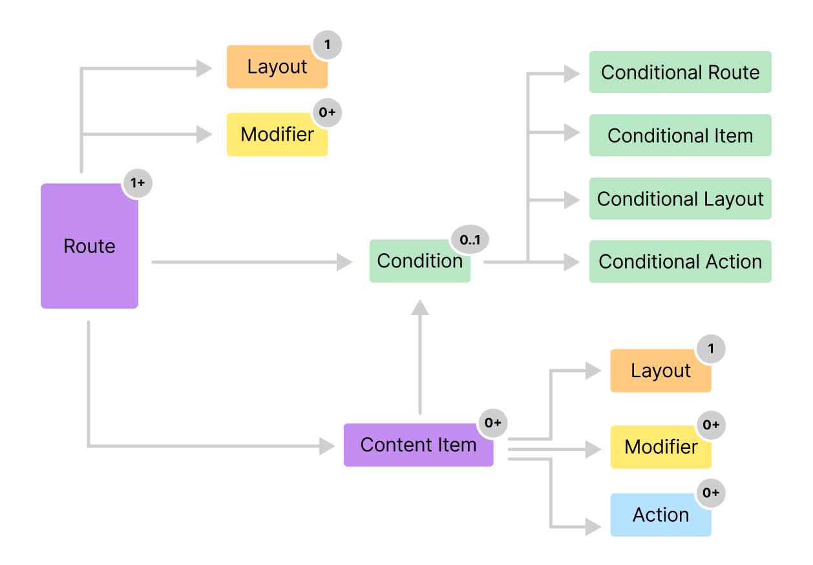

import { Aside } from '@astrojs/starlight/components'

Applications have become much more sophisticated in the past few years and will
continue to advance the State of the Art. Many of them are moving into the realm
of being content-oriented, server-driven experiences. It is in this category
that we would like to play as a framework.

In this article let's explore the five core elements of building such
experiences. This is a distilled version of the essentials for any App and are
the fundamental building blocks of a CMS-driven experience. These 5 elements
are:

1. Route
2. Content Item
3. Layout
4. Action
5. Condition

Let's see each of these in more detail.

## Route

A route represents a single page of content. This could mean a screen in case of
an App or a page in case of a Website. It is a logical container that has fixed
identity (with the **`path`** attribute) and could become part of a User
journey. A journey is where you string a collection of routes in a fixed order
to accomplish some goal.

Routes are a container of content, which are represented by one or more of the
[Content Item](#content-item) building block. When building an App Experience,
you would start from a Route as your starting point, give it a path and the
assemble the set of content-items that represent the content of the page or
screen.

### Conditional Route

Routes can also have a condition, which makes them have one or more destinations
depending on the runtime-evaluation of the condition. A good example is the
Login page of an App. If you are not already logged in, this page is shown with
the login controls. If you are already logged in, you could be shown or
redirected to the Home page. Here the condition is the logged-in state of the
user. You could build the login page as a conditional-route and have it
automatically show the right page depending on the runtime condition.

## Content Item

This is possibly the most important building block of any App. Without this
there would be nothing to show to the user. The content item represents the real
information that the user wants to see or act upon. This could be a set of
products that is shown in a list or a video or the payment-form during checkout.

There is a wide range of content-items you can have and many will be custom and
unique to your application. There are several built-in content items such as
Card, Group, Accordion, Divider, Video, etc. However, the framework is also
built for extending this list with your own custom ones.

<Aside>
 **Route is a Content Item**

Note that a Route is also a specialized form of a Content Item. It just happens
to be a container but really a sub type of a Content Item. Hence, _almost_
everything that applies to a Content Item, also applies to a Route.

</Aside>

### API Content

One of the commonly used content items is the _API Content_. This represents a
self-contained way of rendering network content. It takes a configuration that
allows you to connect to any third-party API and use that data to render a
Flutter Widget.

For example, you can have an API Configuration that talks to Firebase or
Supabase or a specific enterprise API to fetch data and render it in a Widget.
You can also show its _loading_ and _error_ states, if need be.

## Layout

The appearance of a Content Item is controlled by its Layout. In fact, there can
be multiple layouts for a Content Item. However, only one of them is applied at
a time. The ability to have multiple layouts is what makes the framework so
powerful. You could switch these layouts for different content items for
different pages. So, the same item can appear differently under different
contexts.

You would have seen this already in scenarios where a Product-item appears in a
mini-view for a Search listing page and then an expanded view in the detail
page. This is purely a layout change for the same Product content-item.

<Aside>
 **Default Layout**

Every Content Item has a default layout, which is used when there is none
specified on the CMS.

</Aside>

## Action

Actions allow the user to participate and interact with the interface. There can
be a variety of actions that can be invoked in response to User events (tap,
swipe, scroll) and also system events (eg: Network response, timers, etc.). The
most popular action that you will being used is the Navigation Action. This
allows a user to go from Route to Route and navigate a user-journey. As you can
expect, the framework has several built-in actions such as:

- Navigation
- Show/hide snack bars
- Show/hide drawers
- Open URL
- Open Dialog
- Toggle Light/Dark theme
- Show Alerts

As expected, you have the ability to create custom actions and do things very
specific to your application.

## Condition

A condition is a runtime evaluation of some criteria which results in a set of
defined values. For example, the simplest condition could evaluate to a `true`
or `false`. A subscription-status condition could result in `none`, `standard`,
or `premium`.

Conditions can be applied to all of the building blocks seen earlier: Route,
Content Item, Action and Layout. This gives a unique super power to branch on a
condition and show a different route, content-item or layout, or take a
different action.

Some of the common conditions have been built into the system such as:

- A simple Boolean condition
- Current theme
- Feature Flag
- Current Screen Size
- Current platform
- User Authentication status

Of course, you are free to extend this set by creating custom conditions.

## Summary

Route, Content Item, Layout, Action and Condition are the core elements that can
be combined in creative ways to pretty much create any Application you can
imagine. It might seem a bit too simplistic at first. However, it will grow on
you and you will start decomposing complex problems into one or more of these
elements.

As a matter of fact, why don't you try it out on the Payment journey in an app
:thinking:.
