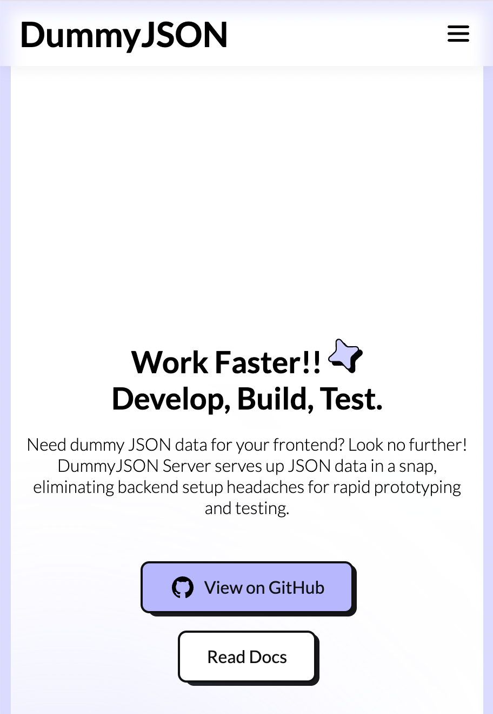
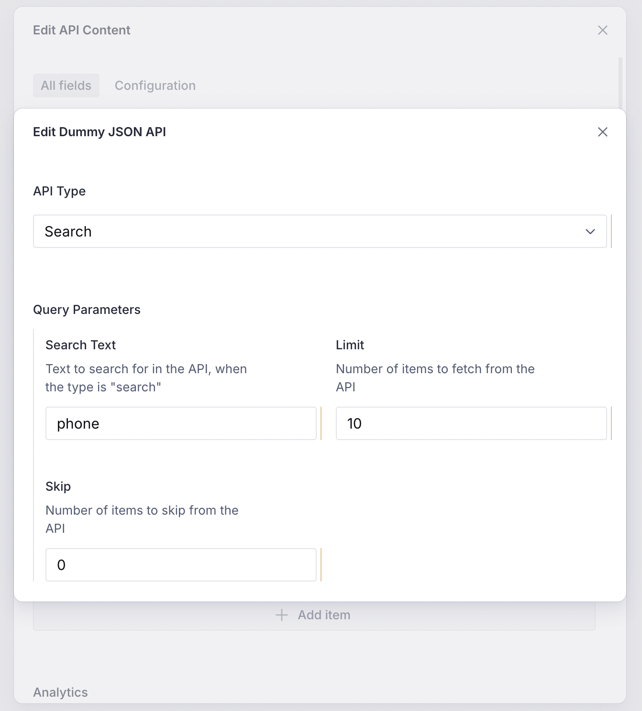
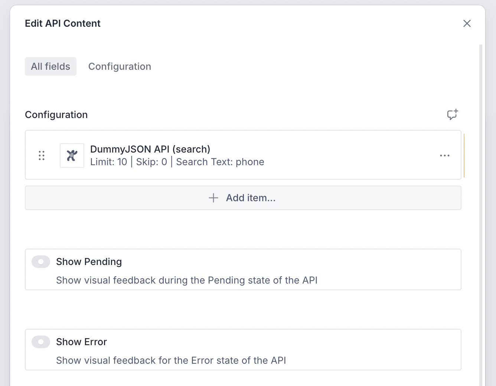
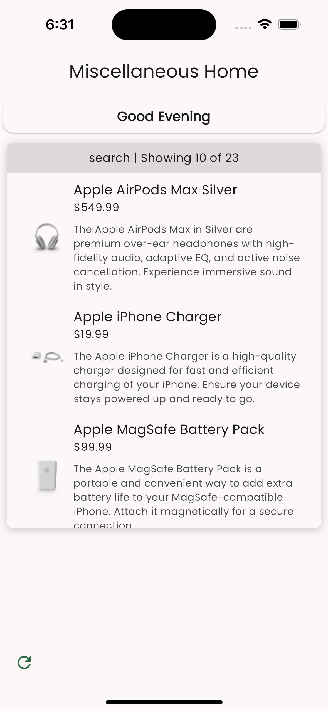

import { Aside } from '@astrojs/starlight/components'

Rendering content from an API remains one of the most popular use cases of the
Vyuh Framework. This is expected as most real-world apps will fetch data from an
API and render it as per the brand guidelines.

In this guide, we will see how to integrate a third-party API and render it as
per our needs.

## 1. Identifying a Third-Party API

After searching the internet for _free API resources_, we decided to go with the
one at [DummyJSON](https://dummyjson.com/). This resource gives a variety of
APIs for _products, carts, recipes, todos_, etc.



The API for **Products** is what we decided to use for this example. It has a
rich schema for its responses and good query parameters around which we could
model our _API Configuration_.

There are two endpoints for products that we can use:

1. [**Products list**](https://dummyjson.com/docs/products#products-all)
   (`https://dummyjson.com/products`): shows a list of products with query
   parameters to control the **`limit`** and **`skip`**.
2. [**Products search**](https://dummyjson.com/docs/products#products-search)
   (`https://dummyjson.com/products/search?q=<search-text>`): allows searching
   for products with some search terms (using the **`q`** parameter). It also
   supports the **`limit`** and **`skip`** query parameters.

## 2. API Configuration schema for the CMS

Based on the parameters we saw earlier, we have come up with a schema that can
be configured from the CMS. It allows changing the `limit`, `skip` and
`searchText` parameters. We have also exposed the two types of product endpoints
with a simple `type` enum.

Here is the _Sanity_ schema, with a few parts elided for brevity.

```typescript
import { defineField, defineType } from 'sanity'

export const dummyJsonApi = defineType({
  name: 'misc.apiContent.dummyJson',
  type: 'object',
  title: 'Dummy JSON API',
  fieldsets: [
    {
      title: 'Query Parameters',
      name: 'queryParameters',
      options: { columns: 2 },
    },
  ],
  fields: [
    defineField({
      name: 'type',
      title: 'API Type',
      type: 'string',
      validation: (Rule) => Rule.required(),
      initialValue: 'products',
      options: {
        list: [
          { title: 'Products', value: 'products' },
          { title: 'Search', value: 'search' },
        ],
      },
    }),
    defineField({
      name: 'searchText',
      title: 'Search Text',
      type: 'string',
      fieldset: 'queryParameters',
    }),
    defineField({
      name: 'limit',
      title: 'Limit',
      type: 'number',
      validation: (Rule) => Rule.min(1).max(50),
      initialValue: 10,
      fieldset: 'queryParameters',
    }),
    defineField({
      name: 'skip',
      title: 'Skip',
      type: 'number',
      validation: (Rule) => Rule.min(0),
      initialValue: 0,
      fieldset: 'queryParameters',
    }),
  ],
  // ... hiding the preview field ...
})
```

To ensure this shows up in our CMS, we need to add it to the
`FeatureDescriptor`, like so.

<Aside>
  Note that the _feature_ has already been included in our top-level studio. We
  do this by depending on this _feature-package_ and adding it to the list of
  features in the studio configuration.
</Aside>

```typescript
import { FeatureDescriptor } from '@vyuh/sanity-schema-core'
import { APIContentDescriptor } from '@vyuh/sanity-schema-system'
import { dummyJsonApi } from './content/dummy-json-api.ts'

export const misc = new FeatureDescriptor({
  name: 'misc',
  title: 'Miscellaneous',
  contents: [
    new APIContentDescriptor({
      configurations: [dummyJsonApi],
    }),
  ],
})
```

Now our API configuration shows up on the CMS and we can configure it as we
need.



## 3. API Configuration on the Flutter side

As you may already know, the CMS counterpart on the Flutter side has an
equivalent `FeatureDescriptor` that includes the _Dart_ `TypeDescriptor` which
can handle fetching and rendering this API Content.

This is done by extending the **`ApiConfiguration<T>`** abstract class. Here we
define the `schemaType`, matching the CMS schema, and override its two methods:

- **`invoke(BuildContext context)`**: invokes the API and fetches the content
  (which you can wrap in type `<T>`). This is then passed to the `build` method.
- **`build(BuildContext context, T? data)`**: Renders the data as per the Design
  System. It is possible to receive null, which could be because of lack of data
  or an error. The type **`<T>`**, which represents the response from the API
  can be defined by you. You can add your exception, if any, or just return
  plain data. If you want to show more details about the API response, you can
  create a more complex type to capture it.

In our case, we chose to use a simple `ProductList` type that is a direct mirror
of the response we get from the DummyJSON API. Thus, our Dart equivalent of the
API configuration looks like so:

```dart
import 'dart:convert';

import 'package:feature_misc/content/api/model.dart';
import 'package:feature_misc/content/api/widgets.dart';
import 'package:flutter/material.dart';
import 'package:json_annotation/json_annotation.dart';
import 'package:vyuh_core/vyuh_core.dart';
import 'package:vyuh_feature_system/vyuh_feature_system.dart';

part 'dummy_json_api_content.g.dart';

@JsonSerializable()
final class DummyJsonApiConfiguration extends ApiConfiguration<ProductList> {
  static const schemaName = 'misc.apiContent.dummyJson';
  static final typeDescriptor = TypeDescriptor(
    schemaType: schemaName,
    fromJson: DummyJsonApiConfiguration.fromJson,
    title: 'DummyJSON API',
  );

  final DummyJsonProductApiType type;
  final String? searchText;
  final int limit;
  final int skip;

  DummyJsonApiConfiguration({
    required this.type,
    this.searchText,
    required this.limit,
    required this.skip,
  }) : super(schemaType: schemaName, title: 'DummyJSON API');

  factory DummyJsonApiConfiguration.fromJson(Map<String, dynamic> json) =>
      _$DummyJsonApiConfigurationFromJson(json);

  @override
  Widget build(BuildContext context, ProductList? data) {
    if (data == null) {
      return empty;
    }

    return ListContainer(
      title: Text(
        '${type.name} | Showing ${data.products.length} of ${data.total}',
        textAlign: TextAlign.center,
      ),
      child: ListView.builder(
        addAutomaticKeepAlives: true,
        itemBuilder: (_, index) {
          final item = data.products[index];
          return ProductTile(item: item);
        },
        itemCount: data.products.length,
      ),
    );
  }

  @override
  Future<ProductList> invoke(BuildContext context) async {
    final parameters = {
      if (type == DummyJsonProductApiType.search) 'q': searchText,
      'limit': limit,
      'skip': skip,
    }.entries.map((x) => '${x.key}=${x.value}').join('&');

    final basePath = switch (type) {
      DummyJsonProductApiType.products => 'https://dummyjson.com/products',
      DummyJsonProductApiType.search => 'https://dummyjson.com/products/search',
    };

    final response = await vyuh.network.get(Uri.parse('$basePath?$parameters'));
    final list = ProductList.fromJson(jsonDecode(response.body));

    return list;
  }
}

```

Note that the model types: `ProductList`, `Product` and
`DummyJsonProductApiType` are defined in a separate file (`model.dart`). These
are the _Dart_ objects that map to the _JSON response_ from the API. Also notice
the use of the **`vyuh.network`** plugin for invoking the API. This is the
recommended way of invoking APIs in Vyuh. The plugin wraps the `HttpClient` from
the standard library.

The use of the static fields for `schemaName` and `typeDescriptor` are just
conventions that we have found to be very useful. It keeps the details neatly
tucked in the class and makes it easy to include it in the `FeatureDescriptor`,
as seen below:

```dart
import 'package:feature_misc/condition/part_of_day.dart';
import 'package:feature_misc/content/api/dummy_json_api_content.dart';
import 'package:flutter/material.dart';
import 'package:vyuh_core/vyuh_core.dart';
import 'package:vyuh_extension_content/vyuh_extension_content.dart';
import 'package:vyuh_feature_system/vyuh_feature_system.dart';

final feature = FeatureDescriptor(
  name: 'misc',
  title: 'Misc',
  // ... hiding other fields ...
  extensions: [
    ContentExtensionDescriptor(
      contents: [
        APIContentDescriptor(configurations: [
          DummyJsonApiConfiguration.typeDescriptor,
        ],),
      ],
    ),
  ],
);

```

Notice the use of the `APIContentDescriptor` where we specify the
`typeDescriptor` for the Dummy JSON API configuration. Later on, if we plan to
add more API configurations, we could include them as well in the
`configurations` array for the `APIContentDescriptor`.

## 4. API content in action

We can now include the API Content block on the CMS and configure it with the
DummyJSON API.



On the Flutter side, if we do a hot-reload and load the page which has this
content block, we can see it live. We have done some simple styling to render
the list of products with custom _ListContainer_ and _ProductTile_ widgets.



## Summary

Vyuh has rich provision to integrate custom API endpoints and render their
responses. To configure it on the CMS, we define a custom schema with the
`APIContentDescriptor` .

There is a similar task on the Flutter side, where we take care of the
implementation details of invoking the API and rendering it. This is done with
the `APIContentDescriptor` where we include the `typeDescriptor` for this
configuration.

Together we now have a powerful, configurable _API Content block_ that can be
_changed dynamically_ from the CMS.
