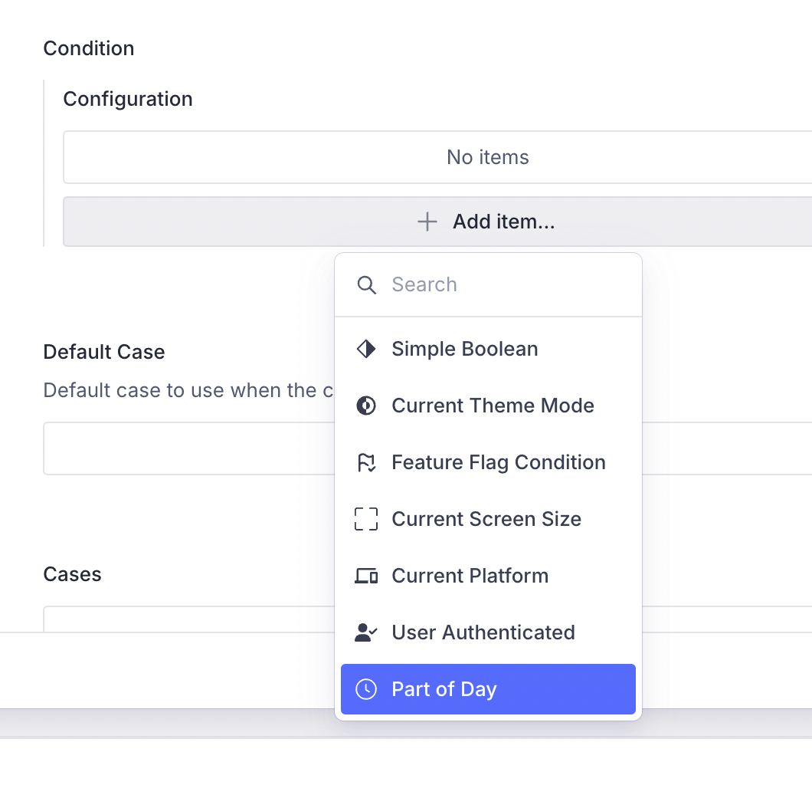
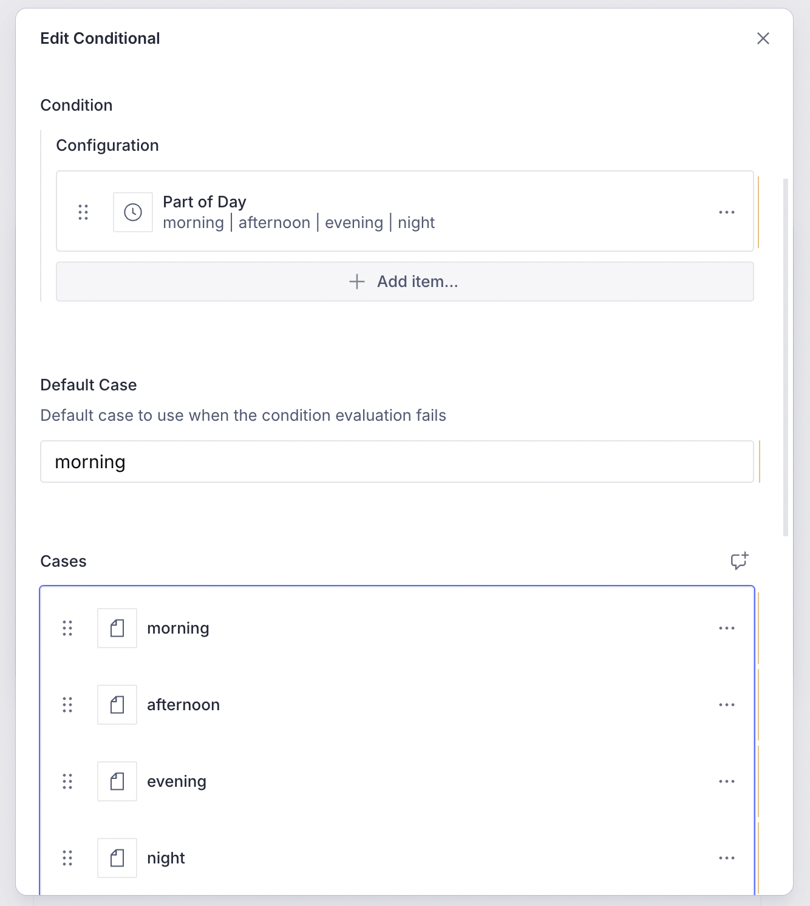
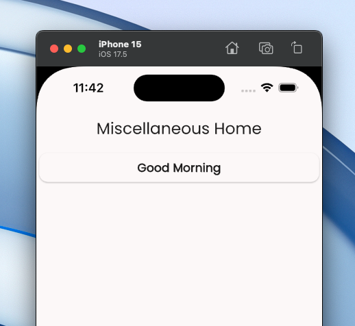

Conditions, as seen in an earlier article help in switching between two or more
possibilities for an _Action_, _Layout_, _Route_ or a _Content Block_. They help
in managing more complex scenarios by introducing branch-points at the right
places.

Conditions can be defined on the CMS, via a schema, and have its counterpart on
the Flutter side. Note that the CMS side is purely declarative and helps in
_configuring the condition_. The Flutter side is where we do the actual
_implementation for the condition_.

> **CMS** is for _configuration_, **Flutter** is for _implementation_

Vyuh allows you to create custom conditions and have them exported from a
feature, inside the `FeatureDescriptor`, both for the CMS side and for the
Flutter side.

## A Condition for "Part of a Day"

In this guide, let's go about creating a custom condition that returns the
current **part of a day**. As per general understanding, we will adopt the
following parts in our custom condition:

- **`morning`**: 5 am to 12 pm
- **`afternoon`**: 12 pm to 5 pm
- **`evening`**: 5 pm to 9 pm
- **`night`**: 9 pm to 5 am.

Arguably, the time ranges for some of these parts can be tweaked a bit but we
will go with these for now.

## 1. Define the schema for the condition

This condition is dependent on the current time and not something we can
statically define. Hence, the schema that we expose on the CMS is super minimal
and only contains a `title` for easy identification. Many of the custom
conditions you may define in the future could have such a simple schema.

Below is the _Sanity_ schema we will use.

 A good practice is to include the possible values of
this condition at runtime, which we do in the **`description`** field and also
in the **`preview`**. 

```typescript
import { defineField, defineType } from 'sanity'
import { GoClock as Icon } from 'react-icons/go'

export const partOfDay = defineType({
  name: 'misc.condition.partOfDay',
  title: 'Part of Day',
  description:
    'Uses the following values: morning | afternoon | evening | night',
  type: 'object',
  icon: Icon,
  fields: [
    defineField({
      name: 'title',
      title: 'Title',
      type: 'string',
      readOnly: true,
      initialValue: 'Part of Day',
    }),
  ],
  preview: {
    prepare(selection) {
      return {
        title: 'Part of Day',
        subtitle: 'morning | afternoon | evening | night',
      }
    },
  },
})
```

Note that we have deliberately set the **`title`** field to `readOnly` along
with an `initialValue`.

 **Naming inside the Schema**

Our feature is named "**misc**" as it will hold miscellaneous aspects of the
framework, demonstrating its capabilities. Its a good practice to use the
feature name as a prefix in all your schemas to avoid any conflicts in the
future.&#x20;

In this case we are using the **`misc.condition.partOfDay`** for the condition.
In general, we recommend following a _dotted notation
(_`<feature>.<type>.<name>`_)_ for naming schemas. 

## 2. Export the condition schema

The schema on its own will not show up inside the CMS until it is exported in
our feature. We do this with the `FeatureDescriptor` inside the `index.ts` file
for the feature.&#x20;



```typescript
import { FeatureDescriptor } from '@vyuh/sanity-schema-core'
import { partOfDay } from './condition/part-of-day.ts'

export const misc = new FeatureDescriptor({
  name: 'misc',
  title: 'Miscellaneous',

  conditions: [partOfDay],
})
```



At the top level where the Sanity Studio is defined, we have already included
the **misc** feature in our list of features. Thus the _part-of-day_ condition
will now be visible when you try associating this condition for, say, a
_conditional-block_.



## 3. Create the Flutter counterpart

The condition equivalent on the Flutter side is where we bring it to life. This
is done by extending the `ConditionConfiguration` and implementing its
`execute()` method.



```dart
import 'package:flutter/material.dart';
import 'package:json_annotation/json_annotation.dart';
import 'package:vyuh_core/vyuh_core.dart';
import 'package:vyuh_extension_content/vyuh_extension_content.dart';

part 'part_of_day.g.dart';

@JsonSerializable()
final class PartOfDayCondition extends ConditionConfiguration {
  static const schemaName = 'misc.condition.partOfDay';

  static final typeDescriptor = TypeDescriptor(
    schemaType: schemaName,
    fromJson: PartOfDayCondition.fromJson,
    title: 'Part of Day',
  );

  PartOfDayCondition() : super(schemaType: schemaName, title: 'Part of Day');

  factory PartOfDayCondition.fromJson(Map<String, dynamic> json) =>
      _$PartOfDayConditionFromJson(json);

  @override
  Future<String?> execute(BuildContext context) {
    final now = DateTime.now();
    final hour = now.hour;

    if (hour < 12) {
      // 5AM - 12PM
      return Future.value('morning');
    } else if (hour < 17) {
      // 12PM - 5PM
      return Future.value('afternoon');
    } else if (hour < 21) {
      // 5PM - 9PM
      return Future.value('evening');
    } else {
      // 9PM - 5AM
      return Future.value('night');
    }
  }
}

```



The logic which we described earlier in the article is now being used to
determine the part of the day. The **`typeDescriptor`** field helps in defining
the registry entry for the content deserializer, which we will use in when
exporting the feature.&#x20;

## 4. Export inside the feature

Just like we did for the schema, we include the condition with the
`FeatureDescriptor` for the Flutter side as well. This is where the
**`typeDescriptor`** comes in handy.



```dart
import 'package:feature_misc/condition/part_of_day.dart';
import 'package:flutter/material.dart';
import 'package:vyuh_core/vyuh_core.dart';
import 'package:vyuh_extension_content/vyuh_extension_content.dart';

final feature = FeatureDescriptor(
  name: 'misc',
  title: 'Misc',
  description:
      'Miscellaneous feature showing all capabilities of the Vyuh Framework.',
  icon: Icons.miscellaneous_services_outlined,
  routes: () async {
    return [
      CMSRoute(
        path: '/misc',
        pageBuilder: defaultRoutePageBuilder,
      ),
    ];
  },
  extensions: [
    ContentExtensionDescriptor(
      conditions: [
        PartOfDayCondition.typeDescriptor,
      ],
    ),
  ],
);

```



## 5. Apply the condition to a Content Block

Finally, we get to use our condition!&#x20;

Let's create a _Conditional Block_ in our CMS and define the content items to
show for the different conditions. We have created simple _Card_ items with the
_title_ mentioning the part of the day.



And here is the App in action, showing the appropriate greeting. We are just shy
of _12pm by 18 minutes_, which is why its still **`morning`**.



## Summary

Custom conditions allow extending the framework to add App specific conditional
logic. This can be done by creating a schema for the CMS and then its
counterpart in Flutter. In both places, we export the custom condition inside
the `FeatureDescriptor`.&#x20;

In this guide, we saw an example of using it for a simple Conditional block
showing different Cards depending on the _"part of the day"_. This can also be
applied to more complex scenarios such as:

- changing the theme of the App _as the day progresses_
- switching Layouts of content items, say between _morning_ and _evening_
- invoking different Actions
- switching between different pages based on the _part of the day_
