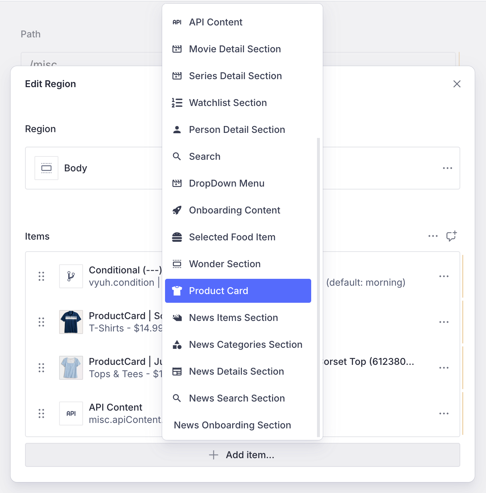
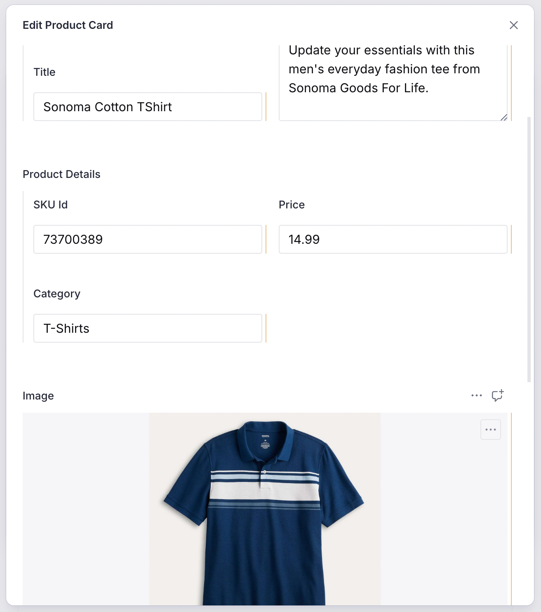
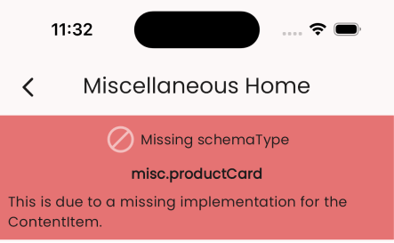
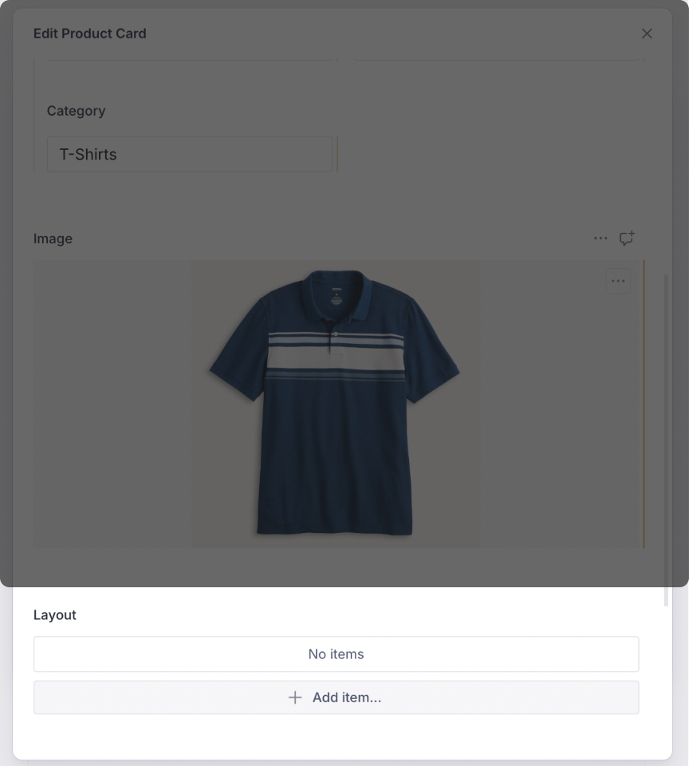

import { Aside } from '@astrojs/starlight/components'
import { Image } from 'astro:assets'

Real world apps will need a variety of Content Types and its only natural that a
framework like Vyuh support such a scenario. Extensibility is one of the primary
qualities of this framework and in this guide we will see how to introduce a new
_Custom Content Type_. We will add the schema on the CMS and build its
implementation on Flutter.

A quick summary of all the steps are given below, with the details in the
following sections:

#### CMS Side

1. [Create a schema for the Content type](#defining-the-schema)
2. [Register it with the FeatureDescriptor](#exporting-it-in-the-featuredescriptor)
3. [Add a few instances of the new Content type for testing](#creating-a-product-card-on-the-cms)

#### Dart/Flutter Side

1. [Create the Dart equivalent of the content type with a custom ContentItem type](#building-the-dart-equivalent-of-the-schema)
2. [Create its ContentBuilder that has a default LayoutConfiguration](#rendering-with-a-layoutconfiguration)
3. [Register it with the FeatureDescriptor on the Dart side](#registering-the-product-content-type)
4. [See the cards rendered live on the screen](#3-seeing-the-products-in-action)

## 1. A Product Card content type

Cards have become one of the most prominent types of visual metaphors for real
world objects. You see them everywhere in apps, in a variety of industry
verticals. We will continue with that tradition and build one for ourselves as a
custom card.

Let's create a **Product Card** that stands for the products you would present
to your customers. These could be products from the Fashion, Sports, Finance,
Healthcare or any other industry. For our use case, let's use the _Fashion_
domain.

### Defining the Schema

The first step is to define a schema that represents a product. A typical
product would consist of the following properties: `title`, `description`,
`price`, `category`, `skuId` and of course an `image`. The following schema
captures all of this in a Sanity schema. The use of the _**preview**_ field
helps in visualizing the card inside the CMS and gives the information in a
quick glance.

```typescript
import { defineField, defineType } from 'sanity'
import { IoShirt as Icon } from 'react-icons/io5'

export const productCard = defineType({
  name: 'misc.productCard',
  title: 'Product Card',
  type: 'object',
  icon: Icon,
  fieldsets: [
    {
      name: 'name',
      title: 'Name',
      options: { columns: 2 },
    },
    {
      name: 'details',
      title: 'Product Details',
      options: { columns: 2 },
    },
  ],
  fields: [
    defineField({
      name: 'title',
      title: 'Title',
      type: 'string',
      validation: (Rule) => Rule.required(),
      fieldset: 'name',
    }),
    defineField({
      name: 'description',
      title: 'Description',
      type: 'text',
      rows: 4,
      validation: (Rule) => Rule.required(),
      fieldset: 'name',
    }),
    defineField({
      name: 'skuId',
      title: 'SKU Id',
      type: 'string',
      validation: (Rule) => Rule.required(),
      fieldset: 'details',
    }),
    defineField({
      name: 'price',
      title: 'Price',
      type: 'number',
      validation: (Rule) => Rule.required(),
      fieldset: 'details',
    }),
    defineField({
      name: 'category',
      title: 'Category',
      type: 'string',
      validation: (Rule) => Rule.required(),
      fieldset: 'details',
    }),
    defineField({
      name: 'image',
      title: 'Image',
      type: 'image',
    }),
  ],
  preview: {
    select: {
      title: 'title',
      price: 'price',
      category: 'category',
      skuId: 'skuId',
      image: 'image',
    },
    prepare(selection) {
      const { title, image, price, category, skuId } = selection
      return {
        title: `ProductCard | ${title} (${skuId})`,
        subtitle: `${category} - $${price}`,
        media: image,
      }
    },
  },
})
```

### Exporting it in the FeatureDescriptor

We can now export this schema for usage inside the CMS. We do this with the
`FeatureDescriptor`. Notice that we are exporting it as a custom content within
the `contentSchemaBuilders` property and also adding to the `regionItems` of the
`RouteDescriptor`. This ensures we can add our product card to a region in the
page.

```typescript
import {
  BuiltContentSchemaBuilder,
  FeatureDescriptor,
} from '@vyuh/sanity-schema-core'
import { RouteDescriptor } from '@vyuh/sanity-schema-system'
import { productCard } from './content/product-card.ts'

export const misc = new FeatureDescriptor({
  name: 'misc',
  title: 'Miscellaneous',
  contents: [
    new RouteDescriptor({
      regionItems: [{ type: productCard.name }],
    }),
  ],
  contentSchemaBuilders: [
    new BuiltContentSchemaBuilder({
      schema: productCard,
      schemaType: productCard.name,
    }),
  ],
})
```

The `ContentSchemaBuilder` for this _productCard_ is a simple one and does not
have any custom configurations or layouts that needs to be assembled. Hence, we
go ahead with the standard `BuiltContentSchemeBuilder`.

### Creating a Product Card on the CMS

Now that we have the schema defined, let's add some products to our page, in the
CMS. Since the _Product Card_ has already been added to the _Route's
region-items_, we can see it in the list of content items for the Region.



After adding some of the details of the Product, we have the card, ready to be
displayed on the App.



## 2. Rendering the Product Card

Having an item defined on the CMS is only half the story. To render it on
Flutter, we do need to create its Dart equivalent. If we fail to do so, we will
be greeted with a message like below, indicating the missing piece of the
Content definition.

Such a message is quite useful during development as it quickly helps in
identifying the source of error. We are already aware of this missing piece, so
let's fix it now.



### Building the Dart equivalent of the Schema

The _Dart_ version of the Product schema is the type-safe version of the JSON we
get from the CMS. We can represent it like below.

```dart
import 'package:feature_misc/content/product/default_layout.dart';
import 'package:json_annotation/json_annotation.dart';
import 'package:vyuh_core/vyuh_core.dart';
import 'package:vyuh_extension_content/vyuh_extension_content.dart';

part 'product_card.g.dart';

@JsonSerializable(createToJson: false)
final class ProductCard extends ContentItem {
  static const schemaName = 'misc.productCard';
  static final typeDescriptor = TypeDescriptor(
    schemaType: schemaName,
    title: 'Product Card',
    fromJson: ProductCard.fromJson,
  );

  static final contentBuilder = ContentBuilder<ProductCard>(
    content: ProductCard.typeDescriptor,
    defaultLayout: DefaultProductCardLayout(),
    defaultLayoutDescriptor: DefaultProductCardLayout.typeDescriptor,
  );

  final String title;
  final String description;
  final ImageReference? image;
  final double price;
  final String skuId;
  final String category;

  ProductCard({
    required this.title,
    required this.description,
    this.image,
    required this.price,
    required this.skuId,
    required this.category,
    super.layout,
  }) : super(schemaType: schemaName);

  factory ProductCard.fromJson(Map<String, dynamic> json) =>
      _$ProductCardFromJson(json);
}
```

Notice the static fields: **`schemaName`**, **`typeDescriptor`** and the
**`contentBuilder`**. These are by convention a way of keeping the meta details
about the content item together. The `typeDescriptor` helps in defining the way
to hydrate a Dart version of the Product from its JSON equivalent. Similarly the
`contentBuilder` helps in defining the creating the visual representation of the
Product. You will see these being used in the `FeatureDescriptor`, where we
register the Product content type.

<Aside>
  The `ProductCard's` `ContentBuilder` is simple and does not rely on
  `ContentDescriptor` at this point. More complex `ContentBuilders` will also
  work with their corresponding `ContentDescriptor` elements to collect
  configurations across the features. One such example is the content-builder
  for **`PortableText`**. It uses a custom `ContentDescriptor` to collect
  _custom blocks, styles and annotations_ across the features and assembles them
  into a single `PortableTextConfig`.
</Aside>

### Rendering with a LayoutConfiguration

To render any `ContentItem`, we need a `LayoutConfiguration` that tells the
framework how to represent it in Flutter. A `ContentItem` can have multiple
`LayoutConfiguration` definitions and any feature can add more layouts for the
content type. This is one of the extensibility points of the framework.

In our case, we define a `DefaultProductLayout` that renders the Product with a
simple Flutter `Card` Widget. The code below shows this.

```dart
@JsonSerializable()
final class DefaultProductLayout extends LayoutConfiguration<Product> {
  static const schemaName = '${Product.schemaName}.layout.default';
  static final typeDescriptor = TypeDescriptor(
    schemaType: schemaName,
    title: 'Product',
    fromJson: DefaultProductLayout.fromJson,
  );

  DefaultProductLayout() : super(schemaType: schemaName);

  factory DefaultProductLayout.fromJson(Map<String, dynamic> json) =>
      _$DefaultProductLayoutFromJson(json);

  @override
  Widget build(BuildContext context, Product content) {
    final theme = Theme.of(context);

    return Card(
      clipBehavior: Clip.antiAlias,
      child: Padding(
        padding: const EdgeInsets.all(8.0),
        child: Row(
          children: [
            if (content.image != null)
              ContentImage(
                ref: content.image!,
                width: 200,
              ),
            Expanded(
              child: Column(
                crossAxisAlignment: CrossAxisAlignment.start,
                children: [
                  Text(
                    content.category,
                    style: theme.textTheme.labelSmall,
                  ),
                  Text(
                    content.title,
                    style:
                        theme.textTheme.titleMedium?.apply(heightFactor: 0.75),
                  ),
                  Padding(
                    padding: const EdgeInsets.symmetric(vertical: 8.0),
                    child: Text(
                      content.description,
                      style: theme.textTheme.bodySmall,
                    ),
                  ),
                  Text(
                    '\$${content.price}',
                    style:
                        theme.textTheme.bodyMedium?.apply(fontWeightDelta: 2),
                  ),
                ],
              ),
            ),
          ],
        ),
      ),
    );
  }
}

```

<Aside>
 **Multiple Layouts**

Note that a `ContentItem` like _ProductCard_ can have one of many layouts
applied to it. This is configurable from the CMS, as shown with the highlighted
_**`Layout`**_ field. Each layout is a different configuration and can contain
specific parameters to tweak the visual representation.



For our use case, we have created a default layout, which is simple and does not
have any configurable parameters.

</Aside>

### Registering the Product Content type

Just like we did on the CMS side, we also need to register this content type on
Flutter. We do this with the `FeatureDescriptor` in the _feature.dart_ file
_(Line #16)_.

```dart title="feature.dart"
import 'package:feature_misc/content/product/product_card.dart';
import 'package:flutter/material.dart';
import 'package:vyuh_core/vyuh_core.dart';
import 'package:vyuh_extension_content/vyuh_extension_content.dart';

final feature = FeatureDescriptor(
  name: 'misc',
  title: 'Misc',
  icon: Icons.miscellaneous_services_outlined,
  extensions: [
    ContentExtensionDescriptor(
      contentBuilders: [
        ProductCard.contentBuilder,
      ],

      // ... rest of the exported elements ...
    ),
  ],
);

```

## 3. Seeing the Products in action

With the schema on the CMS and its equivalent `ContentBuilder` created on
Flutter, we can now see it rendered in our App. It uses the default layout which
we created earlier to render the product as a simple `Card` widget.

For the two products which we added on the page, the corresponding cards can be
seen in the app below.

<Image
  src={import('./images/product-cards.png')}
  alt="Rendering the Product Cards"
  height={600}
/>

## Summary

In this article we described the process of adding a new Content type within our
App. We started with the schema for the _ProductCard_ Content type and
registered it with the `FeatureDescriptor` to be visible inside the CMS.

On the Dart/Flutter side we did an equivalent registration where we created the
`ProductCard` `ContentItem` type that knows how to deserialize the JSON schema.
Using the combination of a `ContentBuilder` for the Product type with a
`DefaultProductCardLayout` we could render the _ProductCard_ on the screen.

In this guide we created a single Default Layout. However, it is possible to
have several different layouts for the `ProductCard`. We will cover creating
additional custom layouts in the guide on
[Custom Layout](/guides/cms/custom-layout).
