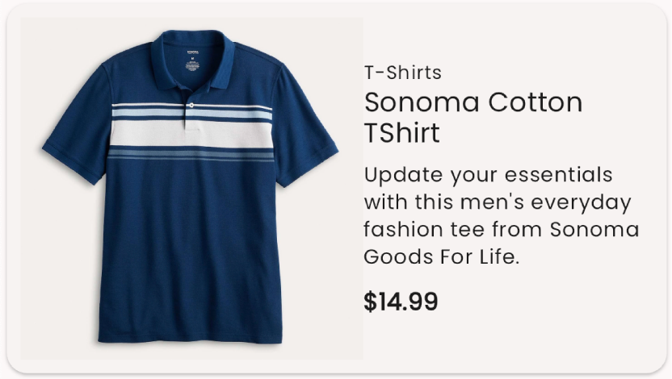
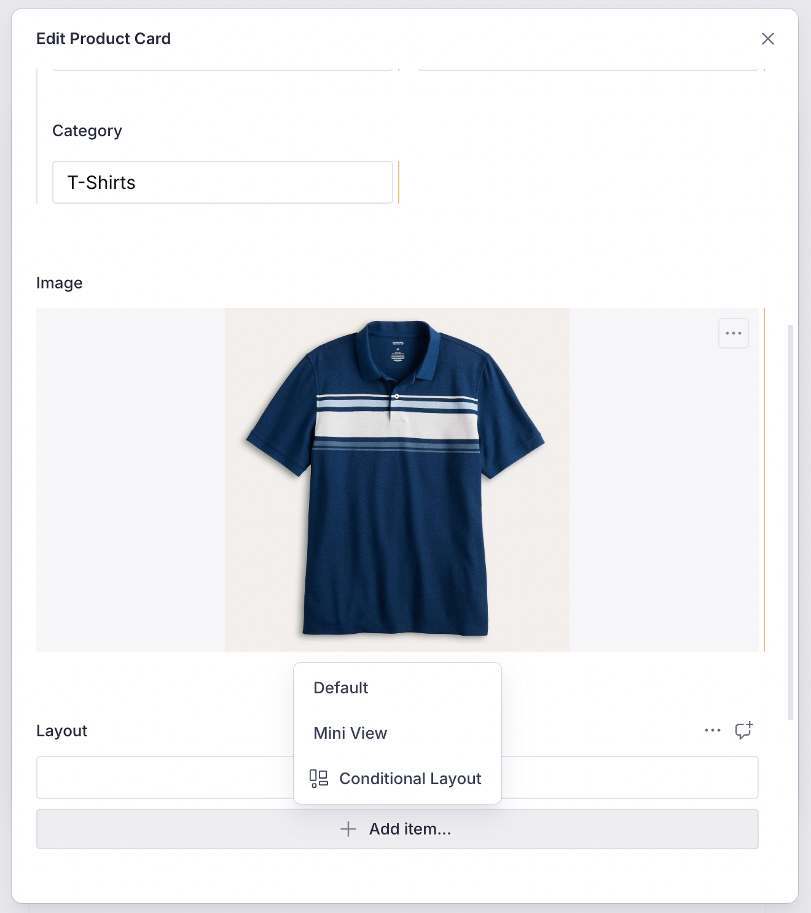
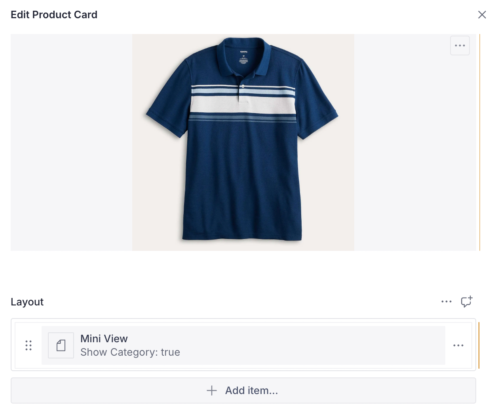
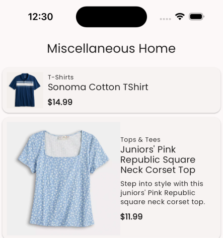

The default layouts that are normally used with a content item will rarely be
sufficient for all of the App scenarios. For example, the default `Card` layout
that is available out of the box is a good start but may not be applicable for
all pages of the app. In some cases, you would want an enlarged view of the same
card and in some cases a mini-view.

To cater to all of these scenarios, the Vyuh Framework allows extending a
Content Item with _additional layouts_. In fact, any feature can provide these
layouts, allowing even unrelated features to contribute to the overall list of
layouts for a content item.

In this guide, let's add a custom layout for the `ProductCard` item we created
in another article. If you haven't seen the article yet, take a quick read and
come back here.


[adding-a-new-content-type.md](adding-a-new-content-type.md)


The default layout for the `ProductCard` item, that we created earlier, looks
like below.&#x20;



We will change things up a bit and make the image come on the left and show just
the `title`, `price` and `category`. This will be our mini-view of the
_ProductCard_. Let's get started.

## 1. Creating a Mini-view layout schema

The schema that we will use to represent the mini-view layout configuration will
be a simple one. We will have a simple boolean to control whether the `category`
should be shown or not. Thus our schema looks like so:

```typescript
export const productMiniViewLayout = defineType({
  name: `${ProductCardDescriptor.schemaType}.layout.miniView`,
  title: 'Mini View',
  type: 'object',
  fields: [
    defineField({
      name: 'showCategory',
      title: 'Show Category',
      type: 'boolean',
      initialValue: true,
    }),
  ],
  preview: {
    select: {
      showCategory: 'showCategory',
    },
    prepare(selection) {
      return {
        title: 'Mini View',
        subtitle: `Show Category: ${selection.showCategory ?? false}`,
      }
    },
  },
})
```

There are couple of things to note in this schema. Firstly, our schema is no
longer a simple string but a _template string_ that uses the
**`ProductCardDescriptor.schemaType`** as its prefix. The reason why we have
switched to using a `ProductCardDescriptor` is partly for _convention_ and also
because we need a custom `ContentDescriptor` to allow adding more layouts.&#x20;

 **ContentDescriptor & ContentSchemaBuilder**

As you already know, a **`ContentDescriptor`** allows extending the capabilities
of a `ContentItem` such as layouts and other types of custom configuration. An
associated **`ContentSchemaBuilder`** for the content-item collects all its
descriptors and uses that to build the final set of configurations for the
`ContentItem`. This assembly by the builder is also necessary to create the
final _master_ schema for the CMS. 

### Creating the `ProductCardDescriptor` and `ProductCardContentBuilder`

The descriptor and builder for the Product content item are fairly simple as
there is no custom configuration being created. We rely on the built-in
capability of the base `ContentSchemaBuilder` to do all the work of assembling
layouts.



```typescript
import { defineField, defineType, SchemaTypeDefinition } from 'sanity'
import { IoShirt as Icon } from 'react-icons/io5'
import {
  ContentDescriptor,
  ContentSchemaBuilder,
} from '@vyuh/sanity-schema-core'

// Descriptor
export class ProductCardDescriptor extends ContentDescriptor {
  static schemaType = 'misc.productCard'

  constructor(props: Partial<ContentDescriptor> = {}) {
    super(ProductCardDescriptor.schemaType, props)
  }
}

// Schema builder
export class ProductCardContentBuilder extends ContentSchemaBuilder {
  private schema = productCard // refers to the schema for the Product content item

  constructor() {
    super(ProductDescriptor.schemaType)
  }

  build(descriptors: ContentDescriptor[]): SchemaTypeDefinition {
    return this.schema
  }
}
```



Notice that the content builder associates itself with the `ProductCard` using
the **`ProductCardDescriptor.schemaType`**.

## 2. Exporting in the FeatureDescriptor

Now that we have our core elements ready, its time to export them in the
FeatureDescriptor. We do that like so:



```typescript
import {
  defaultLayoutConfiguration,
  FeatureDescriptor,
} from '@vyuh/sanity-schema-core'
import { RouteDescriptor } from '@vyuh/sanity-schema-system'
import {
  ProductCardContentBuilder,
  ProductCardDescriptor,
  productCardMiniViewLayout,
} from './content/product-card.ts'

export const misc = new FeatureDescriptor({
  name: 'misc',
  title: 'Miscellaneous',
  contents: [
    new RouteDescriptor({
      regionItems: [{ type: ProductCardDescriptor.schemaType }],
    }),
    new ProductCardDescriptor({
      layouts: [
        defaultLayoutConfiguration(ProductCardDescriptor.schemaType),
        productCardMiniViewLayout,
      ],
    }),
  ],
  contentSchemaBuilders: [new ProductCardContentBuilder()],
})
```



The main lines to notice are from `22-25`, where we export the _default_ layout
and the _mini-view_ layout. Now we have an option to chose this layout when
creating the Product item in the CMS, as seen below.

 The **`defaultLayoutConfiguration`** is just a
convenience method that creates a schema for a default layout. It uses the
schemaType of the content as a prefix. Thus the for the `ProductCard`, it would
be **`misc.productCard.layout.default`**. 





## 3. Creating the Dart `LayoutConfiguration`

The Dart counterpart for the _layout_ is just a type-safe version of the JSON
schema we created earlier. This can be seen below. We also see a simplified
layout of the `ProductCard` in the `build()` method.

```dart
import 'package:design_system/utils/extensions.dart';
import 'package:feature_misc/content/product/product_card.dart';
import 'package:flutter/material.dart';
import 'package:json_annotation/json_annotation.dart';
import 'package:vyuh_core/vyuh_core.dart';
import 'package:vyuh_feature_system/vyuh_feature_system.dart' hide Card;

part 'mini_view_layout.g.dart';

@JsonSerializable()
final class MiniViewProductCardLayout extends LayoutConfiguration<ProductCard> {
  static const schemaName = '${ProductCard.schemaName}.layout.miniView';
  static final typeDescriptor = TypeDescriptor(
    schemaType: schemaName,
    title: 'Mini View Layout',
    fromJson: MiniViewProductCardLayout.fromJson,
  );

  final bool showCategory;

  MiniViewProductCardLayout({this.showCategory = true})
      : super(schemaType: schemaName);

  factory MiniViewProductCardLayout.fromJson(Map<String, dynamic> json) =>
      _$MiniViewProductCardLayoutFromJson(json);

  @override
  Widget build(BuildContext context, ProductCard content) {
    final theme = Theme.of(context);

    return Card(
      clipBehavior: Clip.antiAlias,
      child: Padding(
        padding: const EdgeInsets.all(8.0),
        child: Row(
          children: [
            if (content.image != null)
              Padding(
                padding: EdgeInsets.only(right: theme.spacing.s8),
                child: ContentImage(
                  ref: content.image!,
                  width: 64,
                  fit: BoxFit.contain,
                ),
              ),
            Expanded(
              child: Column(
                crossAxisAlignment: CrossAxisAlignment.start,
                children: [
                  if (showCategory)
                    Text(
                      content.category,
                      style: theme.textTheme.labelSmall,
                    ),
                  Text(
                    content.title,
                    style:
                        theme.textTheme.titleMedium?.apply(heightFactor: 0.75),
                  ),
                  SizedBox(height: theme.spacing.s8),
                  Text(
                    '\$${content.price}',
                    style:
                        theme.textTheme.bodyMedium?.apply(fontWeightDelta: 2),
                  ),
                ],
              ),
            ),
          ],
        ),
      ),
    );
  }
}

```

 When a `ProductCard` is assigned this layout, it is
automatically assigned as part of the deserialization process for the
ProductCard. The real magic is because we include the **`super.layout`** in the
constructor for the `ProductCard`, which is how the assignment is made.


## 4. Exporting it in the feature

By including the layout in the `FeatureDescriptor`, via the
`ProductCardDescriptor`**(line 10)**, we can now be sure that it will be picked
up and rendered correctly.



```dart
final feature = FeatureDescriptor(
  name: 'misc',
  title: 'Misc',
  icon: Icons.miscellaneous_services_outlined,
  extensions: [
    ContentExtensionDescriptor(
      contents: [
        ProductCardDescriptor(layouts: [
          DefaultProductCardLayout.typeDescriptor,
          MiniViewProductCardLayout.typeDescriptor,
        ]),
      ],
      contentBuilders: [
        ProductCard.contentBuilder,
      ],
    ),
  ],
);

```



## 5. Seeing it in action

Below you can see two product cards, each rendered with the mini and default
layouts.



## Summary

This article showed you the way to create multiple layouts for a `ContentItem`.
By simply changing it on the CMS, we are able to affect the change on the App
without any special deployment. This is a hidden super power of the framework,
where you can try out different layouts without changing much of your original
code.&#x20;

Under different contexts, different layouts are useful and this capability is
now available to you as you build more complex applications.
