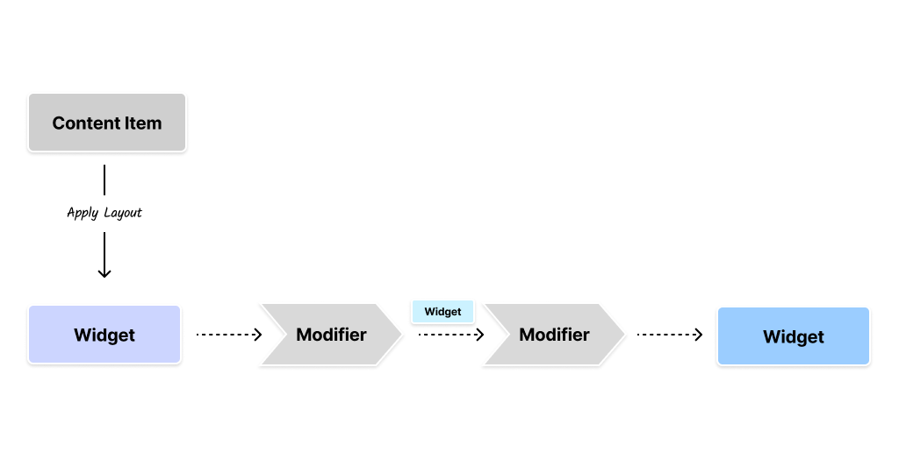

import { Aside } from '@astrojs/starlight/components'
import { Image } from 'astro:assets'
import darkCardImage from './images/dark-card-theme-modifier.png'
import cmsThemeModifierImage from './images/cms-theme-modifier.png'

We have seen earlier that custom layouts can be used to modify the appearance of
a content item. You can create several layouts, exposed by different features
across the application.

That is great for creating different layouts, but what if you want to apply the
same visual behavior across all instances of a content item? Well, that is where
**modifiers** come in.

`Modifiers` allow you to attach a visual behavior to every instance of a content
item, and you can configure that from the CMS with the corresponding
implementation in Flutter.

## Chain of Modifiers

Unlike layouts, there can be multiple modifiers for a content item. These can be
applied as a chain with each modifier getting the output of the previous
modifier.

By chaining modifiers you can get a pretty rich visual output for a specific
content item. We'll see an example of how to use a `theme-modifier` to modify
the theme for the entire widget tree.



The input to the modifier is the output of the _layout_ for the content-item,
which is the `Widget`. Each modifier can modify the `Widget` and pass it on to
the next modifier in the chain. The output of the last modifier is the final
`Widget` that is rendered on the screen.

<Aside type="tip" title={'Creative combination of Modifiers, DI, Layout within Vyuh'}>

You can combine the power of Modifiers, Dependency Injection, and Layouts to
create a rich visual experience for your content items. This is where the true
power of Vyuh lies.

The modifiers can construct a tree that can leverage State-management via
Dependency Injection, `InheritedWidget`s, custom `Layout` of the `ContentItem`,
and other Flutter features to create a powerful visual experience.

The core abstractions of Vyuh are designed to be composable and extensible for
achieving any of your visual requirements.

</Aside>

## Implementing a Custom `ThemeModifier`

Flutter allows us to change the themes of certain widget trees by using a
`Theme` widget at the right places. This allows us to have a different theme
altogether for a widget subtree compared to the one for the entire application.

This is the perfect use case for a Modifier that can come in and wrap the layout
widget for the content item with a Theme widget. The code for this is pretty
simple and can be listed entirely over here.

```dart title="theme_modifier.dart" showLineNumbers {26-31}
import 'package:flutter/material.dart';
import 'package:json_annotation/json_annotation.dart';
import 'package:vyuh_core/vyuh_core.dart';
import 'package:vyuh_feature_system/vyuh_feature_system.dart';

part 'theme_modifier.g.dart';

@JsonSerializable()
final class ThemeModifier extends ContentModifierConfiguration {
  static const schemaName = 'vyuh.content.modifier.theme';

  static final typeDescriptor = TypeDescriptor(
    fromJson: ThemeModifier.fromJson,
    schemaType: schemaName,
    title: 'Theme Modifier',
  );

  final ThemeMode mode;

  ThemeModifier({this.mode = ThemeMode.light}) : super(schemaType: schemaName);

  factory ThemeModifier.fromJson(Map<String, dynamic> json) =>
      _$ThemeModifierFromJson(json);

  @override
  Widget build(BuildContext context, Widget child, ContentItem content) {
    final service = vyuh.di.get<ThemeService>();
    final themeData = service.theme(mode);

    return themeData != null ? Theme(data: themeData, child: child) : child;
  }
}

```

This is a simple modifier that takes a `ThemeMode` as input and wraps the child
widget with a `Theme` widget. The `Theme` widget is constructed using a
`ThemeData` object that is fetched from a `ThemeService`. Somewhere else in the
app, you would have a `ThemeService` that is pre-configured for the light and
dark `ThemeMode`.

You can see how we are combining the output of the layout with the modifier to
create a themed-widget-tree. In the process, we also leverage Dependency
Injection to fetch the `ThemeService` that provides the `ThemeData` object.

> This modifier can be configured from the CMS with the `mode` parameter.

## Specifying Modifiers in the `FeatureDescriptor`

For the modifiers to show up in your CMS and also work on the Flutter side, you
need to specify them inside a `FeatureDescriptor`. This can be seen below.

### CMS Configuration

On the CMS side, we have configured the theme-modifier with `light`, `dark`, and
a `system` mode.

```typescript title="content-modifiers/theme.ts"
import { defineType } from 'sanity'
import { FaPalette as Icon } from 'react-icons/fa6'

export const themeModifier = defineType({
  name: 'vyuh.content.modifier.theme',
  type: 'object',
  title: 'Theme',
  icon: Icon,
  fields: [
    {
      name: 'mode',
      title: 'Mode',
      type: 'string',
      initialValue: 'light',
      options: {
        list: [
          { title: 'Light', value: 'light' },
          { title: 'Dark', value: 'dark' },
          { title: 'System', value: 'system' },
        ],
      },
    },
  ],
  preview: {
    select: {
      mode: 'mode',
    },
    prepare(selection: any) {
      return {
        title: 'Theme',
        subtitle: `Mode: ${selection.mode ?? 'light'}`,
      }
    },
  },
})
```

We then include this in the `FeatureDescriptor` like so:

```typescript title="feature.ts" showLineNumbers {11}
import { FeatureDescriptor } from '@vyuh/sanity-schema-core'
import { themeModifier } from './content-modifiers/theme'

export const system = new FeatureDescriptor({
  name: 'system',
  title: 'System',
  description: 'Core System feature of the framework',

  // rest of the configuration

  contentModifiers: [themeModifier],
})
```

### Flutter Configuration

On the Flutter side, we have its counterpart in the
`ThemeModifier.typeDescriptor`.

```dart title="feature.dart" showLineNumbers {16-18}
import 'theme_modifier.dart';

final feature = FeatureDescriptor(
  name: 'system',
  title: 'System',
  description: 'The core building blocks of the framework',
  icon: Icons.hub,
  init: () async {
    vyuh.di.register(ThemeService());
  },

  // Rest of the configuration

  extensions: [
    ContentExtensionDescriptor(
      contentModifiers: [
        ThemeModifier.typeDescriptor,
      ],
    ),
  ],
);

```

With these two configuration in place, the `ThemeModifier` will work its magic
on the content items. The resulting rendered version can be seen in the
following section.

## In Action

<Image src={cmsThemeModifierImage} alt={'Dark Theme for Card via a Modifier'} />

You can see the configuration for the `ThemeModifier` in the CMS. This is a very
simple example of how you can use a modifier to change the theme of a widget
tree for a content item. In this case, we are changing the theme of a `Card` to
a dark theme.

While the rest of the App might be using a light theme, this content item will
always render with a dark theme. This is a powerful way to apply a targeted
visual change to a content item without disturbing the rest of the application
UI.

<Image
  src={darkCardImage}
  alt={'Dark Theme for Card via a Modifier'}
  width={300}
/>

## Summary

Modifiers are a powerful way to apply a visual behavior to a content item. They
can be chained together to create a rich visual experience for the content item.
You can use them to apply a theme, localization, or any other visual behavior
that you can think of.

The power of modifiers lies in their ability to be configured from the CMS and
applied to the content item in Flutter. This allows you to create a rich visual
experience for your content items without having to write a lot of Flutter code.
