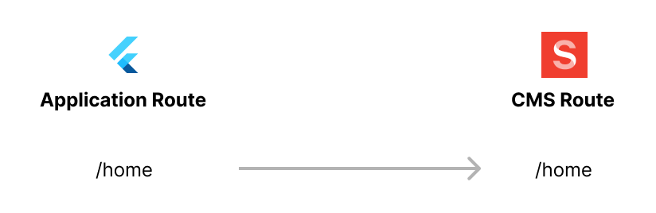
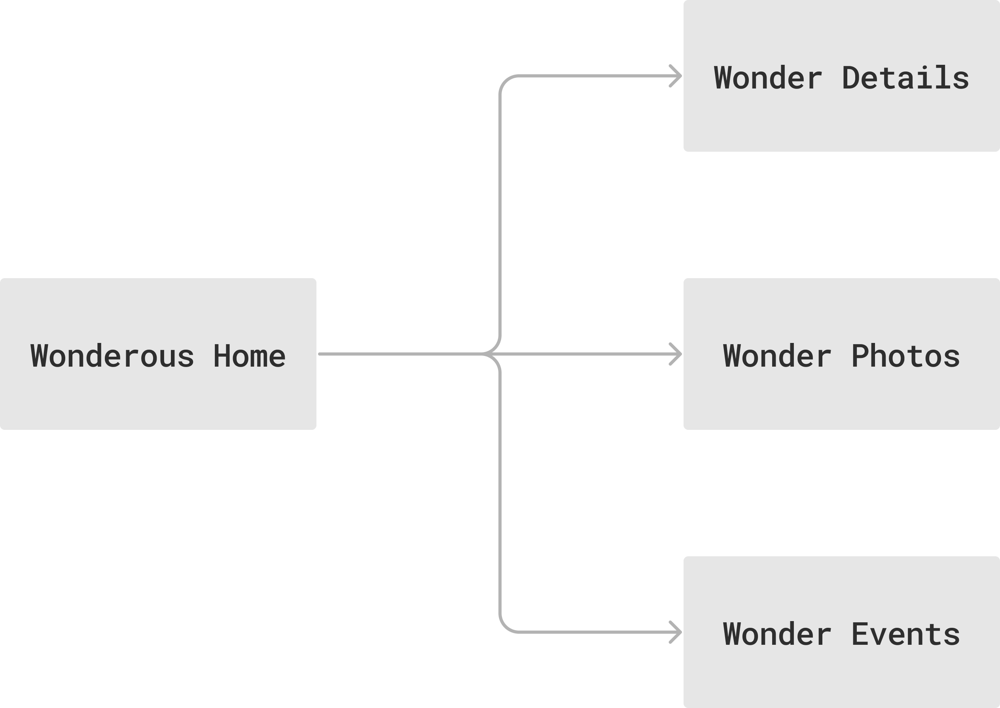
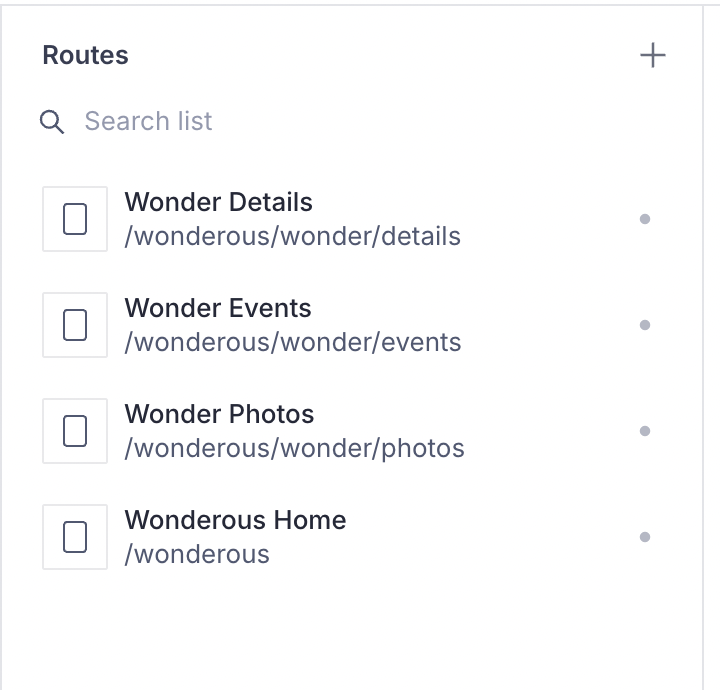
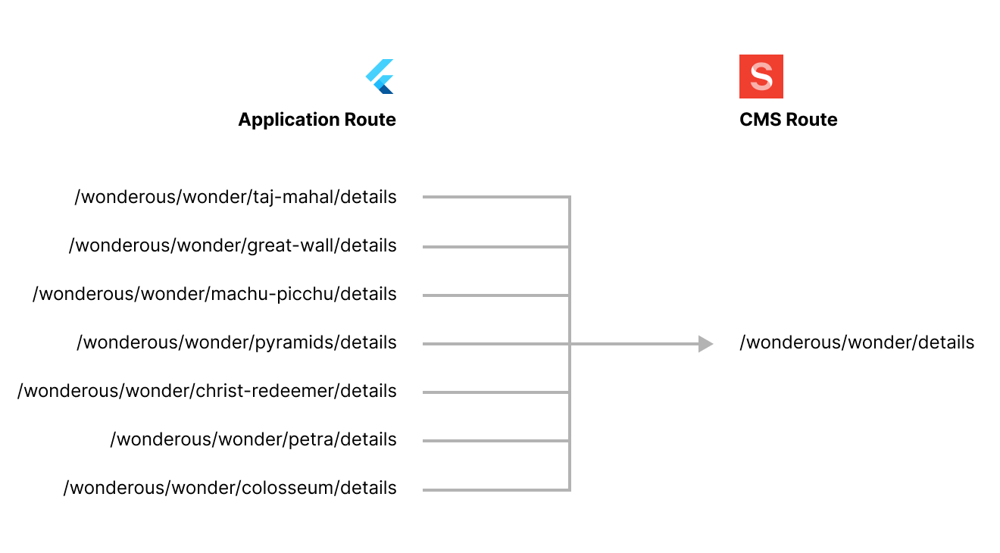

Routes in the Vyuh framework allow you to define the structure of a page or a
dialog. The structure of a route is put together by assembling a set of content
items from the framework. These routes also have an equivalent on the Flutter
side, where they are rendered using an application router like the
**`GoRouter`**. Thus an application route like `/home` can have CMS route with
the same path that defines the structure of the page.



---

## TL;DR;

Template routes are setup using the custom **`CMSRoute`** with a
**`cmsPathResolver`** parameter. This resolver function takes in an application
route path and maps it to a CMS path.

```dart
// CMS Routes
CMSRoute(
      path: '/wonderous/wonder/:wonder([^/]+)',
      redirect: (_, state) {
        if (state.topRoute?.path == null) {
          return '${state.matchedLocation}/details';
        }

        return '${state.matchedLocation}/${state.topRoute!.path}';
      },
      routes: [
        StatefulShellRoute.indexedStack(
          branches: [
            StatefulShellBranch(
              routes: [
                CMSRoute(path: 'details', cmsPathResolver: wonderPathResolver),
              ],
            ),
            StatefulShellBranch(
              routes: [
                CMSRoute(path: 'events', cmsPathResolver: wonderPathResolver),
              ],
            ),
            StatefulShellBranch(
              routes: [
                CMSRoute(path: 'photos', cmsPathResolver: wonderPathResolver),
              ],
            ),
          ],
          builder: (context, __, shell) {
            // ... construct the Scaffold with bottom navigation ...
          },
        ),
      ],
    ),

// Resolver
String wonderPathResolver(String path) {
  return switch (path) {
    (String x) when x.contains(RegExp(r'/wonder/[^/]+/details')) =>
      '/wonderous/wonder/details',
    (String x) when x.contains(RegExp(r'/wonder/[^/]+/events')) =>
      '/wonderous/wonder/events',
    (String x) when x.contains(RegExp(r'/wonder/[^/]+/photos')) =>
      '/wonderous/wonder/photos',
    _ => path
  };
}
```

---

## Why do we need this?

When you start out, you'll most likely create a 1:1 mapping between an
application route and a CMS route. But over time, you'll realize that there will
be more complex scenarios where multiple application routes can map to the same
CMS route and provide the same structure. For eg., you could have multiple
restaurant detail pages where the ID of the restaurant would be used to
determine the restaurant, but the structure of the detail page would be exactly
the same across all these restaurants.&#x20;

This style of mapping multiple application routes to a single CMS route is
referred to as a **Template Route**.&#x20;

 **Template?**

The **template** here refers to the route structure which remains the same
across all these application routes.&#x20; 

Additionally, by leveraging the template routes, you also reduce the number of
CMS routes you have to create in order to support your application. I think
we'll all agree that _reusability_ is far better and superior than
_duplication_. Template routes allow you to achieve that in a much more elegant
fashion.

## Template Routes in Wonderous

If you haven't seen the
[exposition on the Wonderous example](../../examples/wonderous-app/), now would
be a good time to take a look at it.&#x20;

The main goal of the **Wonderous** example is show the different wonders of the
world. Interestingly, it maps perfectly to the template routes that we're
discussing right now. The structure of every wonder page is pretty much the
same. Instead of creating separate Wonder pages for each of the wonders, it's
probably best to create a single structural page that acts as the CMS route for
all the wonders.&#x20;

That's a perfect use case for a _template route_, where we create a single CMS
route and have multiple application routes mapped to it. Let's see how it is
done in Wonderous.

## Wonderous Routes

The navigation inside the Wonderous app is quite simple. You start on the
homepage from which you drill-down to explore each of the wonders. Each wonder
is further broken down into:

- Details page (includes the details of the wonder)
- Photos page (shows you all the photos relevant to that wonder)
- Event page (shows all the events that have happened during the timeline of the
  wonder)

This can be seen in the navigation structure, shown below:



### CMS Routes

Since the structure of the details page, the photos page, and the events page is
pretty much the same, we have created separate routes for them on the CMS. This
can be seen in the screenshot below. Notice that the paths of these pages end
with `/wonder/details`, `/wonder/events`, and `/wonder/photos`, indicating that
this is just a CMS template route.

 As an aside, if we were duplicating this across
wonders, you would have to include the wonder (via an identifier) in the path
itself. Eg: **`/wonderous/wonder/taj-mahal/details`**. Doing this for every
wonder would just be cumbersome and unnecessary duplication.

The template-route approach really shines here. 



### Application Routes

Each of the wonders have a specific **`identifier`** that helps us in
identifying the wonder on the CMS. When constructing the application route, we
will include this identifier in the route path itself and use that to map the
exact wonder page on the CMS.



The magic of mapping the application route to the CMS route happens in our
custom `GoRoute` called **`CMSRoute`**. We supply the **`cmsPathResolver`**
parameter which takes care of mapping the route. This can be seen in the snippet
below.



```dart
import 'package:feature_wonderous/api/wonder_client.dart';
import 'package:flutter/material.dart';
import 'package:go_router/go_router.dart';
import 'package:vyuh_core/vyuh_core.dart' hide RouteBase;

Future<List<RouteBase>> routes() async {
  return [
    CMSRoute(path: '/wonderous'),
    CMSRoute(
      path: '/wonderous/wonder/:wonder([^/]+)',
      redirect: (_, state) {
        if (state.topRoute?.path == null) {
          return '${state.matchedLocation}/details';
        }

        return '${state.matchedLocation}/${state.topRoute!.path}';
      },
      routes: [
        StatefulShellRoute.indexedStack(
          branches: [
            StatefulShellBranch(
              routes: [
                CMSRoute(path: 'details', cmsPathResolver: wonderPathResolver),
              ],
            ),
            StatefulShellBranch(
              routes: [
                CMSRoute(path: 'events', cmsPathResolver: wonderPathResolver),
              ],
            ),
            StatefulShellBranch(
              routes: [
                CMSRoute(path: 'photos', cmsPathResolver: wonderPathResolver),
              ],
            ),
          ],
          builder: (context, __, shell) {
            // ... construct the Scaffold with bottom navigation ...
          },
        ),
      ],
    ),
  ];
}

String wonderPathResolver(String path) {
  return switch (path) {
    (String x) when x.contains(RegExp(r'/wonder/[^/]+/details')) =>
      '/wonderous/wonder/details',
    (String x) when x.contains(RegExp(r'/wonder/[^/]+/events')) =>
      '/wonderous/wonder/events',
    (String x) when x.contains(RegExp(r'/wonder/[^/]+/photos')) =>
      '/wonderous/wonder/photos',
    _ => path
  };
}

```



Notice the use of the `cmsPathResolver` in `lines 23, 28 and 33`. All of them
point to the single function `wonderPathResolver`. The job of this handler is
take in the application route (via the **`path`** argument) and generate the
corresponding CMS-path.

The Regular Expression (RegExp) here is simply to check that an identifier
exists in the application route path and then map to the corresponding CMS path.

The table below gives a few mappings in action.

| Application Route Path                | CMS Route Path                |
| ------------------------------------- | ----------------------------- |
| /wonderous/wonder/taj-mahal/details   | **/wonderous/wonder/details** |
| /wonderous/wonder/great-wall/events   | **/wonderous/wonder/events**  |
| /wonderous/wonder/machu-picchu/photos | **/wonderous/wonder/photos**  |

## Summary

Template Routes are a great way to simplify the management of common Application
Routes that all have the same visual structure.&#x20;

By assigning all of them to the same CMS Route, you can ensure there is no
duplication. It is however necessary that you do this mapping by using the
**`CMSRoute`** with a custom **`cmsPathResolver`**. Doing so, gives you lot of
flexibility in managing the routes on your application.

Ask this question if you need a **Template Route**: same visual structure across
various parameterized application routes ? If yes, create a `CMSRoute` with a
`cmsPathResolver`. And you are good to go.
