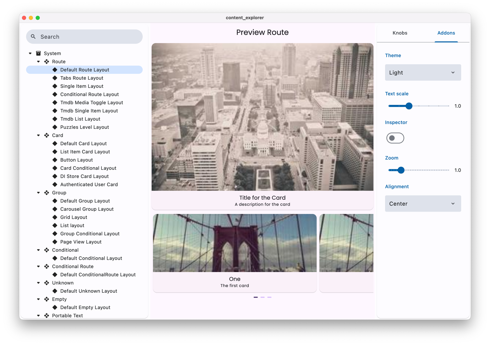

import { Tabs, TabItem } from '@astrojs/starlight/components'

[Widgetbook](https://pub.dev/packages/widgetbook) is a powerful tool for
developing Flutter widgets in isolation. Vyuh provides first-class integration
with Widgetbook through the `vyuh_widgetbook` package, making it easy to preview
and test your content types.



## Benefits

### 🎯 Isolated Development

Develop and test your content types in isolation, without the complexity of your
full application. This makes it easier to:

- Focus on specific components
- Test different states and variations
- Iterate quickly on designs

### 🔄 Live Preview

See your changes in real-time as you develop:

- Preview content types with different layouts
- Test light and dark themes
- View content at different sizes

### 🧪 Testing Made Easy

The isolated environment makes it easier to:

- Verify content type behavior
- Test different data scenarios
- Ensure consistent styling
- Debug layout issues

## Installation

Add the widgetbook package to your project:

```yaml
dependencies:
  vyuh_widgetbook: ^1.0.0
```

## Usage

Create a new Flutter app for your widgetbook. Here's an example from our
[Content Explorer](https://github.com/vyuh-tech/vyuh/tree/main/apps/content_explorer)
app:

```dart
import 'package:design_system/design_system.dart';
import 'package:feature_conference/feature_conference.dart' as conference;
import 'package:feature_counter/feature_counter.dart' as counter;
import 'package:feature_food/feature_food.dart' as food;
import 'package:feature_misc/feature_misc.dart' as misc;
import 'package:feature_puzzles/feature_puzzles.dart' as puzzles;
import 'package:feature_tmdb/feature_tmdb.dart' as tmdb;
import 'package:feature_unsplash/feature_unsplash.dart' as unsplash;
import 'package:feature_wonderous/feature_wonderous.dart' as wonderous;
import 'package:flutter/widgets.dart';
import 'package:vyuh_feature_auth/vyuh_feature_auth.dart' as auth;
import 'package:vyuh_feature_onboarding/vyuh_feature_onboarding.dart' as onboarding;
import 'package:vyuh_feature_system/vyuh_feature_system.dart' as system;
import 'package:vyuh_widgetbook/vyuh_widgetbook.dart';

void main() {
  // Initialize Flutter bindings if needed
  WidgetsFlutterBinding.ensureInitialized();

  runWidgetBook(
    features: () => [
      // Add your features here
      system.feature,
      counter.feature,
      tmdb.feature,
      food.feature,
      wonderous.feature,
      puzzles.feature,
      misc.feature,
      unsplash.feature,
      onboarding.feature,
      auth.feature(),
      conference.feature,
    ],
    // Optional: Use your design system themes
    lightTheme: DesignSystem.lightTheme,
    darkTheme: DesignSystem.darkTheme,
  );
}
```

## Using in Your App

To use Widgetbook in your own Vyuh app:

1. Create a new Flutter app for your widgetbook (e.g., `my_app_widgetbook`)
2. Add the `vyuh_widgetbook` dependency
3. Import your features and their content types
4. Use `runWidgetBook` to start the app

```dart
import 'package:flutter/widgets.dart';
import 'package:vyuh_widgetbook/vyuh_widgetbook.dart';
import 'package:vyuh_feature_system/vyuh_feature_system.dart' as system;
import 'package:my_feature_one/my_feature_one.dart' as feature1;
import 'package:my_feature_two/my_feature_two.dart' as feature2;

void main() {
  runWidgetBook(
    features: () => [
      system.feature,
      feature1.feature,
      feature2.feature,
    ],
    lightTheme: MyAppTheme.light,
    darkTheme: MyAppTheme.dark,
  );
}
```

## Navigation

The widgetbook app organizes your content by:

1. **Features**: Your app's features are listed in the left sidebar
2. **Content Types**: Each feature's content types are shown under it
3. **Layouts**: Each content type can have multiple layouts

## Best Practices

1. **Preview Data**: Use realistic preview data in your content types:

```dart
static final typeDescriptor = TypeDescriptor<MyContent>(
  schemaType: schemaName,
  title: 'My Content',
  fromJson: MyContent.fromJson,
  preview: () => MyContent(
    id: 'preview',
    title: 'Preview Title',
    description: 'This is a preview of my content type',
  ),
);
```

2. **Theme Testing**: Always test your content types in both light and dark
   themes

3. **Size Testing**: Test your content at different sizes to ensure responsive
   behavior

## Next Steps

- Check out the [Content Previews Guide](/guides/cms/previews) to learn more
  about content previews
- Visit the [Widgetbook documentation](https://docs.widgetbook.io/) for advanced
  features
- Explore the
  [Content Explorer](https://github.com/vyuh-tech/vyuh/tree/main/apps/content_explorer)
  for a complete example
