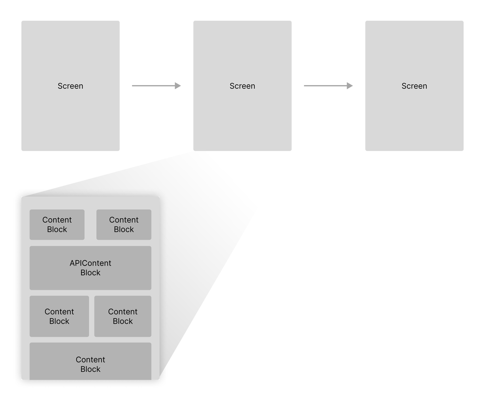
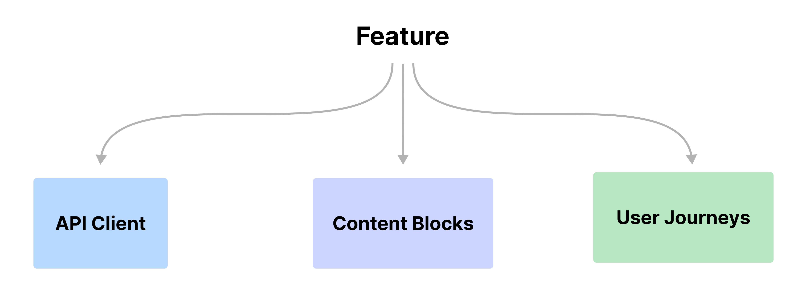

import { Aside } from '@astrojs/starlight/components'

Designing a feature in the Vyuh framework requires putting together a bunch of
elements. This includes the following:

- **APIs** to talk to the backend to fetch data
- **Experience layer** that renders the widgets on the screen and provides User
  Interactivity
  - Distilling the **Content Blocks** that make up the feature
  - **Journeys** which allow the user to navigate from screen to screen in
    exploring the content and interacting with it in different ways
  - **Design system** components for a consistent experience
  - Client side **State management** to keep track of User interactions
  - **Analytics** to track user interactions and understand user behavior

<Aside title={'Universal Truth about Applications'}>

Although we talk about the **Vyuh Framework** in this article, the set of things
that you have to do for building a feature for an application is _universally
true_ and applicable across all applications.

Whether you use a low-code tool or a no-code tool, the set of things you have to
do pretty much remains the same. The Vyuh Framework however makes it easier to
manage both functional and non-functional aspects of building a feature. This
allows you to grow from an MVP to the scale of a Super App!

</Aside>

## Core Ideas

Some of the core ideas of building a feature are already discussed in a separate
article on [Features and Plugins](/concepts/features-and-plugins). Make sure to
take a look at that before reading further.

In this article, we'll focus more on applying the Vyuh Framework to build a
feature. This is all about distilling the feature in terms of its schemas, APIs,
and experience widgets.

## Distilling a Feature

As we've already seen in the article that was referenced before, a feature is
essentially a collection of screens stitched together to form a journey. The
content of each screen comes from a set of content blocks that you would design
and configure from a CMS.

Now, it's possible that these content blocks may not have a CMS counterpart, and
could be driven entirely from code. But for now, let's assume for a moment that
we are designing features that are CMS connected, which allows dynamic
configuration and flexibility for the business teams.

Thus, the three core building blocks of any feature include the **APIs**, the
**Content Blocks**, and **Journeys**. Let's see each of these in detail.

### APIs

APIs are the primary source of data for the feature. They could be REST APIs,
GraphQL APIs, or even Websockets. The APIs are responsible for fetching the data
that is required to render the content blocks on the screen.

The APIs are also responsible for sending the user interactions back to the
server for processing. This could be a simple form submission or a complex
interaction that requires a series of steps to be completed.

The Vyuh framework has a built-in component for working with APIs, called the
`APIContent`. This can be configured from the CMS, making it easier for the
business teams to change the type of data source that should be used to drive
the content on the screen. The API content-block simplifies the configuration
needed to show content on the screen, without burdening the business teams with
the implementation details of the request headers, API keys or other security
parameters that are required to fetch data from the endpoint.

> Although we talk about APIs as the driving source of content for the content
> block, it's possible that the content blocks come directly from the CMS. In
> this case, they are configured on the CMS itself and rendered on the screen.

#### API SDKs

As you start working with more complex APIs and a large number of APIs, you will
soon see a need to wrap all these APIs into an API SDK. The API SDK can expose a
HTTP client that is used to fetch data from the server using semantic operations
instead of talking directly to the endpoint URLs.

The use of the API SDK also hides the details of deserializing the response
payloads and creating Dart objects out of them. Additionally, these API SDKs can
be tested independently and made sure that they are robust enough to work under
various conditions and request parameters.

When these APIs are commonly used across multiple features, the API SDK becomes
the common package through which these features make those calls.

In short, think of wrapping your APIs inside an API SDK and exposing it as a
common package that can be used by multiple features when needed.

### Content Blocks

While the APIs focus on fetching data from a remote endpoint, the content blocks
are the key elements that allow you to render this data inside a screen. These
content blocks have two counterparts:

- On the CMS where it exists as a schema, allowing business teams to configure
  it.
- On the Flutter side where it exists as a widget and possibly with the
  combination of other elements like state management, dependency injection,
  analytics, etc., which will all wrap together to provide the implementation
  for the content block. Here is where you would also apply the **Design
  System** to make the widgets visually consistent.

<Aside title={'Design System as an SDK'}>
  
The Design System, just like the API-SDK, can be extracted into a separate
package. This could be used across multiple features and even across apps if
they are maintaining a similar visual identity.

It's probably a good idea to start building your design system (themes, colors,
typography, icons, spacings, and of course the UI components) into a separate
package so it becomes more reusable across features & apps.

</Aside>

### Journeys

Now we have included journeys as part of a feature which is purely from a
customer's perspective.

However, when we work with the Vyuh Framework, we think of the journeys as not
being hardcoded into the feature itself. Instead, they are defined and
configured from the CMS. This gives the business the ability to change the
journeys on the fly depending on the type of customer,

Externalizing the journeys is one of the key elements of the Vyuh Framework.
With that, the features themselves only have to expose a set of content blocks,
which are configured from the CMS. The business teams will use the content
blocks to assemble pages and then stitch them together through a navigation
journey.

<Aside title={'Fixed Journeys'}>

However, there are cases where a journey is so fixed in nature that it doesn't
require a special type of configuration from the CMS. The payment journey is one
such example.

Once you check out from your cart, the payment journey begins and accepts your
payment method, then takes you additional screens for more details, and finally
completes the secure transaction. It then takes you back to the confirmation
page. This journey can be hard-coded into the feature itself.

</Aside>

### Some Handy tools

A couple of tools that we have found useful when designing features:

- **Icon fonts**: Use [Flutter Icon](https://www.fluttericon.com/) for
  generating the icons that you need for your feature. This is a great way to
  keep your app size small and also have a consistent set of icons across the
  app.
- **Theme Builder**: Use the
  [Material Theme Builder](https://material-foundation.github.io/material-theme-builder/)
  to quickly crank out the theme for your next App or Feature.

## Summary

This guide has provided a set of tips for designing your features by identifying
its core components. By applying these ideas you can even make features that
work across a family of Vyuh Apps.
