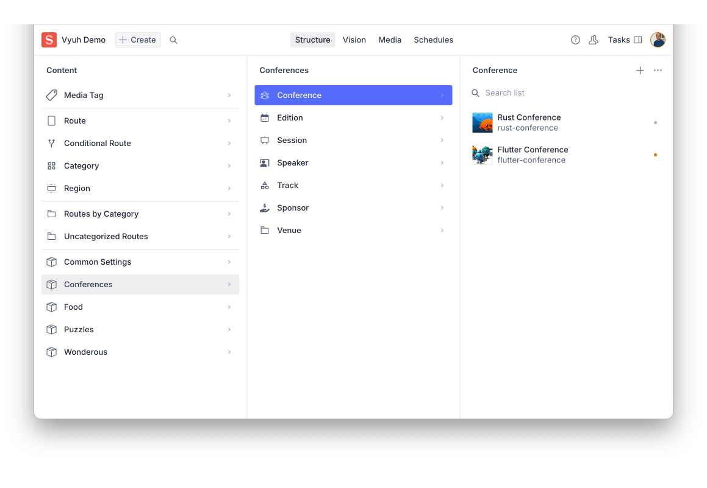

import { Aside } from '@astrojs/starlight/components'

The Vyuh structure plugin (`@vyuh/sanity-plugin-structure`) is a powerful tool
that helps you organize and combine Sanity schemas from multiple features into a
unified master schema. This guide explains how to use the plugin effectively and
how it integrates with the `@vyuh/schema-core` package.

## Overview

When building a Vyuh application, each feature defines its schemas and exports
them using the `FeatureDescriptor` class from `@vyuh/sanity-schema-core`. This
approach ensures:

1. Consistent schema organization across features
2. Type-safe schema definitions
3. Automatic schema registration and combination
4. Automatic categorization of schemas by feature in the Desk Structure

> The Vyuh structure plugin reads the `FeatureDescriptor` instances and
> assembles them into a single schema that can be used in your Sanity Studio.
> Here is how your studio would look after integrating a bunch of features.
> Notice the automatic grouping of schemas by feature.



## Installation

First, install the plugin package in your Sanity Studio project:

```bash
cd my-sanity-studio
pnpm add @vyuh/sanity-plugin-structure
```

Install the core schema package in your features. We are assuming that each of
your feature is organized as a separate package with its own `package.json`.

```bash
cd features/my-feature
pnpm add @vyuh/sanity-schema-core
```

These packages provide:

- `@vyuh/sanity-schema-core`: Core utilities for defining and organizing Sanity
  schemas, including the `FeatureDescriptor` class
- `@vyuh/sanity-plugin-structure`: The Vyuh structure plugin that combines and
  organizes your feature schemas

<Aside title="Using pnpm Workspaces" type="tip">

Consider using pnpm workspaces to better organize your Sanity Studio and feature
packages. Workspaces allow you to manage multiple packages in a single
repository, sharing dependencies and enabling easier development:

```bash
# pnpm-workspace.yaml
packages:
  - 'studio'
  - 'features/*'
```

This setup allows you to:

- Keep all feature packages and studio in one repository
- Share dependencies across packages
- Use consistent versioning
- Run commands across all packages

Learn more about [pnpm workspaces](https://pnpm.io/workspaces).

</Aside>

## Using FeatureDescriptor

### Basic Structure

Each feature exports its schemas using a `FeatureDescriptor` instance. Here is
an example from the **conference** feature:

```typescript title="features/conference/conference.ts" {14}
import {
  BuiltContentSchemaBuilder,
  FeatureDescriptor,
} from '@vyuh/sanity-schema-core'
import { DocumentDescriptor } from '@vyuh/sanity-schema-system'
import { conference } from './documents/conference'
import { session } from './documents/session'
import { speaker } from './documents/speaker'

// Export all schema types
export const schemaTypes = [conference, session, speaker]

// Export feature descriptor
export const conference = new FeatureDescriptor({
  name: 'conf',
  title: 'Conference Feature',
  description: 'Conference management feature',
  contentSchemaBuilders: [
    new BuiltContentSchemaBuilder(conference),
    new BuiltContentSchemaBuilder(session),
    new BuiltContentSchemaBuilder(speaker),
  ],
})
```

### Feature Descriptor Properties

The `FeatureDescriptor` accepts these key properties:

- `name`: Unique identifier for the feature
- `title`: Display name for the feature
- `description`: Optional description
- `contents`: Array of content descriptors that extend content items with
  additional capabilities (layouts, validations, etc.)
- `contentSchemaBuilders`: Array of schema builders that define the actual
  schema types and their structure. Each builder corresponds to a single content
  type and assembles the corresponding `ContentDescriptor` elements into a
  single schema for the content-type.

<Aside title="Additional Properties" type="tip">

`FeatureDescriptor` also supports the following advanced properties. If you are
also building a Vyuh App, these can be leveraged on the **Flutter** side. 

- `contentModifiers`: Schema type definitions that modify content schemas
- `contentSchemaModifiers`: Functions that can modify content schemas
- `actions`: Schema definitions for feature-specific actions
- `conditions`: Schema definitions for feature-specific conditions
- `analyticsContexts`: Schema definitions for analytics contexts

These properties are used for advanced customization of your feature's behavior
and capabilities.

</Aside>

### Customizing Content Descriptors

For example, to add custom layouts to a content type:

```typescript title="features/conference/conference.ts" {5-9,15-17}
import { ContentDescriptor } from '@vyuh/sanity-schema-core'
import { conferenceLayout } from './layouts/conference'

// Create a custom content descriptor for conference
class ConferenceDescriptor extends ContentDescriptor {
  constructor(props: Partial<ConferenceDescriptor>) {
    super('conf.conference', props)
  }
}

export const conference = new FeatureDescriptor({
  name: 'conf',
  title: 'Conference Feature',
  contents: [
    new ConferenceDescriptor({
      layouts: [conferenceLayout],
    }),
  ],
  contentSchemaBuilders: [
    new BuiltContentSchemaBuilder(conference),
    // ... other schema builders
  ],
})
```

### Schema Registration

In your Sanity configuration, register your features using the `vyuh` plugin
from `@vyuh/sanity-plugin-structure`:

> Note: The `vision` and `media` plugins are also included with the vyuh plugin.

```typescript title="my-sanity-studio/sanity.config.ts" {15-17}
import { defineConfig } from 'sanity'
import { vyuh } from '@vyuh/sanity-plugin-structure'
import { conference } from './features/conference'
import { blog } from './features/blog'

export default defineConfig([
  {
    name: 'default',
    title: 'My Vyuh Studio',
    basePath: '/',
    projectId: 'your-project-id',
    dataset: 'production',

    plugins: [
      vyuh({
        features: [conference, blog],
      }),
    ],
  },
])
```

## Best Practices

1. **Feature Namespacing**: Prefix schema types with feature name (e.g.,
   `conf.session`)
2. **Type Safety**: Use TypeScript for schema definitions using the core types
   from Sanity such as `defineType`, `defineField`, etc.
3. **Modular Organization**: Keep related schemas together in feature packages
4. **Documentation**: Include descriptions for fields and types
