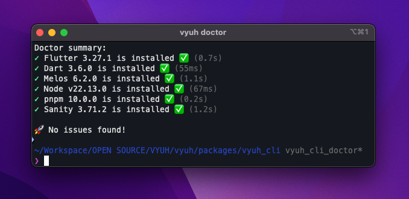

import { Aside, Tabs, TabItem, Badge } from '@astrojs/starlight/components'
import { PubBadge } from '@/components/PubBadge'

The Vyuh CLI is a new tool that allows you to quickly scaffold projects,
features, schemas and content-items for the Vyuh framework. It is built on top
of the `Mason` package and includes a few other utilities to make it easier to
generate projects and features.

<Aside type={'note'} title={'PNPM and Melos'}>

The Vyuh CLI internally uses `pnpm` and `melos` to manage the packages for the
schema and feature packages. This is to ensure that the packages are managed in
a consistent way across all the projects.

For seamless functionality, ensure the following dependencies are installed and accessible in your shell path:

[Setup pnpm](https://pnpm.io/installation) and [Setup Melos](https://melos.invertase.dev/getting-started) - for managing the mono-repo structure of both NPM schema packages and Dart-based feature packages respectively. It's recommended to install these globally for consistent package management.

[**Sanity CLI**](https://www.sanity.io/docs/getting-started-with-sanity-cli) - for building CMS-driven UIs and managing Sanity projects. Ensure you are logged into Sanity using sanity login.

To ensure all dependencies are correctly installed Check environment with [Vyuh Doctor](https://pub.dev/packages/vyuh_cli). This helps diagnose potential setup issues and confirm your environment is ready.

</Aside>

## Activate the Vyuh CLI

The first step is to activate the <PubBadge name="vyuh_cli" inline /> package
globally. This gives you access to the `vyuh` command that can be used to
generate the initial structure. Run this command in your terminal:

```shell
dart pub global activate vyuh_cli
```

<Aside type={'tip'} title={'Adding to Shell Path'}>

If you want to use the `vyuh` command from anywhere in your terminal, you can
add the Dart pub global executables to your shell path. This is usually done by
adding the following line to your shell profile file (like `.bashrc` or `.zshrc`
or `.config/fish/config.fish`):

<Tabs>
  <TabItem label={'Bash, Zsh'}>

    ```shell
    export PATH="$HOME/.pub-cache/bin:$PATH"
    ```

  </TabItem>
  <TabItem label={'Fish'}>

    ```shell
    set PATH "$HOME/.pub-cache/bin:$PATH"
    ```

  </TabItem>
</Tabs>

After adding this line, you can run the `vyuh` command from anywhere in your
terminal.

A similar setup is required for those running on **Windows**.

</Aside>

## Create your new project

In the folder where you plan to build your _mono-repo_ project for the Vyuh
Application, run the following. The `<project_name>` tag is the one where you
should specify your own name for the project.

```bash
vyuh create project <project_name>
```

The above command will create a complete folder structure under `<project-name>`
which is described in more detail in the
[Project Structure](/guides/project-structure) article.

### More parameters

There are more details you can pass when creating the project as shown below:

```text title="Create Project" {3}
A Vyuh Flutter project created by Vyuh CLI.

Usage: vyuh create project <project-name> [arguments]
-h, --help                Print this usage information.
-o, --output-directory    The desired output directory when creating a new project.
    --description         The description for this new project.
                          (defaults to "A Vyuh Flutter project created by Vyuh CLI.")
    --cms                 The content management system for this new project.
                          (defaults to "sanity")
    --org-name            The organization for this new project.
                          (defaults to "com.example.vyuh")
    --application-id      The bundle identifier on iOS or application id on Android. (defaults to <org-name>.<project-name>)
```

## Add a new feature

Just like the command for creating projects, we also have a
`vyuh create feature <feature-name>` that does very similar things in terms of
setting up a new feature for the project.

This will create a new feature package (_in Flutter_) inside the current folder
of your shell.

```text title="Create Feature" {3}
Create a new Vyuh feature.

Usage: vyuh create feature <feature-name> [arguments]
-h, --help                Print this usage information.
-o, --output-directory    The desired output directory when creating a new feature.

Run "vyuh help" to see global options.

```

<Aside title={'Custom output folder'}>

By default the CLI generates the files in the folder where you run the command.
To create it inside a specific folder, you could pass in the **`-o`** flag with
the relative directory. This is particularly useful when generating features.

For example, to generate the feature package inside the **`./features`** folder
of your root project directory, you would run the following:

```bash
vyuh create feature "new-feature" -o features
```

Don't worry about passing space-separated words inside your feature name. The
tool automatically takes care of converting it to a proper_snake_case when it
generates the feature. For the previous command, the name "new-feature" will
result in creating a folder called `new_feature` inside the `features`
directory.

</Aside>

## Add a new schema

We also have the command for creating a new schema for the CMS. You can use
`vyuh create schema <feature-name>` to set it up.

This will create a new schema package (_in Typescript_) inside the current
folder of your shell.

```text title="Create Schema" {3}
Create a new Vyuh feature CMS schema.

Usage: vyuh create schema <feature-name> [arguments]
-h, --help                Print this usage information.
-o, --output-directory    The desired output directory when creating a new feature.
    --cms                 The content management system for this new schema.
                          (defaults to "sanity")

Run "vyuh help" to see global options.

```

## Add a new content item

The `vyuh create item <item-name>` command is used to create a new content item
within your Vyuh project. Content items represent individual pieces of content,
such as articles, blog posts, or product descriptions.

```text title="Create Item" {3}
Create a new Vyuh ContentItem.

Usage: vyuh create item <item-name> [arguments]
-h, --help                Print this usage information.
-o, --output-directory    The desired output directory when creating a new item.
-f, --feature             The feature to add the content item to. If not specified, the item will be created without a feature context.

Run "vyuh help" to see global options.
```

The `<item-name>` argument specifies the name of the content item to be created.
The name should be a valid Dart identifier.

The `-o` or `--output-directory` option allows you to specify the directory
where the content item will be created. If not specified, the content item will
be created in the current directory.

The `-f` or `--feature` option allows you to specify the feature to which the
content item belongs. If specified, the content item will be created within the
`lib/content` directory of the specified feature. If not specified, the content
item will be created in the `lib/content` directory of the current project.

After creating the content item, you will need to:

1.  Run `dart run build_runner build` to generate the JSON serialization code.
2.  Register the `ContentBuilder` in your `FeatureDescriptor` with the
    `ContentExtensionDescriptor()`.

## Environment checks with Doctor <Badge text="New" />

The `vyuh doctor` command helps you verify that your development environment is
properly set up for Vyuh development. It checks for all required dependencies
and their versions:



```bash
vyuh doctor
```

This command validates the presence and configuration of:

- Flutter SDK
- Dart SDK
- Melos (for monorepo management)
- Node.js
- pnpm (for package management)
- Sanity CLI

The command provides a detailed report of any issues found and suggestions for
fixing them. It's particularly useful when:

- Setting up a new development environment
- Troubleshooting build or runtime issues
- Ensuring your environment meets all prerequisites before creating a new
  project

## Update the CLI

The Vyuh CLI has an inbuilt mechanism to update itself. You can run the
following command to update the CLI:

```shell
vyuh update
```

This will check for the latest version of the CLI and update it if necessary.

```shell
> vyuh update
✓ Checked for updates (0.7s)
CLI is already at the latest version.

```

## Summary

This guide showed you the steps to set up the **Vyuh CLI** on your system and
use it to generate various parts of the Application. Currently, there is support
for creating a new Vyuh App, a Vyuh Feature package for Flutter and a Vyuh
schema package for Sanity CMS.

There will be more added in the future to accommodate other aspects of
developing Vyuh Apps.
