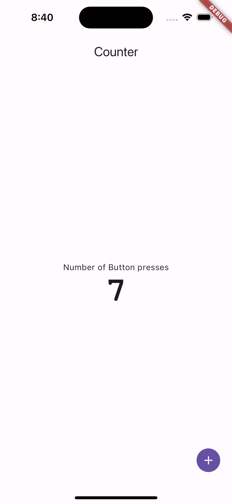

import { Aside } from '@astrojs/starlight/components'

Welcome to a new way to build Flutter Apps with the **Vyuh Framework**. The
concepts here are simple and you will soon be in a position to build large scale
apps with minimal effort.

<Aside type="note">

**Core Concepts**

If you have not read through the **Core Concepts**, now would be a good time to
quickly glance through that. The important ones you should cover include:

- [Features and Plugins](../concepts/features-and-plugins.md)
- [Descriptors and Builders](../concepts/descriptors-and-builders.md)

</Aside>

## 1. Let's Start

Now that you have some understanding of the core concepts, let's dig in to build
our first feature with the **Vyuh Framework**.

### Install Flutter

We assume you already have Flutter installed 😇. If not, you can always go to
[Flutter.dev and install it](https://docs.flutter.dev/get-started/install). Go
through the steps outlined over there and have your Flutter setup ready.

### Creating your Project

We will create the standard Flutter Application project and take off from there.
On your Command Shell, run the following command in the directory where you want
your project.

```shell
flutter create vyuh_demo
```

Next we need to add a few packages for the framework. Run this command in your
project directory:

```shell
flutter pub add vyuh_core vyuh_feature_developer go_router mobx flutter_mobx
```

Now that you have the basics, we can start focusing on building a **Feature**.

## 2. Create a Feature

Vyuh based applications are a collection of Features. Each feature is a
descriptor which describes the feature with `name`, `title`, `routes`, an
`init`-function, etc. The mandatory ones are `name`, `title` and `routes`. Let's
go ahead and define a feature.

### Create the `feature.dart` file

Create a file, under `/lib`, called `feature.dart` and put the following code in
it:

```dart
import 'package:flutter/material.dart';
import 'package:flutter_mobx/flutter_mobx.dart';
import 'package:go_router/go_router.dart';
import 'package:mobx/mobx.dart';
import 'package:vyuh_core/vyuh_core.dart';

final feature = FeatureDescriptor(
  name: 'counter',
  title: 'The classic Flutter counter',
  description: 'A simple counter that tracks the number of button presses',
  icon: Icons.add_circle_outlined,
  routes: () async {
    return [
      GoRoute(
          path: '/counter',
          builder: (context, state) {
            return const _Counter();
          }),
    ];
  },
);

```

Let's take a moment to call out a few things:

- `FeatureDescriptor` is a way to describe a single feature. Think of it like a
  manifest of all things exposed by this feature. For now we will just create
  the `routes`.
- The `routes` field is an async function that returns an array of the
  `go_router` routes. This means, everything you know about `go_router` is all
  you need to work with routes. We don't use any proprietary packages anywhere
  in the framework and leverage the best community voted packages from
  `pub.dev`.

### Create the `_Counter` widget

Your dart analyzer would have already complained that you haven't included the
implementation for the `_Counter` widget. Let's add that next.

In the same `feature.dart` file, add the following code below the `feature`
field.

```dart
class _Counter extends StatefulWidget {
  const _Counter();

  @override
  State<_Counter> createState() => _CounterState();
}

class _CounterState extends State<_Counter> {
  final counter = 0.obs();

  @override
  Widget build(BuildContext context) {
    return Scaffold(
      appBar: AppBar(title: const Text('Counter')),
      body: Column(
        mainAxisAlignment: MainAxisAlignment.center,
        crossAxisAlignment: CrossAxisAlignment.stretch,
        children: [
          const Text(
            'Number of Button presses',
            textAlign: TextAlign.center,
          ),
          Observer(
              builder: (_) => Text(
                    '${counter.value}',
                    style: Theme.of(context)
                        .textTheme
                        .displayLarge
                        ?.apply(fontFamily: 'Courier New', fontWeightDelta: 2),
                    textAlign: TextAlign.center,
                  )),
        ],
      ),
      floatingActionButton: IconButton.filled(
        icon: const Icon(Icons.add),
        onPressed: () => runInAction(() => counter.value++),
      ),
    );
  }
}
```

In the above code, you will notice that we are using MobX for state management.
This is not mandatory, and you are free to use any state management technique
you like.

> Disclaimer
>
> The creator of the **Vyuh Framework** has also created **MobX.dart** in the
> past. So its natural to use MobX for all state management 😇.

## 3. Running the app with the `feature`

Now we have the **counter-feature** ready, it's time to invoke the `runApp`
method of the **Vyuh Framework**. Let's go back to the `main.dart` file in your
project and replace it with these lines:

```dart
import 'package:flutter/material.dart';
import 'package:vyuh_core/vyuh_core.dart' as vc;
import 'feature.dart';

void main() async {
  WidgetsFlutterBinding.ensureInitialized();

  vc.runApp(
    initialLocation: '/counter',
    features: () => [
      feature,
    ],
  );
}

```

Note that we are using `/counter` as our initial route. This is the same route
we have exposed earlier in the feature.

Now we have the complete app ready. Let's run it using the following command in
your project directory:

```shell
flutter run
```

After a few moments, you should see an app getting launched on your chosen
device or simulator. Here's how it looks after a couple of button presses:



## Summary

If you have reached this far, we hope you were able to see a simple feature like
**Counter** implemented in an independent manner. With the definition of the
feature in `FeatureDescriptor`, you were able to assemble a simple application.
This technique is exactly the same whether you build a single feature or
hundreds of features.

Of course, as you gain more experience, you can become more sophisticated in
your approach to including features conditionally or choosing to enable features
for only some of your customers. The possibilities are endless.

<Aside type={'note'}>
  **A parting exercise**

The framework also includes a developer feature (`vyuh_feature_developer`) that
shows you details of all the included features in a Vyuh Application. We have
already added that package above.

Now, your task is to include that developer-feature in the list of features for
`runApp` and navigate to it. The developer-feature is available on the
`/developer` route. Hope you have fun figuring this out.

**Hint**: if you do get stuck, refer to the `vyuh_demo` app in the framework's
GitHub repo.

</Aside>
