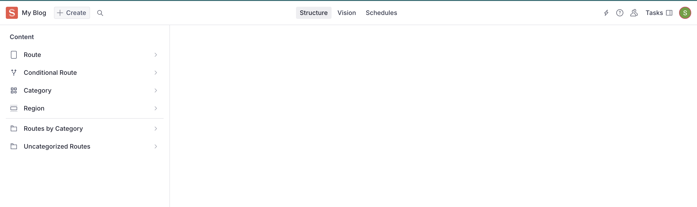
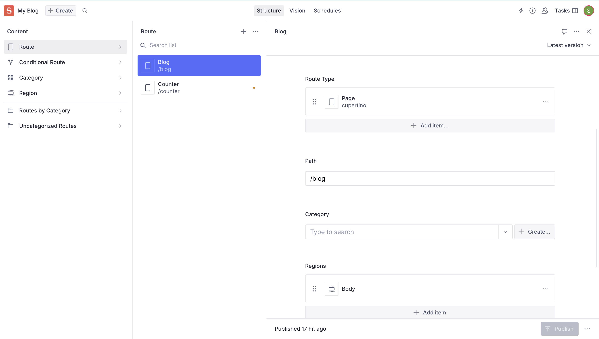
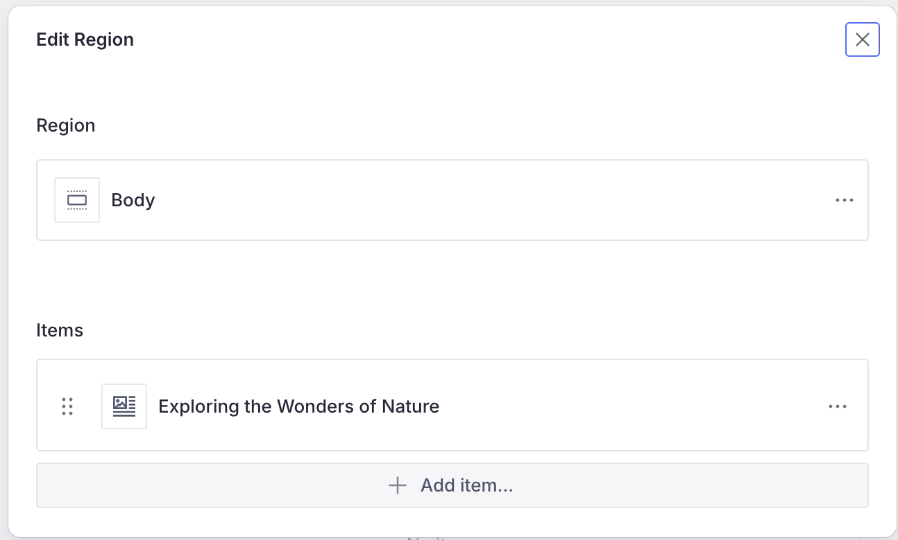
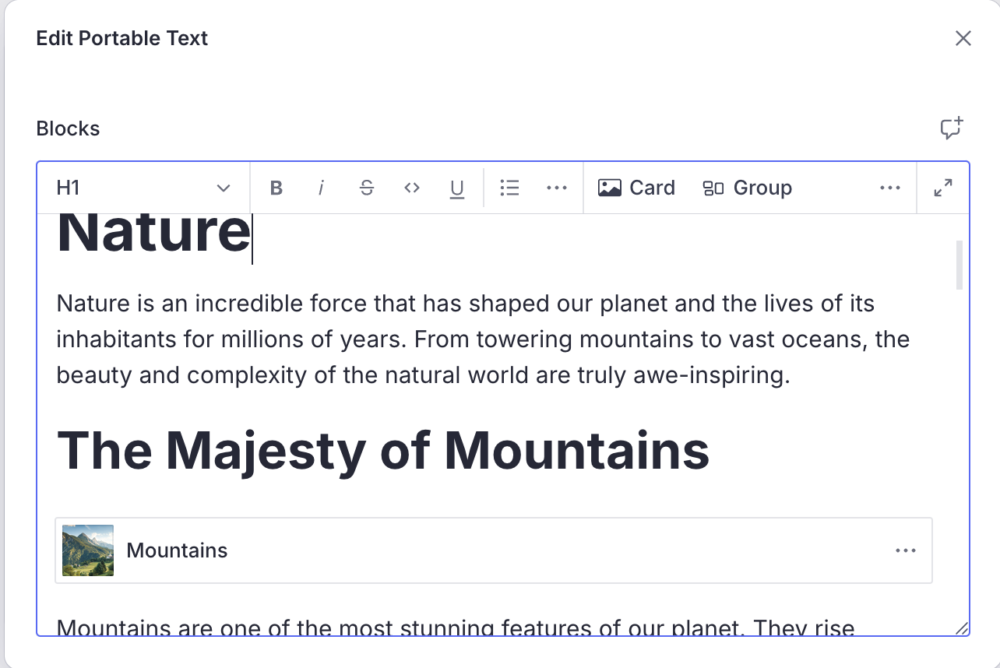
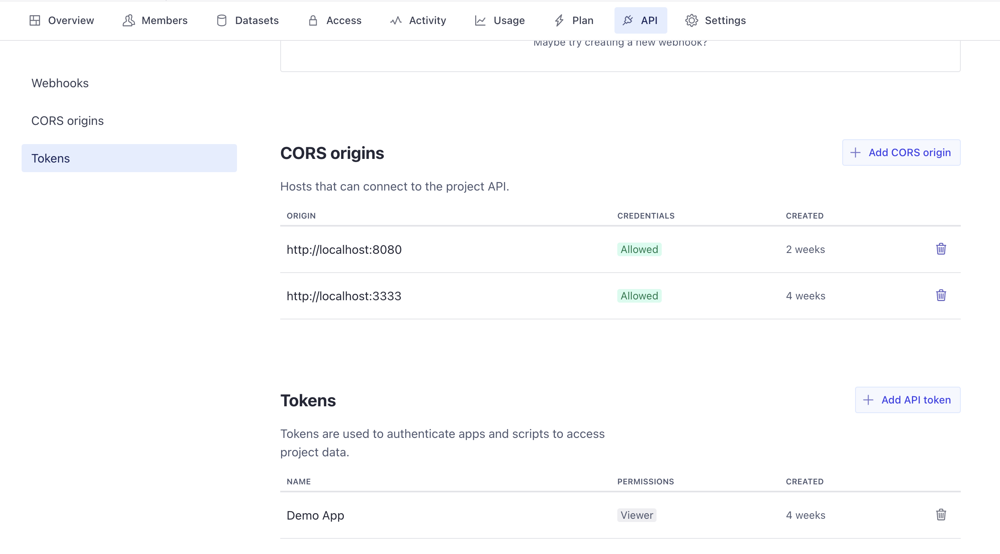
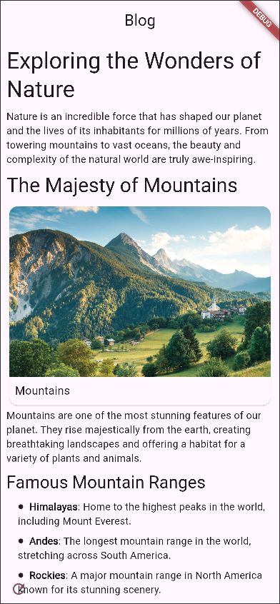

import { Aside } from '@astrojs/starlight/components'

Now that we know how to setup a feature in Vyuh, let's see how we can integrate
it with a CMS. We will be using [Sanity.io](https://sanity.io) for this example,
which is also our default supported CMS.

## 1. Setup the Sanity CMS

Sanity is a headless CMS that allows you to define your own schemas and content
types, entirely in code. This makes it easy to quickly build sophisticated
schemas without wrestling with any Drag-n-Drop builders. It also sports a
**Studio** which becomes the go-to UI tool for content editors. In this section,
we will set up the studio and use the Vyuh Framework to build a simple blog
schema and its corresponding widget.

### Scaffold the project

Setup a _free_ Sanity project using the
[guides from Sanity.io](https://www.sanity.io/get-started?ref=hero) or use the
command line shown below:

```bash
pnpm dlx create-sanity@latest
```

While creating the sanity project, select the project template as
`Clean project with no predefined schema types`

<Aside type={'note'}>
**Scaffold Quickly**

A faster way to scaffold a Vyuh project would be with the
[vyuh-tech/bricks](https://github.com/vyuh-tech/bricks) repo. You can use the
Dart scaffolding tool, **Mason**, to quickly create a _Vyuh project_ with
Flutter and Sanity.

Refer to the [Mason Setup](mason-setup.md) guide for more details.

</Aside>

### **An Aside on developing with a CMS 🤔**

Vyuh is designed to be CMS-agnostic and allows a different style of building
Apps where you give the control of content to the content-editors. This is a
powerful way to build apps where the content is the king and the app is just a
medium to display it.

Content is not limited to only the text and other visual blocks on a CMS but it
can be your entire App Experience. This technique has been a key pillar in
building large scale apps where the content and experience can be very dynamic.

In this regard, the CMS becomes your declarative, **no-code tool** where you
focus on what content should be shown under what conditions and the **Flutter
App** becomes the code that renders it. Every block that is available on the CMS
has its **counterpart** in Flutter. It's a different way of building apps and a
throwback to Model-Driven Development.

What you get is a dynamic App that can be changed on the fly without an App
Store release. It also allows greater exploration of the app experience and can
be a great tool for A/B testing.

## 2. Configure the Studio

Add the following dependencies to your `package.json` and run `pnpm install` .
These dependencies will help in the schema development with _Sanity_ and _Vyuh_.

```json5
// package.json
{
  dependencies: {
    /* Other Dependencies */
    '@vyuh/sanity-plugin-structure': '^1.16.2',
    '@vyuh/sanity-schema-core': '^1.16.2',
    '@vyuh/sanity-schema-system': '^1.16.2',
  },
}
```

Once installation is done, go to the `sanity.config.ts` file and update the
contents as below

```typescript
// sanity.config.ts

import { defineConfig } from 'sanity'
import { vyuh } from '@vyuh/sanity-plugin-structure'
import { system } from '@vyuh/sanity-schema-system'

export default defineConfig([
  {
    name: 'default',
    title: 'My Blog',
    basePath: '/',

    projectId: '<Your Sanity Project ID>',
    dataset: 'production',

    plugins: [
      vyuh({
        features: [
          system,
          // ... other features ... //
        ],
      }),
    ],
  },
])
```

<Aside>

**`vyuh({ features: [] })`** is a sanity plugin that configures the studio.

1. It takes an array of `FeatureDescriptor`s that represent the features of your
   application. Each`FeatureDescriptor` contributes a set of content schemas
   that are available on the Studio.&#x20;
2. It also includes the standard Sanity plugins such as the _Structure_,
   _Vision_ and _Media_ for simpler setup.

</Aside>

Now run the project , using `pnpm dev`



Your studio should look something like above with the standard document types of
_Route_, _Conditional_ _Route_, _Category_ and _Region_.

## 3. Explore the Sanity Studio

Let's create a simple route for a blog post, with the path `/blog`. Add a region
on the route and call it `body`. Inside this region, add the `Portable Text`
block.





Now let's create some text and format it to look like a real blog post. We can
add a title, section-headings, paragraphs, and images to the post.



## 4. Create the feature on the Flutter side

Just like we had the `FeatureDescriptor` for setting up the schemas in Sanity,
we also have an equivalent `FeatureDescriptor` on the Flutter side that handles
the rendering of these schemas. Let's set it up inside the `feature.dart` file.

<Aside>
In our application, we define each feature using a
`FeatureDescriptor`. A feature is treated as a self-contained, independent unit
within the app and can include various routes and content-extensions to handle
CMS content. It also has other metadata such as a `name`, `title`, `icon`, etc.

For every feature, we will create a dedicated **`feature.dart`** file, which
will contain the **`FeatureDescriptor`**.

</Aside>

```dart
// lib/feature.dart

import 'package:flutter/material.dart';
import 'package:go_router/go_router.dart';
import 'package:vyuh_core/vyuh_core.dart';
import 'package:vyuh_feature_system/vyuh_feature_system.dart';

final feature = FeatureDescriptor(
  name: 'blog',
  title: 'My diary of travel blogs',
  description: 'Chronicling my journeys across the world in my travel blog',
  icon: Icons.pages,
  routes: () async {
    return [
      GoRoute(
        path: '/blog',
        pageBuilder: defaultRoutePageBuilder,
      ),
    ];
  },
);

```

Note that the `defaultRoutePageBuilder` is a standard page-builder that knows
how to work with CMS routes. We are also declaring our starting blog entry in
the `/blog` route.

## 5. Setup the Vyuh app

We are now in the final leg of this journey, where we connect the content,
feature and the app to see all of it in action.

We need to add few packages from the framework that allows rendering of the CMS
content and also show a _Developer View_ of the features. Run this command in
your project directory:

<pre class="language-sh">
  <code class="lang-sh">
    <strong>
      flutter pub add vyuh_feature_system vyuh_feature_developer
      vyuh_plugin_content_provider_sanity
    </strong>
  </code>
</pre>

> :point_up_2: Notice the reference to the Sanity Content Provider package. This
> is the key package that allows connecting to Sanity and fetching
> documents.&#x20;

Now we add `SanityContentProvider` within the `DefaultContentPlugin`. This
creates the connection to the Sanity Studio we setup earlier and can fetch
content on demand.

```dart
lib/main.dart

import 'package:flutter/material.dart';
import 'package:sanity_client/client.dart';
import 'package:vyuh_core/vyuh_core.dart' as vc;
import 'package:vyuh_extension_content/vyuh_extension_content.dart';
import 'feature.dart' as blog;
import 'package:vyuh_feature_system/vyuh_feature_system.dart' as system;
import 'package:vyuh_feature_developer/vyuh_feature_developer.dart'
    as developer;
import 'package:vyuh_plugin_content_provider_sanity/vyuh_plugin_content_provider_sanity.dart';

void main() async {
  WidgetsFlutterBinding.ensureInitialized();

  vc.runApp(
    initialLocation: '/blog',
    features: () => [
      system.feature,
      developer.feature,
      blog.feature,
    ],
    plugins: [
      DefaultContentPlugin(
        provider: SanityContentProvider(
          SanityClient(
            SanityConfig(
              dataset: 'your_dataset',
              projectId: 'your_project_id',
              token:'your_token',
            ),
          ),
        ),
      )
    ],
  );
}
```

- We use the /blog as our `initialRoute` to load it up as the starting page of
  our App.
- The `project-id` should be the same as the one used earlier for the Studio
  setup
- To get the **token**, visit the `Manage` console of the Sanity Project and
  create a Read Token. The token is a security measure and ensures only
  validated requests are allowed by Sanity.



Now run the app and be ready to be greeted by our lovely blog. Play around in
the Studio to add more text, images, and moving blocks around. If you hit the
_**refresh icon**_ at the bottom-left of the screen, you will see the content
updates live on your App.



<Aside type={'tip'}>

### Running on the Web?

If you are running on the Web, make sure to update the **CORS Origins** in
Sanity to include the port number you are using. In the previous screenshot of
the console, you will notice that we have used **`https://localhost:8080`**.

You will also have to pass the **`--web-port=8080`** to ensure the Browser
launches on the correct port.

</Aside>

## Summary

This guide gave you a quick way of creating content on Sanity and seeing it live
on the Device Simulator. With the power of the Vyuh Framework, you can make
changes on Sanity and have it rendered in real-time.

Try exploring other _Content types_ such as Cards, Groups, and playing around
with _Actions_ and _Conditions_. This is just the beginning and there is lot you
can do with custom content and the Vyuh Framework. We will explore more in other
guides.
