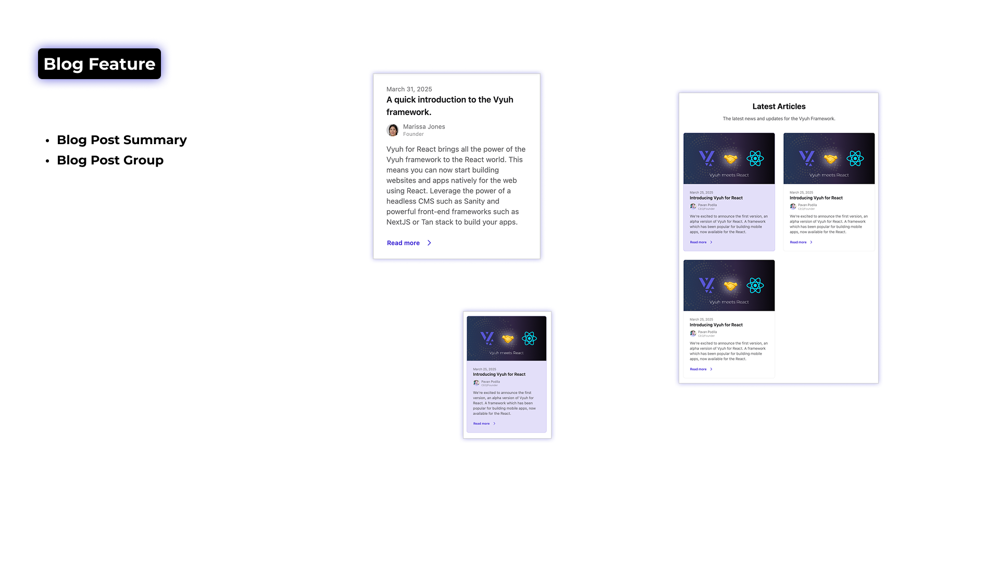

import { Aside } from '@astrojs/starlight/components'

The blog feature provides content types and components for building blog
sections and displaying blog posts. It's designed to work seamlessly with the
Vyuh framework's content system, allowing you to create rich, interactive blog
experiences.



## Content Types

The blog feature includes several content types for building blog sections and
displaying blog content. Here's the complete list of content types provided by
the blog feature:

- **Blog Post Summary** - Individual blog post previews with metadata
- **Blog Group** - Collections of blog posts for display
- **Blog Post** - Full blog post content _(under construction)_
- **Blog Category** - Category definitions for organizing posts _(under
  construction)_
- **Blog Author** - Author profiles for blog posts _(under construction)_

We'll cover the two main content types in detail below, but you can explore the
full source code on GitHub for more information about the other content types.

<Aside title="Source Code">

You can explore the full source code for the blog feature on GitHub:

- [Sanity Schema (blog)](https://github.com/vyuh-tech/vyuh-react/tree/main/features/blog/sanity-schema-blog/src)
- [React Feature (blog)](https://github.com/vyuh-tech/vyuh-react/tree/main/features/blog/react-feature-blog/src)

You can also view the complete
[blog feature directory](https://github.com/vyuh-tech/vyuh-react/tree/main/features/blog)
in the Vyuh repository.

</Aside>

### Blog Post Summary

The BlogPostSummary content type represents an individual blog post with
metadata:

```typescript
// Blog post summary content structure
interface BlogPostSummary extends ContentItem {
  // The title of the blog post
  readonly title: string

  // A short summary of the post
  readonly excerpt?: string

  // Featured image for the blog post
  readonly image?: ImageReference

  // Publication date of the blog post
  readonly date?: string

  // Author information
  readonly author?: {
    readonly name?: string
    readonly role?: string
    readonly avatar?: ImageReference
  }

  // Categories or tags for the blog post
  readonly categories?: string[]

  // Whether this post should be featured
  readonly featured?: boolean

  // Link to the full post
  readonly action?: Action
}
```

Blog post summaries are used to display previews of blog posts in lists, grids,
or featured sections.

### Blog Group

The BlogGroup content type represents a collection of blog posts:

```typescript
// Blog group content structure
interface BlogGroup extends ContentItem {
  // The main title for the blog section
  readonly title: string

  // A supporting text that appears below the title
  readonly subtitle?: string

  // Blog posts to display in the section
  readonly posts: {
    readonly title: string
    readonly excerpt?: string
    readonly image?: ImageReference
    readonly date: string
    readonly author?: {
      readonly name: string
      readonly role?: string
      readonly avatar?: ImageReference
    }
    readonly categories?: string[]
    readonly featured?: boolean
    readonly action: Action
  }[]

  // Optional call-to-action button (e.g., "View all posts")
  readonly action?: Action
}
```

Blog groups are used to display collections of blog posts, such as recent posts,
featured posts, or category-specific posts.

## Implementation Structure

### Sanity Studio Side

In Sanity Studio, the blog feature is defined with content descriptors and
schema builders:

```typescript
// Blog feature descriptor for Sanity
export const blog = new FeatureDescriptor({
  name: 'blog',
  title: 'Blog',
  description: 'Schema for Blog components including posts and post groups',

  // Content descriptors define available content types
  contents: [
    new BlogGroupDescriptor({
      layouts: [defaultBlogGroupLayout],
    }),
    new RouteDescriptor({
      regionItems: [
        { type: BlogGroupDescriptor.schemaName },
        { type: BlogPostSummaryDescriptor.schemaName },
      ],
    }),
  ],

  // Schema builders generate Sanity schemas
  contentSchemaBuilders: [
    new BlogPostSchemaBuilder(),
    new BlogGroupSchemaBuilder(),
  ],
})
```

The BlogPostSchemaBuilder defines the schema for blog posts:

```typescript
// Blog post schema builder
export class BlogPostSchemaBuilder extends ContentSchemaBuilder {
  private schema = defineType({
    name: 'blog.post.summary',
    title: 'Blog Post Summary',
    type: 'object',
    icon: Icon,
    fields: [
      defineField({
        name: 'title',
        title: 'Post Title',
        type: 'string',
        validation: (Rule) => Rule.required(),
      }),
      defineField({
        name: 'excerpt',
        title: 'Excerpt',
        type: 'text',
        description: 'A short summary of the post',
      }),
      // More fields...
    ],
    // Preview configuration...
  })

  constructor() {
    super(BlogPostSummaryDescriptor.schemaName)
  }

  build(descriptors: ContentDescriptor[]) {
    return this.schema
  }
}
```

### React Side

In the React application, the blog feature is defined with content builders that
render the content:

```typescript
// Blog feature descriptor for React
export const blog = new FeatureDescriptor({
  name: 'blog',
  title: 'Blog',
  description: 'Blog components for building Blog pages',
  icon: <Icon />,

  extensions: [
    new ContentExtensionDescriptor({
      // Content builders render the content
      contentBuilders: [
        new BlogGroupContentBuilder(),
        new BlogPostSummaryContentBuilder(),
      ],
    }),
  ],
});
```

The BlogPostSummaryContentBuilder defines how blog posts are rendered:

```typescript
// Blog post content builder
export class BlogPostSummaryContentBuilder extends ContentBuilder<BlogPostSummary> {
  constructor() {
    super({
      schemaType: BLOG_POST_SUMMARY_SCHEMA_TYPE,
      defaultLayout: new DefaultBlogPostSummaryLayout(),
      defaultLayoutDescriptor: DefaultBlogPostSummaryLayout.typeDescriptor,
    })
  }
}
```

## Components

The blog feature includes several React components for rendering blog content:

### BlogPostCard

The BlogPostCard component renders a blog post summary as a card:

```tsx
export const BlogPostCard: React.FC<BlogPostCardProps> = ({
  content,
  className,
}) => {
  const { getImageUrl } = useMediaUtils()

  // Format date to a readable string
  const formatDate = (dateString: string | undefined) => {
    if (!dateString) return null
    const date = new Date(dateString)
    return new Intl.DateTimeFormat('en-US', {
      year: 'numeric',
      month: 'long',
      day: 'numeric',
    }).format(date)
  }

  return (
    <div
      className={cn(
        'flex flex-col overflow-hidden rounded-lg transition-all hover:shadow-md',
        content.featured
          ? 'bg-primary/15 border-primary/20 border'
          : 'bg-base-100 border-base-300 border',
        'cursor-pointer',
        className,
      )}
      onClick={() => executeAction(content.action)}
    >
      {/* Featured image */}
      {content.image && (
        <div className="aspect-video overflow-hidden">
          
        </div>
      )}

      {/* Card content */}
      <div className="flex flex-1 flex-col p-4">
        {/* Title, author, date, excerpt, etc. */}
      </div>
    </div>
  )
}
```

## Usage

The blog feature provides a complete solution for building blog sections in your
application. Content creators can use Sanity Studio to create and manage blog
posts, while developers can use the React components to render those posts in
the application.

<Aside type="tip">
  The blog feature works well with the marketing feature for creating complete
  websites with both marketing pages and blog content.
</Aside>
