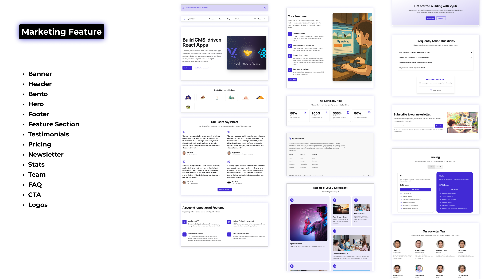

import { Aside } from '@astrojs/starlight/components'

The marketing feature provides a comprehensive set of content blocks designed
for building marketing websites and landing pages. It includes components for
common marketing sections like heroes, features, testimonials, and more.



## Content Types

The marketing feature includes a comprehensive set of content types that work
together to create complete marketing pages. Here's the full list of content
types provided by the marketing feature:

- **Hero** - Impactful page headers with calls to action
- **Feature Section** - Showcases product or service features
- **Banner** - Attention-grabbing notification bars
- **Header** - Navigation headers for websites
- **Footer** - Page footers with navigation and information
- **CTA (Call to Action)** - Conversion-focused action blocks
- **FAQ** - Frequently asked questions sections
- **Testimonials** - Customer testimonial displays
- **Pricing** - Pricing tables and plans
- **Stats** - Numerical statistics and metrics displays
- **Team** - Team member profiles and listings
- **Logo** - Logo displays for branding
- **Bento** - Grid-based content layouts
- **Newsletter** - Email signup forms

We'll cover the top three content types in detail below, but you can explore the
full source code on GitHub for more information about the other content types.

<Aside title="Source Code">

You can explore the full source code for the marketing feature on GitHub:

- [Sanity Schema (marketing)](https://github.com/vyuh-tech/vyuh-react/tree/main/features/marketing/sanity-schema-marketing/src)
- [React Feature (marketing)](https://github.com/vyuh-tech/vyuh-react/tree/main/features/marketing/react-feature-marketing/src)

You can also view the complete
[marketing feature directory](https://github.com/vyuh-tech/vyuh-react/tree/main/features/marketing)
in the Vyuh repository.

</Aside>

### Hero

The Hero content type is designed for creating impactful page headers with calls
to action:

```typescript
// Hero content structure
interface Hero extends ContentItem {
  // The main title for the hero section
  readonly title: string

  // A supporting text that appears below the title
  readonly subtitle?: string

  // Media content (image or video)
  readonly media?: {
    type: 'none' | 'image' | 'video'
    image?: ImageReference
    video?: ObjectReference
  }

  // Call-to-action buttons
  readonly actions?: Array<{
    variant: 'primary' | 'secondary' | 'tertiary' | 'link'
    action: Action
  }>
}
```

Heroes are typically used at the top of landing pages to grab attention and
direct users to key actions.

### Feature Section

The Feature content type showcases product or service features with supporting
media:

```typescript
// Feature content structure
interface Feature extends ContentItem {
  // The main title for the feature section
  readonly title: string

  // A supporting description
  readonly description?: string

  // List of individual features to highlight
  readonly features?: Array<{
    title: string
    description?: string
    icon?: string
  }>

  // Media content (image, video, or code example)
  readonly media?: {
    type: 'none' | 'image' | 'video' | 'code-example'
    image?: ImageReference
    video?: ObjectReference
    codeExample?: {
      code: string
      language: string
    }
  }

  // Call-to-action buttons
  readonly actions?: Array<{
    variant: 'primary' | 'secondary' | 'tertiary' | 'link'
    action: Action
  }>
}
```

Feature sections are versatile and can be used to highlight product
capabilities, benefits, or use cases.

### Banner

The Banner content type creates attention-grabbing notification bars:

```typescript
// Banner content structure
interface Banner extends ContentItem {
  // The main text to display
  readonly text: string

  // Optional icon
  readonly icon?: IconName

  // Call-to-action button
  readonly action?: Action

  // Whether the banner can be dismissed
  readonly dismissible?: boolean

  // Text for the dismiss button
  readonly dismissText?: string

  // Unique identifier for storing dismiss state
  readonly cookieId?: string
}
```

Banners are useful for announcements, promotions, or important notifications.

## Implementation Structure

### Sanity Studio Side

In Sanity Studio, the marketing feature is defined with content descriptors and
schema builders:

```typescript
// Marketing feature descriptor for Sanity
export const marketing = new FeatureDescriptor({
  name: 'marketing',
  title: 'Marketing',
  description: 'Schema for marketing components...',

  // Content descriptors define available content types
  contents: [
    new HeroDescriptor({
      layouts: [defaultHeroLayout],
    }),
    new FeatureSectionDescriptor({
      layouts: [defaultFeatureLayout],
    }),
    new BannerDescriptor({
      layouts: [defaultBannerLayout],
    }),
    // More content descriptors...

    // Route descriptor defines which content types can be used in routes
    new RouteDescriptor({
      layouts: [fullPageRouteLayout],
      regionItems: [
        { type: BannerDescriptor.schemaName },
        { type: HeaderDescriptor.schemaName },
        { type: HeroDescriptor.schemaName },
        // More content types...
      ],
    }),
  ],

  // Schema builders generate Sanity schemas
  contentSchemaBuilders: [
    new BannerSchemaBuilder(),
    new HeaderSchemaBuilder(),
    new HeroSchemaBuilder(),
    // More schema builders...
  ],
})
```

### React Side

In the React application, the marketing feature is defined with content builders
that render the content:

```typescript
// Marketing feature descriptor for React
export const marketing = new FeatureDescriptor({
  name: 'marketing',
  title: 'Marketing',
  description: 'Marketing components for building marketing pages',
  icon: 'layout-grid',

  extensions: [
    new ContentExtensionDescriptor({
      contents: [
        new RouteDescriptor({
          layouts: [FullPageRouteLayout.typeDescriptor],
        }),
      ],

      // Content builders render the content
      contentBuilders: [
        new HeroContentBuilder(),
        new FeatureContentBuilder(),
        new BannerContentBuilder(),
        // More content builders...
      ],
    }),
  ],
})
```

## Usage

The marketing feature provides a complete toolkit for building marketing pages.
Content creators can use Sanity Studio to create and manage marketing content,
while developers can use the React components to render that content in the
application.

<Aside type="tip">
  The marketing feature is designed to be used with the Vyuh framework's content
  system. It works best when combined with other features like the blog feature
  for a complete website solution.
</Aside>
