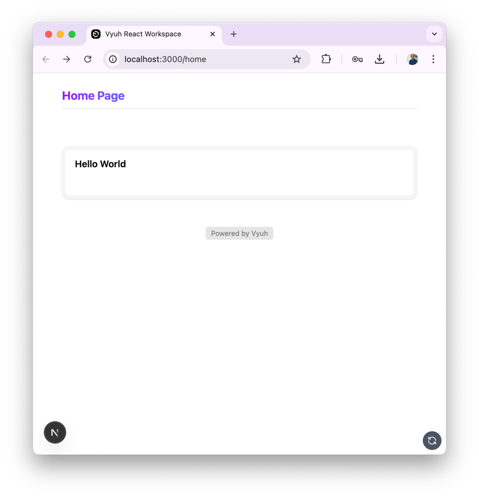

import { Aside, Steps } from '@astrojs/starlight/components'
import firstRouteVideo from './images/first-route.mp4'

After setting up Sanity CMS for your Vyuh React application, the next step is to
create your first route. Routes in Vyuh are the foundation of your application's
content structure, defining pages and their content organization.

<Aside type="tip">
  Make sure you've completed the [Set Up Sanity CMS](/react/intro/setup-sanity)
  guide before proceeding.
</Aside>

## Understanding Routes in Vyuh

In Vyuh, a route represents a page in your application. Each route:

- Has a unique path (like `/home` or `/about`)
- Contains regions that organize content
- Can have different layouts
- Holds various content elements like cards, rich-text blocks, and more

## Creating Your First Route

<Steps>

1. **Open your Sanity Studio**

   Navigate to your Sanity Studio (typically running at
   [http://localhost:3333](http://localhost:3333)) and log in.

2. **Create a new Route document**

   In the Sanity Studio sidebar, find the "Content" section and click on
   "Route". Then click the "Create new" button.

3. **Configure the Route**

   Fill in the basic route information:

   - **Title**: Give your route a descriptive name (e.g., "Home Page")
   - **Path**: Set the URL path for this route (e.g., `/home`)

4. **Add a Region**

   Regions are containers that organize content within your route. Let's add a
   "body" region:

   - Click the "Add item" button to add a Region
   - Choose "+ Create" to create a new Region. This will open up a new panel.
   - Set the identifier to "body" and the title to "Body"
   - Click "Publish" to create the region

5. **Add Content to the Region**

   Now let's add a simple card to our body region:

   - Click the "Add Item" button in the body region
   - Select "Card" from the content types
   - Fill in the card details:
     - **Title**: "Hello World"
     - **Description**: "My first Vyuh content element"

</Steps>

## Watch the Process

Here's a video demonstration of creating your first route in Sanity:

<video
  className="w-full"
  src={firstRouteVideo}
  controls
  autoPlay={true}
  muted={true}
  loop={true}
></video>

## Viewing Your Route in Next.js

Now that you've created and published your first route, you can view it in your
Next.js application using the `RouteLoader` component:

```tsx
// In your root page.tsx
import { RouteLoader } from '@vyuh/react-extension-content'

function HomePage() {
  return <RouteLoader path="/home" live={true} />
}
```

The `live={true}` property enables real-time updates, so any changes you make in
Sanity Studio will immediately appear in your React application.

<Aside type="note">

Make sure your React application is properly configured with the Vyuh provider
and content plugin as described in the
[Rendering Content](/react/guides/rendering-content) guide.

If you created the repo using the [template workspace](/react/intro/get-started)
that we linked to earlier, then you can just go to the `/home` path on your
address bar, and you should see the page.



</Aside>

## Next Steps

Now that you've created your first route, you can:

1. Add more regions to organize your content
2. Experiment with different content types like portable-text, images, and
   groups
3. Try different layouts for your route
4. Create additional routes for other pages in your application

Continue to [Rendering Content with Vyuh React](/react/guides/rendering-content)
to learn more about displaying your Sanity content in your React application.
